<p align="center">
  <picture>
    <source media="(prefers-color-scheme: dark)" srcset="docs/drivecode/assets/logos/logo-dark.png">
    
  </picture>
</p>

<h1 align="center">Drive</h1>

<p align="center">
Stay on a call with your agents. See what they are doing. Steer.
</p>

<p align="center">
<em>Drive coding</em> — built on <a href="#cline-upstream">Cline</a>.
</p>

<p align="center">
  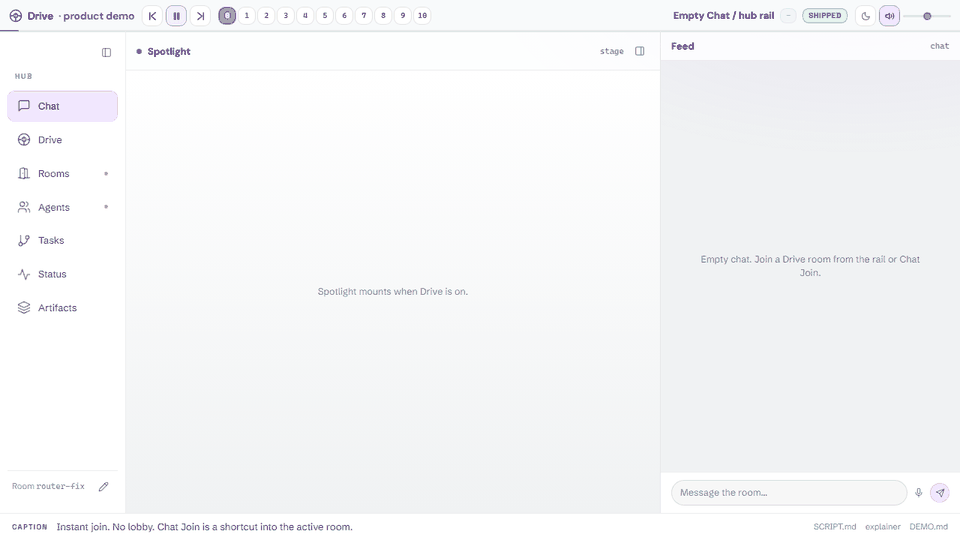
</p>

<p align="center">
<sub>15-second highlights of the ~3-minute session · <a href="https://hhalperin.github.io/cline-drivecode/drivecode/design/canvases/drive-product-demo.html">watch the interactive demo</a> (47 scripted beats with voice, keyboard: ←/→/Space)</sub>
<br>
<sub>No network needed: clone the repo and open <code>docs/drivecode/design/canvases/drive-product-demo.html</code> in a browser.</sub>
<br>
<sub>Every beat wears a maturity chip: <b>SHIPPED</b> exists in the product today, <b>PLANNED</b> is design intent.</sub>
</p>

---

Prompting an agent is a turn-based conversation: you ask, you wait, you read a
wall of output, you ask again. That works for one agent doing one thing. It
stops working the moment an agent is doing something long, or several agents are
doing several things, because the two questions you actually care about —
**what is it doing right now** and **is anything stuck** — have no answer.

Drive answers both. You join a call with an agent and watch its work land on a
shared surface as it happens. Agents publish where they are to a durable log you
can read at any time, from any surface, including after the fact.

The same features ship in two clients against one hub:

| Surface | Where |
|---|---|
| **Hub UI** | Drive rail in the Cline Hub dashboard |
| **CLI (TUI)** | Interactive OpenTUI (`bun run cli -i`) |

> Hub screenshots below are light theme (the hub ships light and dark). TUI
> screenshots are the dark terminal surface.

## Contents

- [Hub tour](#hub-tour) — Drive · Rooms · Artifacts · Tasks · Status · Analytics
- [Spotlight](#spotlight) — shared surface inside a call
- [CLI (TUI)](#cli-tui) — Drive join/leave + Status Hub
- [`report_status`](#the-report_status-tool) — how agents publish
- [Quickstart](#quickstart)
- [How it fits together](#how-it-fits-together)
- [Cline (upstream)](#cline-upstream) — everything the base product does

---

## Hub tour

Everything Drive adds lives under one **Drive** section in the hub sidebar —
lobby, rooms, artifacts, tasks, Status Hub, Analytics — rather than tools
scattered across the app. The CLI auto-spawns the same hub daemon.

### Drive lobby

Pairing home: turn Drive on, see attention counts, jump into Status Hub, and
scan which agents are reporting.


### In a call

A Drive call is a room. You are in it, and so is at least one agent. The agent
narrates decisions rather than keystrokes — what it is about to try and why —
and you steer without waiting for a turn to end. Raise a hand to interrupt, mute
or deafen the partner, or take the Spotlight yourself.

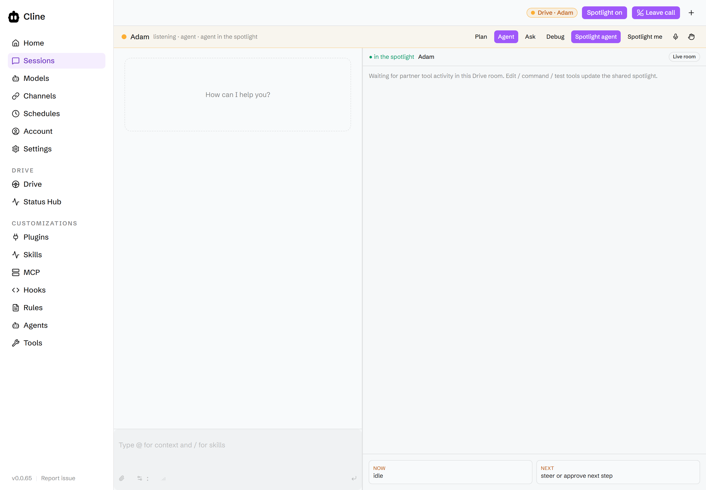

**Drive Settings** (in the call chrome) pick a runtime profile —
`local` / `cloud` / `hybrid` — and BYOK speech providers for STT and TTS. Bring
your own keys; nothing Drive-specific is locked to a single vendor.

Four sub-modes shape how the agent behaves. They map onto Cline's native
plan/act:

| Sub-mode | The agent… | Native mode |
|---|---|---|
| **Plan** | thinks out loud before touching anything | `plan` |
| **Agent** | does the work, narrating as it goes | `act` |
| **Ask** | answers questions without editing | `plan` |
| **Debug** | investigates a specific failure | `act` |

Rooms are owned by the hub — the single writer for roster, Spotlight holder,
mute flags, and sub-mode. Every client renders a projection of that state, so
the same room looks the same from Hub and TUI. Drive today is one developer
driving many agents; multi-human rooms are an explicit non-goal for now.

### Rooms

Every Drive session you have run, resumable. Stopping a room ends the call and
saves a handoff — configuration and history stay put, so **Start** picks up
where you left off.


### Artifacts

Plans, diagrams, walkthroughs, and captures produced in a call — kept across
rooms, filterable by kind and tag.


### Tasks

What blocks what, across every active team. A read-only dependency map of hub
team tasks (not an editor). Open with `?demoPlans=1` to walk the current Drive
plan set as a fixture.


### Status Hub

**A changelog for every agent.** Humans want status often. Agents should
volunteer it rather than be asked. Most updates land quietly here — and where
*other agents* read them to understand the project. Only genuinely urgent
updates interrupt you.

Three lenses over the same surface:

| Lens | Question |
|---|---|
| **Board** | Where is everything, and what needs me? |
| **Changelog** | What happened? |
| **Dependency map** | What blocks what? |

**Board** — one row per piece of work, attention order (blocked → failed →
running). Counts at the top are computed across every live row, not just what
is on screen.

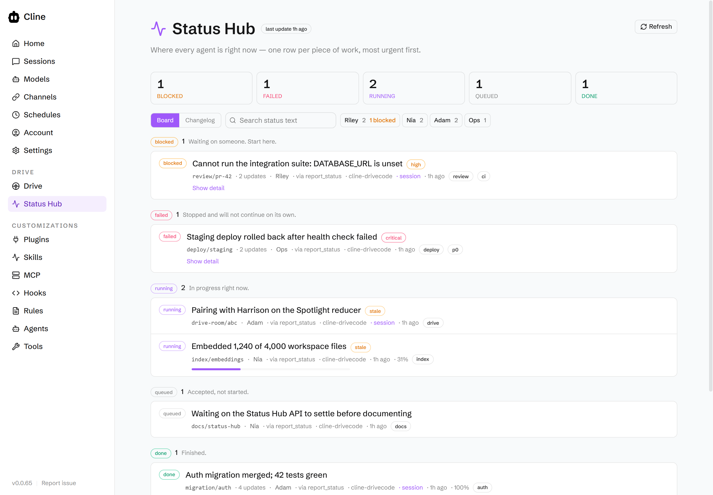

**Changelog** — flat and chronological, including superseded updates and
transitions (`running → blocked`). A `running` item that has not moved in 30
minutes is flagged **stale**.

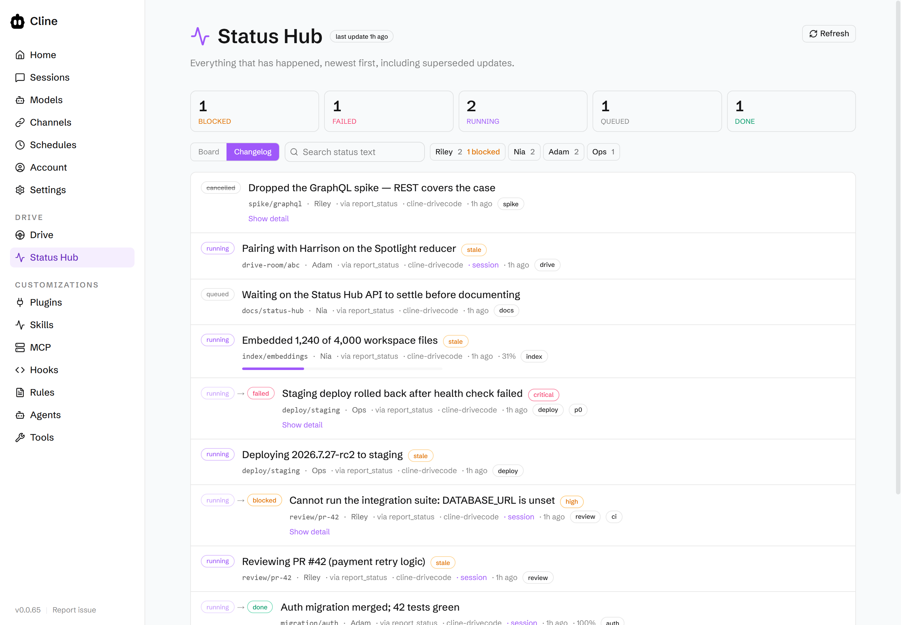

**Dependency map** — the team task graph from `status.tasks_snapshot`, laid out
by dependency layer. Select a task to see what blocks it and what it unblocks.
Screenshots use the Drive plan set
([`docs/drivecode/plans/cline-drivemode/`](docs/drivecode/plans/cline-drivemode/))
as the fixture (`/status?demoPlans=1&statusMode=dependency-map`).

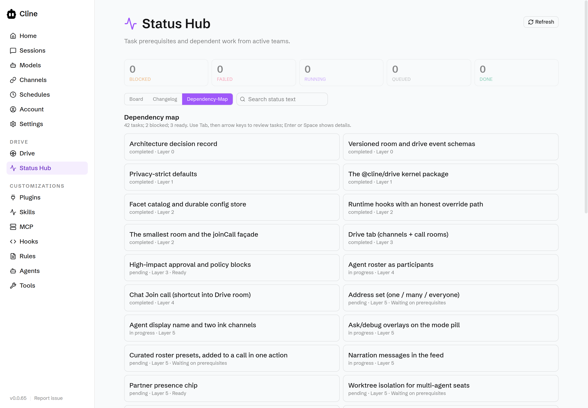

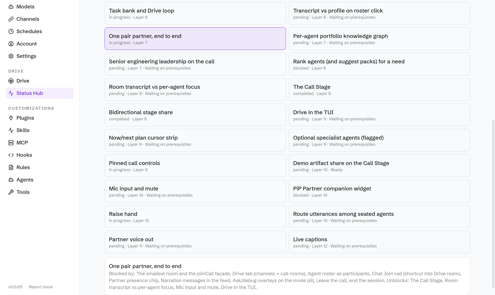

Storage and cursor semantics live in
[docs/drivecode/README.md](docs/drivecode/README.md) (`~/.cline/db/status.db`,
append-only, keyset pagination by `seq`).

### Analytics

Did Drive sessions get work done? Local session rollups and shipped digests —
not live agent ops, and nothing phones home. Demo fixture:
`/analytics?demoSessions=1`.


---

## Spotlight

**See who is sharing, and what.**

The Spotlight is the shared surface inside a call. It always names who holds it.

When the **agent** holds it, work streams onto the surface as cards — file
edits, commands and their output, test results, plan steps, decisions. You are
watching the work, not reading a transcript afterwards.

When **you** hold it, you pin something concrete for the agent to look at:

| Pin | What you share |
|---|---|
| **Selection** | a block of code, pasted as text |
| **File** | a path in the workspace |
| **Terminal** | command output |

Handing the Spotlight back and forth is one control: **Spotlight agent** /
**Spotlight me**. While you hold it, the agent's card deck dims rather than
disappearing.

The Spotlight is derived entirely from a versioned event stream — last event
wins. There is no screen capture to configure and no second connection to
babysit; a client that joins late replays the room snapshot and catches up.

Simulated share-screen beats (no credentials required) exercise the same
surface — open `/drive?demoShareScreen=1`:


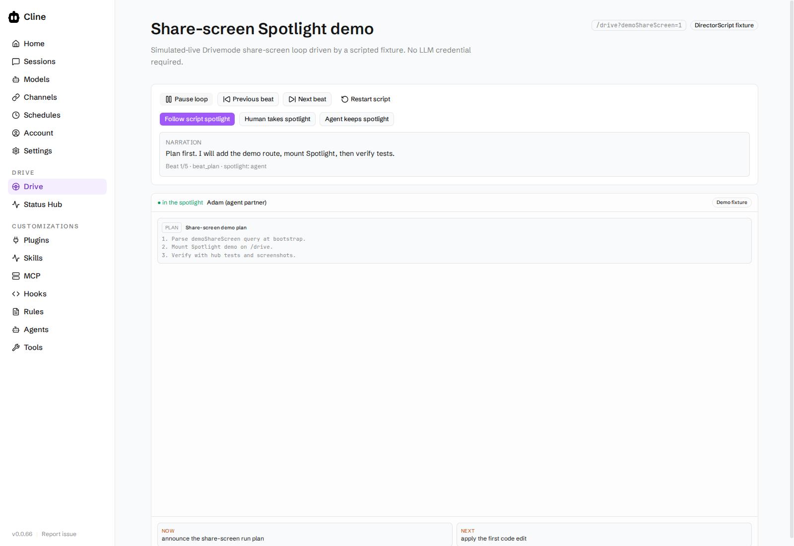

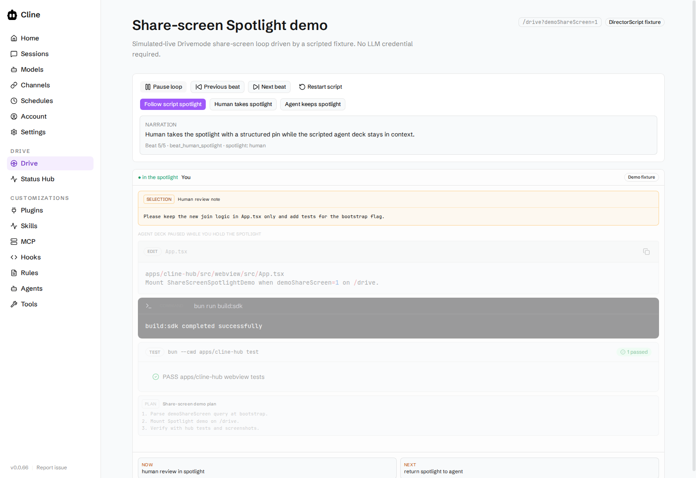

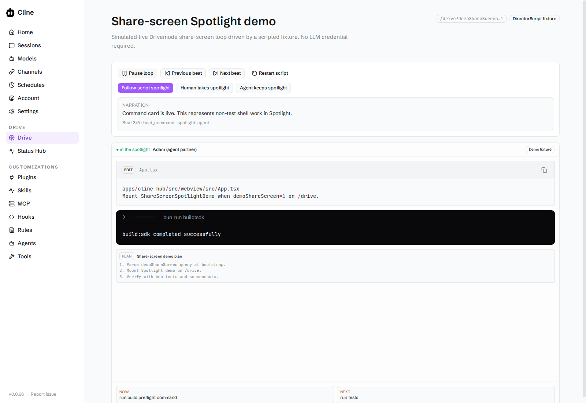

> The hub wire protocol still calls this surface `stage` (`StageState`,
> `call_set_stage`). Renaming it is a breaking change across every client, so
> the UI name and the protocol name differ for now.

---

## CLI (TUI)

The interactive TUI is the same agent core in the terminal: OpenTUI chat,
plan/act, slash commands, file mentions, live tool approvals, and headless
one-shots. Drive is a first-class mode on that surface — not a separate app.


`Ctrl+Shift+D` (or click the status-bar Drive line) joins or leaves the call.
When Drive is on, the bar shows the partner and sub-mode
(`plan` / `agent` / `ask` / `debug`). Cline is the default partner persona,
in the TUI and the product demo alike.

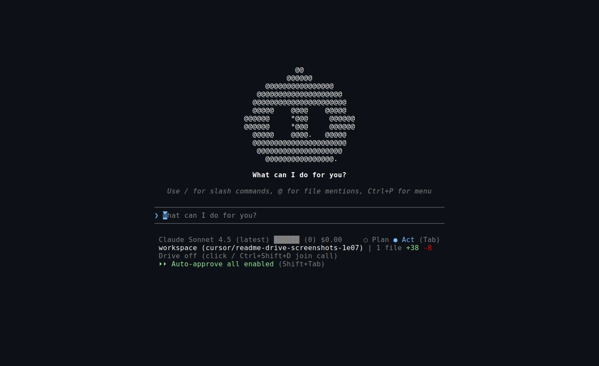

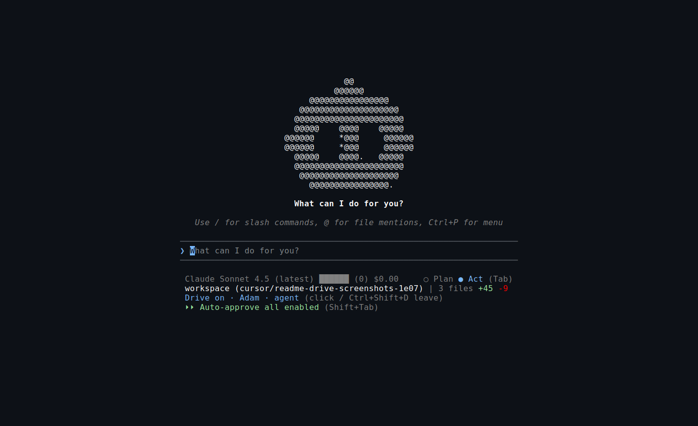

**Status Hub in the TUI** — `/status` (or **Opt+T** / the command palette).
Tab switches Board ↔ Dependency map. Live data comes from a
`StatusSnapshotSource` (hub ops). Demo plans:
`CLINE_DEMO_STATUS_PLANS=1` (optional lens / auto-open via
`CLINE_DEMO_STATUS_LENS` / `CLINE_DEMO_OPEN_STATUS`).

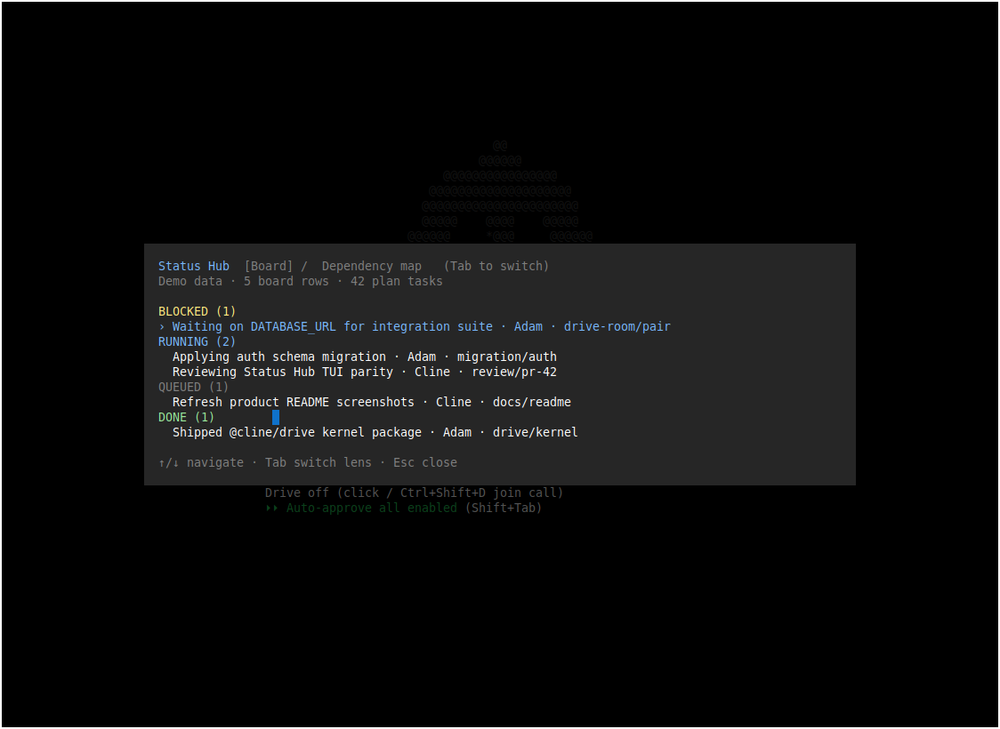

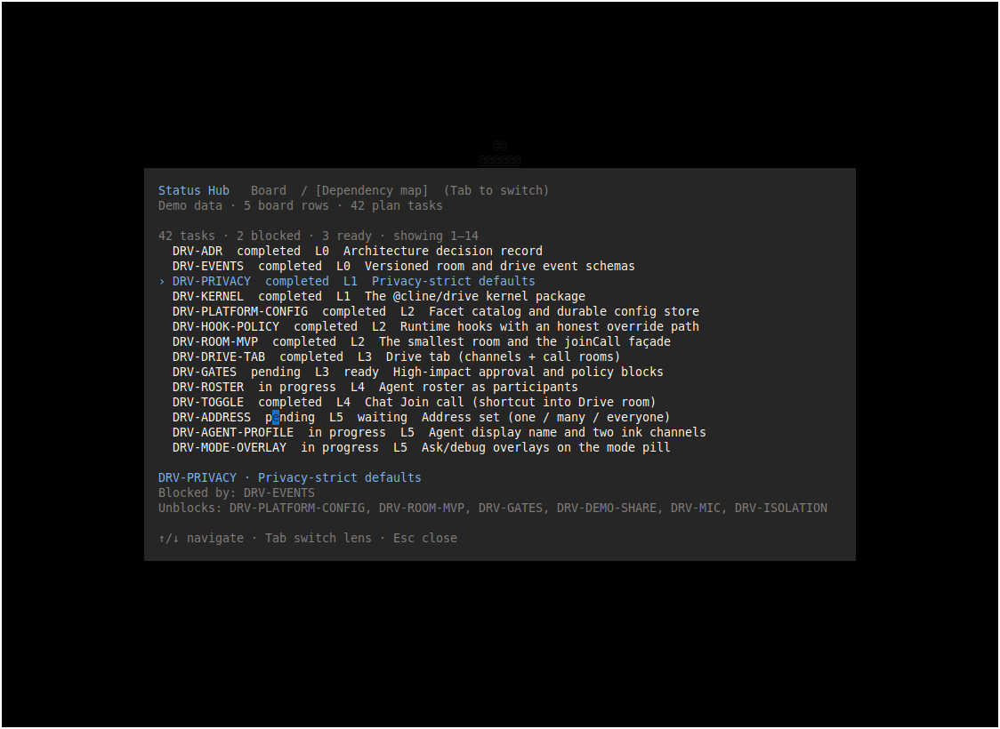

```bash
bun run cli -i                                    # interactive TUI
bun run cli -P anthropic -m claude-sonnet-4-5 "…" # one-shot
bun run cli doctor                                # local health
```

Configure providers with `cline auth` or env vars (`ANTHROPIC_API_KEY`,
`CLINE_API_KEY`, `OPENROUTER_API_KEY`, …). Full CLI docs:
[apps/cli/README.md](apps/cli/README.md).

| In the TUI | How |
|---|---|
| Drive join / leave | `Ctrl+Shift+D` or status-bar Drive line |
| Status Hub | `/status` · **Opt+T** · command palette |

---

## The `report_status` tool

Agents publish through an ordinary tool, so status flows through the normal
model → tool → hub path and shows up in the transcript like any other action.
It is on by default.

```jsonc
{
  "subject": "migration/auth",     // stable key; reuse it for the whole timeline
  "state": "blocked",              // queued | running | blocked | done | failed | cancelled
  "headline": "Cannot run the integration suite: DATABASE_URL is unset",
  "detail": "Tried .env.test and the CI defaults. I need a test database URL.",
  "priority": "high",              // low | normal | high | critical
  "progress": 0.4                  // optional, 0..1
}
```

**Priority decides who gets interrupted.** `high` and `critical` raise a
notification; everything else waits in the Hub to be found. Attribution
(session, agent, workspace) is filled from tool context — an agent cannot file
status as another agent. A failed publish returns a message rather than throwing.

Agents report unprompted on starting distinct work, finishing it, the moment
they are blocked, and at real milestones — not after every tool call.

---

## Quickstart

Drive is **public but self-hosted**: clone this repository and run it on your
own machine. There is no hosted service and nothing to sign up for. Requires
[Bun](https://bun.sh) 1.3.13+ and Node 22+.

```bash
git clone https://github.com/hhalperin/cline-drivecode.git
cd cline-drivecode
bun install --frozen-lockfile
bun run build:sdk               # required — packages resolve each other through dist/
bun run preflight               # toolchain, build output, ports, provider
```

**Hub (Drive rail, Spotlight, Status Hub, Analytics)**

```bash
bun run --cwd apps/cline-hub dev
```

Two URLs are printed. Open the one labelled **`Cline Hub dashboard listening`**
(not the Vite one), and click **Connect**. Preferred ports are used when free;
if they are busy, the next free ports are chosen automatically — read them from
your terminal. `dev` starts the hub daemon for you.

- **Drive** in the sidebar is the lobby for everything above.
- **Turn on Drive** opens a room with an agent. The call renders around the
  chat surface, so the URL changes — that is expected.
- **Rooms / Artifacts / Tasks / Status Hub / Analytics** are the rest of the
  Drive rail.
- In a call, **Drive Settings** chooses local/cloud/hybrid plus STT/TTS.

**Bring your own key.** A real call needs a provider. An API key env var alone
does not select one, so either run
`bun run cli auth --provider <id> --apikey <key> --modelid <model>` or pick a
provider under **Settings → Providers** in the dashboard. To look around with
no credentials, open `/drive?demoShareScreen=1` on the dashboard URL — the
scripted share-screen demo. Populate Status / Tasks with `?demoPlans=1`,
Analytics with `?demoSessions=1`.

**CLI (TUI)**

```bash
bun run cli -i
```

The interactive TUI auto-spawns the hub daemon. Use `bun run cli doctor
preflight` when something will not start, and `bun run cli doctor` /
`bun run cli doctor fix` when something is already running and shouldn't be.

**Self-hosted beta**

- [Install guide](docs/drivecode/reference/install.md) — prerequisites,
  Windows notes, ports, expected test failures, uninstall
- [Privacy](docs/drivecode/reference/privacy.md) — what is written to disk and
  what leaves your machine
- [Support](docs/drivecode/plans/cline-drivemode/ops/beta-support.md) — where
  to report a problem

## How it fits together

```
 Browser (Drive rail · Spotlight · Status Hub · Analytics · Drive Settings)
        │  WebSocket
 Cline Hub dashboard  ── listen port chosen automatically when free
        │  hub ops: call_* · status.* · drive.* · drive_config_*
 CLI TUI  ── same hub daemon, same agent core ── bun run cli -i
        │       Drive join/leave: Ctrl+Shift+D (status bar)
        │       Status Hub: /status · Opt+T
        │
 Hub daemon  ── single writer ── discovered (not a fixed port)
        │
 ├── Event log        .cline/drive/rooms/<id>/  (append-only DriveEvent)
 ├── Live room         RoomSnapshot Map          (rebuildable from log)
 ├── Facets            .cline/drive/facets.v1.json
 ├── @cline/drive      kernel: sub-modes, narration, topology, BYOK
 ├── @cline/core       sessions, tools, status.db, cron.db, hub
 ├── @cline/llms       providers (AI SDK 7 / LanguageModelV4)
 └── @cline/shared     schemas: room + status + topology events
```

The hub is the only writer for shared state. Clients publish facts and render
projections; they never hold an authoritative copy. Room truth is partitioned
into three lanes
([ADR-0013](docs/drivecode/plans/cline-drivemode/adr/ADR-0013-state-partition.md)):
append-only event log, live `RoomSnapshot`, durable Drive facets. Everything
above is built on the [Cline SDK](https://docs.cline.bot/sdk/overview) — the
same packages this repo publishes — rather than beside it.

**Reference**

- [docs/drivecode/README.md](docs/drivecode/README.md) — status schema, hub op
  list, query options, room model
- [docs/drivecode/reference/architecture.md](docs/drivecode/reference/architecture.md) — diagram-first
  Status Hub / Drive protocol planes
- [docs/drivecode/reference/skills-inventory.md](docs/drivecode/reference/skills-inventory.md) —
  in-repo skills vs candidates for `cline/skills`
- [ADR-0005](docs/drivecode/plans/cline-drivemode/adr/ADR-0005-status-hub.md) — Status Hub
  design and the alternatives rejected
- [ADR-0010](docs/drivecode/plans/cline-drivemode/adr/ADR-0010-provider-harness-byok.md) —
  BYOK provider harness and runtime topology
- [ADR-0013](docs/drivecode/plans/cline-drivemode/adr/ADR-0013-state-partition.md) —
  three-lane state partition (event log / live room / facets)
- [docs/drivecode/plans/cline-drivemode/](docs/drivecode/plans/cline-drivemode/) — the full Drive
  plan set, vision through architecture
- [apps/cli/README.md](apps/cli/README.md) — CLI / TUI details

---

# Cline (upstream)

Everything below is the upstream Cline README, unchanged.

<p align="center">
  
</p>

<h1 align="center">Cline</h1>

<p align="center">
The open source coding agent in your IDE and terminal.
</p>

<div align="center">

<div align="center">
<table>
<tbody>
<td align="center">
<a href="https://docs.cline.bot" target="_blank"><strong>Docs</strong></a>
</td>
<td align="center">
<a href="https://discord.gg/cline" target="_blank"><strong>Discord</strong></a>
</td>
<td align="center">
<a href="https://www.reddit.com/r/cline/" target="_blank"><strong>r/cline</strong></a>
</td>
<td align="center">
<a href="https://github.com/cline/cline/discussions/categories/feature-requests?discussions_q=is%3Aopen+category%3A%22Feature+Requests%22+sort%3Atop" target="_blank"><strong>Feature Requests</strong></a>
</td>
<td align="center">
<a href="https://cline.bot/join-us" target="_blank"><strong>Join us!</strong></a>
</td>
</tbody>
</table>
</div>

</div>

<br>

<div align="center">
<table>
<tr>
<td align="center" width="50%">

### CLI

Run Cline in your terminal.
Interactive chat or fully headless
for CI/CD and scripting.

```
npm i -g cline
```

<a href="./apps/cli/README.md">Learn more</a>
<br><br>

</td>
<td align="center" width="50%">

### Kanban

Run many agents in parallel from a
web-based task board. Each card gets its own
worktree, auto-commit, and dependency chains.

```
npm i -g kanban
```

<a href="https://github.com/cline/kanban">Learn more</a>
<br><br>

</td>
</tr>
<tr>
<td align="center" width="50%">

### VS Code Extension

AI coding assistant in your editor.
Create files, run commands, browse the web,
and use tools with human-in-the-loop approval.

<a href="https://marketplace.visualstudio.com/items?itemName=saoudrizwan.claude-dev">Install from VS Marketplace</a>
<br><br>

</td>
<td align="center" width="50%">

### JetBrains Plugin

The same Cline experience in IntelliJ IDEA,
PyCharm, WebStorm, GoLand, and the rest of
the JetBrains family.

<a href="https://plugins.jetbrains.com/plugin/28247-cline">Install from JetBrains Marketplace</a>
<br><br>

</td>
</tr>
</table>
</div>

<div align="center">
<table>
<tr>
<td align="center">

### SDK

Build your own AI agents and integrations powered by the same engine that runs the CLI, Kanban, VS Code extension, and JetBrains plugin. Custom tools, multi-agent teams, connectors, scheduled automations, and more.

```
npm install @cline/sdk
```

<a href="https://docs.cline.bot/cline-sdk/overview">Documentation</a>
<br><br>

</td>
</tr>
</table>
</div>

---

## Index

| Product | Description | Location | CHANGELOG |
|---------|------------|--------------|--------------|
| **SDK** | Node.js programmatic agent API and extension exports. | [`sdk/`](https://github.com/cline/cline/tree/main/sdk) | [CHANGELOG.md](https://github.com/cline/cline/blob/main/sdk/CHANGELOG.md) |
| **CLI** | Terminal UI, headless mode, shell commands, and CLI-specific flows. | [`apps/cli/`](https://github.com/cline/cline/tree/main/apps/cli) | [CHANGELOG.md](https://github.com/cline/cline/blob/main/apps/cli/CHANGELOG.md) |
| **VS Code Extension** | The Marketplace extension and extension host integration. | [`/`](https://github.com/cline/cline/tree/main) (WIP migrating) | [CHANGELOG.md](https://github.com/cline/cline/blob/main/CHANGELOG.md) |
| **JetBrains Plugin** | JetBrains-hosted client that talks to the shared agent core. | Currently we are not open-sourcing JetBrains plugins | - |
| **Kanban** | Web-based multi-agent task board. | [`cline/kanban`](https://github.com/cline/kanban) | [CHANGELOG.md](https://github.com/cline/kanban/blob/main/CHANGELOG.md) |
| **Docs site** | Public documentation pages. | [`docs/`](https://docs.cline.bot/) | - |

## Edits Code Across Your Project

Cline reads your project structure, understands the relationships between files, and makes coordinated changes across your codebase. It monitors linter and compiler errors as it works, fixing issues like missing imports, type mismatches, and syntax errors before you even see them. In VS Code and JetBrains, every edit shows up as a diff you can review, modify, or revert. All changes are tracked with checkpoints, so you can easily undo the agent's work.

## Runs Bash Commands

Cline executes commands directly in your terminal and watches the output in real time. Install packages, run build scripts, execute tests, deploy applications, manage databases. For long-running processes like dev servers, Cline continues working in the background and reacts to new output as it appears, catching compile errors, test failures, and server crashes as they happen.

## Plan and Act

Toggle between Plan mode and Act mode. In Plan mode, Cline explores your codebase, asks clarifying questions, and lays out a strategy. Once you're aligned, switch to Act mode and Cline executes the plan. Every file edit and terminal command requires your approval, so you stay in control of what actually changes. Or toggle auto-approve and let Cline run autonomously.

## Rules and Skills

Define project-specific rules in `.clinerules` files that guide how Cline works in your codebase: coding standards, architecture conventions, deployment procedures, testing requirements. Rules are picked up automatically by the CLI, VS Code extension, and JetBrains plugin. Use skills to let the model load specific rules when needed.

## Works With Every Model

Cline is not locked to a single AI provider. Use whichever model fits your workflow:

| Provider | Models |
|----------|--------|
| Anthropic | Claude Opus, Sonnet, Haiku |
| OpenAI | GPT series models |
| Google | Gemini series models |
| OpenRouter | 200+ models from any provider |
| Vercel AI Gateway | Route to many providers through one gateway |
| AWS Bedrock | Claude, Llama, and more |
| Azure / GCP Vertex | All hosted models |
| Cerebras / Groq | Fast inference models |
| Ollama / LM Studio | Run local models on your machine |
| Any OpenAI-compatible API | Self-hosted or third-party endpoints |

## Extend With Plugins or MCP Servers

Extend Cline's capabilities with plugins. Using the SDK, register tools and lifecycle hooks programmatically through the plugin system for logging, auditing, policy enforcement, or adding domain-specific capabilities. Simple plugin example below.

```typescript
import { Agent, createTool } from "@cline/sdk"

const deployTool = createTool({
  name: "deploy",
  description: "Deploy the current branch to staging.",
  inputSchema: { type: "object", properties: { env: { type: "string" } }, required: ["env"] },
  execute: async (input) => {
    // your deployment logic
  },
})

const agent = new Agent({ tools: [deployTool], /* ... */ })
```
...or use [MCP servers](https://github.com/modelcontextprotocol) to connect to databases, query APIs, manage cloud infrastructure, and interact with external systems. Use [community-built servers](https://github.com/modelcontextprotocol/servers) or ask Cline to create custom tools on the fly. In the CLI, manage servers with `cline mcp`.

## Multi-Agent Teams

Coordinate multiple agents working together on complex tasks. A coordinator agent breaks the work into subtasks and delegates to specialist agents, each with their own tools and context. Team state persists across sessions so you can pick up where you left off.

```bash
cline --team-name auth-sprint "Plan and implement user authentication with tests"
```

## Scheduled Agents

Run agents on cron schedules for recurring automations. Daily PR summaries, weekly dependency checks, codebase health reports. Schedules persist across restarts and run independently of any terminal session.

```bash
cline schedule create "PR summary" \
  --cron "0 9 * * MON-FRI" \
  --prompt "List all open PRs and their review status" \
  --workspace /path/to/repo
```

## Connect to Slack, Telegram, Discord, and More

Chat with your agent from any messaging platform: Telegram, Slack, Discord, Google Chat, WhatsApp, and Linear. Each conversation thread maps to an agent session with full context. Set up access control to restrict who can interact with your agent.

```bash
# Connect to Telegram
cline connect telegram -k $BOT_TOKEN
# Connect to Slack through webhook
cline connect slack --bot-token $SLACK_TOKEN --signing-secret $SECRET --base-url $URL
# Connect to Slack using socket mode
cline connect slack --bot-token $SLACK_TOKEN --app-token $SLACK_APP_TOKEN
```

## Headless CLI for CI/CD

Run Cline with zero interaction for scripting and automation. Pipe input, get JSON output, chain commands, integrate into CI/CD pipelines.

```bash
cline "Run tests and fix any failures"
git diff origin/main | cline "Review these changes for issues"
cline --json "List all TODO comments" | jq -r 'select(.type == "agent_event" and .event.text) | .event.text'
```

## Contributing

Start with the [Contributing Guide](CONTRIBUTING.md). Join our [Discord](https://discord.gg/cline) and head to the `#contributors` channel to connect with other contributors. Check our [careers page](https://cline.bot/join-us) for full-time roles.

## License

[Apache 2.0 © 2026 Cline Bot Inc.](./LICENSE)
