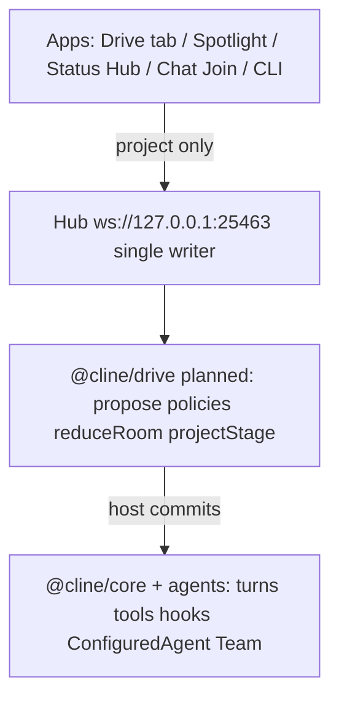

# Native Cline vs Drivecode

**Cline runs agents; Drive is a Cline mode that makes running them feel like being on a call.**

This page is a value comparison: what upstream Cline already ships versus what Drive mode adds. Every Drivecode row carries a maturity label so the claim stays honest. Integration goal: almost seamless—Drive enables features inside Cline, it is not a separate product ([PRD 8](../plans/cline-drivemode/prd/prd-drive-as-cline-mode.md), [ARD-0007](../plans/cline-drivemode/ard/ARD-0007-drive-as-cline-mode.md)).

Planning north star: [cline-drivemode](../plans/cline-drivemode/). Harness layer: [drivecode-sdk](../plans/drivecode-sdk/). Deeper Status Hub / Spotlight citations (worktree): [`.claude/worktrees/agent-host-protocol-ui-demo-f3bccc/docs/drivecode/README.md`](../../.claude/worktrees/agent-host-protocol-ui-demo-f3bccc/docs/drivecode/README.md).

## Layering

Drive sits on Cline. It does not replace the agent loop, open a second daemon, or fork `ConfiguredAgent` YAML.

Three verbs: **the harness proposes, the host commits, apps project.** See [04-relationship-to-cline-drivecode.md](../plans/drivecode-sdk/04-relationship-to-cline-drivecode.md).

## Maturity legend

| Label | Meaning |
|---|---|
| `plan` | Documented in `docs/plans/` only; no meaningful product code on the branch you run |
| `scaffold` | UI/CLI shell on the current workspace (Join call chrome, Drive status bar); little or no hub protocol |
| `worktree` | Working depth in `.claude/worktrees/agent-host-protocol-ui-demo-f3bccc/` — not fully on the day-to-day branch |
| `shipped` | Present on the branch you run day-to-day as a usable product surface |

Checked against this workspace: no `sdk/packages/drive`, no `status.db` path in main `sdk/`, Drive chrome in hub Chat + CLI status bar; Status Hub + Spotlight + `call_*` depth live in the worktree.

## Value matrix

| Axis | Native Cline | Drivecode adds | Maturity | Primary refs |
|---|---|---|---|---|
| Interaction model | Turn chat: prompt → wait → transcript | Call room: join, roster, stay in the call | `scaffold` | [00-vision.md](../plans/cline-drivemode/00-vision.md); [DriveCallChrome.tsx](../../apps/cline-hub/src/webview/src/drive/DriveCallChrome.tsx); CLI [status-bar.tsx](../../apps/cli/src/tui/components/status-bar.tsx) |
| WIP visibility | Transcript wall of tool output | Spotlight / stage cards (edit, command, test, plan, decision) | `worktree` | [DRV-STAGE](../plans/cline-drivemode/features/DRV-STAGE.md); worktree `Spotlight.tsx`, `stageReducer.ts` |
| Multi-agent | Team tools / mailbox (runtime groups) | Room roster, address set, RosterPack, recruit | `plan` | [DRV-ROSTER-PACK](../plans/cline-drivemode/features/DRV-ROSTER-PACK.md); [DRV-RECRUIT](../plans/cline-drivemode/features/DRV-RECRUIT.md); [ARD-0003](../plans/cline-drivemode/ard/ARD-0003-recruit-and-roster-pack.md) |
| Cross-agent status | Transient hub events; session lifecycle column | Durable Status Hub (`status.db`, Board + Changelog, `seq` cursor) | `worktree` | Worktree [ARD-0005](../../.claude/worktrees/agent-host-protocol-ui-demo-f3bccc/docs/plans/cline-drivemode/ard/ARD-0005-status-hub.md); worktree `sqlite-status-store.ts`, `status-handlers.ts` |
| Interruptibility | Cancel / pending-prompt queue | Raise-hand pause-after-tool; mid-turn steer queue | `plan` | [DRV-INTERRUPT](../plans/cline-drivemode/features/DRV-INTERRUPT.md); [DRV-STEER-QUEUE](../plans/cline-drivemode/features/DRV-STEER-QUEUE.md) |
| Mode UX | Plan / Act | Drive mode on the same control family; postures Plan/Agent/Ask/Debug while Drive is on | `scaffold` | [DRV-MODE-OVERLAY](../plans/cline-drivemode/features/DRV-MODE-OVERLAY.md); [PRD 8](../plans/cline-drivemode/prd/prd-drive-as-cline-mode.md); Chat Drive wiring in [Chat.tsx](../../apps/cline-hub/src/webview/src/Chat.tsx) |
| Agent identity | `.cline/agents/*.yaml` (ConfiguredAgent) | `.driveagent/<slug>/` home + AgentProfile appearance overlay + recruit | `plan` | [ARD-0001](../plans/cline-drivemode/ard/ARD-0001-driveagent-home.md); [DRV-AGENT-PROFILE](../plans/cline-drivemode/features/DRV-AGENT-PROFILE.md); [examples/driveagent-pair-partner](../plans/cline-drivemode/examples/driveagent-pair-partner/) |
| Privacy | Session storage norms | Privacy-strict: no transcript/audio persist without explicit debug flag | `plan` | [DRV-PRIVACY](../plans/cline-drivemode/features/DRV-PRIVACY.md); [HANDOFF-drivecode.md](../plans/HANDOFF-drivecode.md) |
| Collaboration primitive | Session | Room: participants, stage sharer, addressSet | `worktree` | [01-architecture.md](../plans/cline-drivemode/01-architecture.md) D3; worktree hub `call_*` / collaboration paths |
| Host portability | Cline SDK only | `@cline/drive` host port + capability descriptor + conformance kit | `plan` | [02-architecture.md](../plans/drivecode-sdk/02-architecture.md); [DRV-KERNEL](../plans/cline-drivemode/features/DRV-KERNEL.md) — package not present under `sdk/packages/` |
| Surface IA | Chat / CLI / IDE extension | Drive mode in Chat (+ optional Drive hub activity + Status Hub) | `worktree` | [PRD 8](../plans/cline-drivemode/prd/prd-drive-as-cline-mode.md); [DRIVE-TAB.md](../design/drive-wireframes/DRIVE-TAB.md); worktree `drive-view.tsx`, `status-view.tsx` |
| Media | N/A for coding-agent MVP | Events-first stage (typed work cards); WebRTC pixels later | `worktree` | [00-vision.md](../plans/cline-drivemode/00-vision.md); [02-research-streaming.md](../plans/cline-drivemode/02-research-streaming.md); worktree Spotlight |

## What we deliberately reuse

Drivecode is an overlay, not a second product stack:

| Keep from native Cline | Drivecode rule |
|---|---|
| Hub on `:25463` | Single writer; nothing defaults to `:7891` |
| `ConfiguredAgent` / `.cline/agents/*.yaml` | Prompts, tools, skills, provider, model stay here |
| Cline `Team` | Runtime execution group — never rename to RosterPack |
| Hook engine | Drive policies decide; core applies |
| Pending-prompt / turn queue | Steer queue builds on existing primitives |
| Bundled ai-elements | Stage cards render with existing UI building blocks |
| Sessions / cron DBs | Status Hub is a separate `status.db`, not a rewrite of sessions |

## Naming firewall

| Drive word | Native word | Do not conflate |
|---|---|---|
| RosterPack | Team | Seating preset vs runtime group |
| AgentProfile | ConfiguredAgent | Appearance overlay vs behavior definition |
| Spotlight (UI) | `stage` (wire) | Product label vs protocol field |
| Room | Session | Collaboration unit vs agent turn container |

## Related links

- Vision: [00-vision.md](../plans/cline-drivemode/00-vision.md)
- Architecture: [01-architecture.md](../plans/cline-drivemode/01-architecture.md)
- Status Hub ADR (worktree): [ARD-0005](../../.claude/worktrees/agent-host-protocol-ui-demo-f3bccc/docs/plans/cline-drivemode/ard/ARD-0005-status-hub.md)
- SDK relationship: [04-relationship-to-cline-drivecode.md](../plans/drivecode-sdk/04-relationship-to-cline-drivecode.md)
- Repo handoff: [HANDOFF-drivecode.md](../plans/HANDOFF-drivecode.md)
- Worktree product reference: [docs/drivecode/README.md](../../.claude/worktrees/agent-host-protocol-ui-demo-f3bccc/docs/drivecode/README.md) (in worktree tree)
