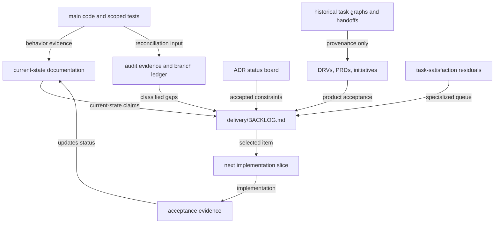

# Backlog reconciliation and stale-task cleanup plan

**Status:** proposed cleanup plan; no backlog item has been closed by this document<br>
**Decision basis:** [implementation/backlog audit](../research/17-implementation-backlog-audit.md) and its [evidence ledger](../research/17-implementation-backlog-evidence.md)<br>
**Scope:** Drive Mode, Drive task/session work, Spotlight, Status Hub, and their Drive documentation corpus<br>
**Outcome:** one trustworthy place to select unfinished product work, while retaining delivered plans as useful history.



Caption:

- Code plus focused verification determine whether a capability is **verified shipped**; prose and branches never outrank that evidence.
- `BACKLOG.md` is the planned general work-selection surface. `REMAINING-task-satisfaction.md` remains a specialized residual queue, not a competing master list.
- Historical delivery files preserve why work happened, but cannot select new work without a reconciled backlog entry.
- A branch is a candidate for comparison, not an automatically outstanding task.

## Why this cleanup is needed

The audit found 149 unchecked boxes across 46 Drive plan files, including many implementation steps already present on `main`. The old delivery graph and checklists therefore no longer reliably answer either of these simple questions:

1. What must actually be built next?
2. What evidence lets us call it done?

The goal is not to delete history or compress every plan into a single tracker. It is to distinguish durable intent, current behavior, and remaining work so that task selection does not recreate shipped capability or silently discard a real gap.

## Operating model after reconciliation

| Need | Canonical source | Rule |
|---|---|---|
| Actual behavior | code and scoped tests, summarized in `leadership/SYSTEMS-ANALYSIS.md` | A checklist is not implementation evidence. |
| General unfinished work | proposed `delivery/BACKLOG.md` | Every selectable item names its acceptance boundary, evidence link, and status class. |
| Task-satisfaction residuals | `delivery/REMAINING-task-satisfaction.md` | Keep it as the detailed specialized source; link one residual package from the general backlog. |
| Architecture / product decision | `adr/` and the decision-status board | An unresolved choice is decision-gated, not an engineering task. |
| Feature intent / acceptance | DRV, PRD, and active initiative documents | Reconcile their status headers against the backlog. |
| Historical execution order | `delivery/TASK-GRAPH.md` and superseded handoffs | Mark historical; never use them as the default task picker. |
| Audit evidence | research 17 and its branch ledger | Preserve as a dated evidence source, not a live tracker. |

### Status vocabulary

Use the following terms verbatim across the nest. They make an item’s meaning visible without forcing a document move.

| Status | Meaning | Backlog treatment |
|---|---|---|
| **Verified shipped** | Present on `main` with source evidence and appropriate verification | Close delivery steps; retain only extension or regression work. |
| **Active partial** | The foundation exists, but a bounded product acceptance condition does not | Keep one narrowly named implementation item. |
| **Planned** | Direction or demo exists but `main` has no product implementation evidence | Keep as future work, not as a shipped claim. |
| **Decision-gated** | Product policy, scope, or architecture remains intentionally undecided | Put a decision record in the backlog; do not assign an implementation task. |
| **Candidate patch review** | An unmerged branch or patch needs comparison with `main` | Keep it out of the product queue until an explicit merge, reimplementation, reference, or abandon disposition. |
| **Reference / historical** | Explains delivered work or a prior investigation | Add an explicit banner/header and remove it from work selection. |

## Guardrails before changing documentation

1. **Protect concurrent work.** Do not stash, delete, or rewrite unrelated dirty documentation. In particular, resolve the current `drive-product-demo` “active” versus audit “reference” classification with the author before changing that initiative’s status.
2. **Use a fresh baseline.** Record the commit being reconciled in each cleanup batch. Re-run focused code/branch evidence if `main` changed materially after the audit baseline.
3. **Make small reversible commits.** Separate the backlog control plane, status-header reconciliation, and factual wording/port cleanup. No bulk renames or document deletion.
4. **Do not infer work from branch age.** Compare unmerged refs with `main`; choose one disposition: already replayed, candidate patch, experimental reference, or intentionally abandoned. Capture the reasoning in the branch ledger/backlog rather than creating a task per branch.
5. **Keep task granularity honest.** A cleanup action is complete only when the affected document points to its replacement source of truth. Merely checking old boxes is not reconciliation.

## Staged execution plan

### Stage 0 — freeze the evidence boundary

**Purpose:** make later status edits auditable instead of editorial.

- Record the current `main` SHA and current worktree state in the cleanup PR/commit description.
- Confirm the audit’s source/test/branch evidence remains representative; refresh only changed areas.
- Create a working reconciliation table with: document, claimed status, evidence class, canonical backlog destination, disposition, and unresolved decision.
- List in-flight documentation separately from committed plans. Do not let it silently become product status.

**Exit evidence:** a reviewed reconciliation table and a known baseline; no product files changed.

### Stage 1 — establish a single live selection surface

**Purpose:** stop new work from being selected from stale checklists.

Create `delivery/BACKLOG.md` as the general living queue. It should be brief, link-led, and use rows rather than duplicate specifications.

Recommended fields:

| Field | Meaning |
|---|---|
| `ID / title` | Stable, human-readable work item name |
| `Class` | Active partial, planned, or decision-gated |
| `Why now` | Product outcome or current blocker |
| `Evidence` | Source/test/audit link proving the gap |
| `Acceptance / verify` | The smallest observable completion boundary |
| `Dependencies / owner role` | Required decision or owning surface, not a personal assignment |
| `Source plans` | Links to DRV/PRD/initiative history |

Then update `plans/cline-drivemode/README.md`, the nest landing page, `HANDOFF.md`, `STRUCTURE.md`, `AGENTS.md`, and `AGENT-RUNBOOK.md`. The first task-selection instruction should be “choose the declared highest-priority eligible, unblocked item in `BACKLOG.md`,” then honor its dependencies and verification boundary. Mark `TASK-GRAPH.md` as historical delivery sequencing rather than a live queue. Keep `REMAINING-task-satisfaction.md` as the detailed specialized source and link it through one residual-package row in the general backlog.

**Exit evidence:** a contributor can identify the next unblocked work item without opening an old feature checklist.

### Stage 2 — reconcile status claims in place

**Purpose:** make each plan honest while preserving its implementation history.

Add a compact, standard header to each materially relevant **DRV** before altering its checklist:

```md
> Status: verified shipped | active partial | planned | decision-gated | reference
> Reconciled against: main <SHA> and research 17
> Canonical backlog: [entry](../delivery/BACKLOG.md) | none
> Historical delivery: link to the relevant task graph, handoff, or initiative overview
```

Initiatives retain the statuses required by `initiatives/README.md` (`active`, `reference`, or `done`) and add a separate `Reconciled delivery state:` line. Historical reviews and superseded handoffs receive a concise resolution banner rather than a DRV-style status header.

Apply the header to the highest-conflict plans first:

| Area | Audit classification to reconcile | Likely live boundary after cleanup |
|---|---|---|
| Drive Tab / DriveAgent Home | Default product home shipped; channels/room browser not | Planned information architecture, if still desired |
| Gates | Core policy/staging exists | Active partial: feed, deny/expiry/recovery presentation |
| Room MVP | Hub-owned in-memory room exists | Active partial: durable recovery, reconnect, human identity/media boundary |
| Roster / RosterPack / Recruit | Foundations and stall picker exist | Active partial: general Add → Recruit and pack library/editor |
| Stage | Stage primitives exist | Planned/partial only for the remaining surface explicitly evidenced |
| Task Bank | Durable bank, cursor, archive, and basic editor exist | Active partial / decision-gated items defined in the task-unit research note |
| Toggle | Current posture controls exist | Retain only unimplemented acceptance behavior |
| Plan re-entry / remaining satisfaction work | Generic re-entry is shipped; task/session spine is largely shipped | Retain only the End-packet → next-task resume CTA and the documented satisfaction residuals; remove duplicate feature checklists |

For maintained delivered feature specifications such as the events kernel, chat fork, clean drain, felt agency, plan improve, shipped digest, status sessions, stuck recovery, task metrics, and leave/end work, use **verified shipped** after confirming the audit’s evidence. Reserve **reference / historical** for superseded handoffs, historical task graphs, completed reference initiatives, and prior investigations. Do not erase acceptance checks that explain a past delivery.

**Exit evidence:** every source of a live backlog row has one visible status and no document both claims “planned” and “shipped” without qualification.

### Stage 3 — resolve cross-document contradictions

**Purpose:** remove the sources of future drift, not just the visible stale boxes.

1. Resolve the status of static demos: a demo can document intended UX but cannot upgrade unimplemented product capabilities to shipped.
2. Resolve the task-bank scope contradiction before scheduling runtime expansion: current code is workspace-backed while prior prose says “one active plan per room.” Record the choice through an adr/decision-gated backlog entry.
3. Correct `docs/drivecode/README.md` so its product reference names the shipped fourth Status mode, Sessions, alongside the existing three modes. Make one authoritative mode count and room-status statement; update conflicting copies rather than adding another summary.
4. Sweep the high-risk Drive documents — `TASK-GRAPH.md`, `AGENT-RUNBOOK.md`, the delivery handoff, plan README, foundations, and relevant ADRs/features — for hard-coded operational hub ports. Replace live connection claims with hub discovery / the URL printed at startup. Retain the intentional “no second `:7891` daemon” safety constraint.
5. Add resolution banners to historical reviews and superseded handoffs so a search result cannot look like a current implementation plan.

**Exit evidence:** search results no longer contain contradictory current-state claims for mode count, task-bank scope, demo maturity, or hub connection behavior.

### Stage 4 — make reconciliation repeatable

**Purpose:** prevent the backlog from drifting back after the next implementation batch.

- Require a backlog disposition in every Drive PR: create, advance, block, close, or explicitly “no backlog effect.”
- When a capability lands, update the matching backlog row and its source-plan status header in the same change or a paired documentation change.
- Periodically compare `BACKLOG.md` with `main`, rather than counting unchecked boxes.
- Treat new initiative folders as active only when their README declares scope, status, canonical backlog row, and verification boundary.

**Exit evidence:** a newly landed capability cannot leave a competing “unimplemented” task without an intentional decision.

## Initial candidate queue (not yet assigned work)

These are proposed classes inferred from the audit. They are a starting point for `BACKLOG.md`, not authorization to implement all of them.

| Candidate | Class | Smallest next decision or delivery boundary |
|---|---|---|
| Task as durable execution unit | Active partial + decision-gated | Adopt the product contract and scope/identity/evidence decisions in [research 18](../research/18-task-as-execution-unit.md) before schema expansion |
| Task-satisfaction residuals | Active partial | Reconcile each remaining privacy, host-skill, feed, learning-queue, and governance item against current code |
| ADR-0015 disposition | Decision-gated | Explicitly accept, amend, or supersede the still-proposed observability ADR before its landed slices accrue further implementation assumptions |
| Gates experience | Active partial | Define/feed an observable gate lifecycle, expiration, denial, and recovery UX |
| Room recovery and human identity | Active partial | Prove restart/reconnect UX and cross-surface human identity without assuming persistent rooms |
| Persistent rooms / multi-human media | Decision-gated / future | Decide whether these remain non-goals or warrant a separately scoped persistence/media initiative |
| Recruit and pack authoring | Active partial | Define general Recruit entry point and editable/inspectable roster-pack library |
| Spatial dependency map / Plans rail | Active partial | Implement the locked viewport, Plans rail, artifact-edge, and accessibility slices while retaining the shipped semantic card-grid baseline |
| Literal Spotlight screen frame, PiP, audio, pixel/WebRTC | Planned / decision-gated | Keep these separate from the shipped Stage/structured-share foundations; static demo is design evidence only |
| CLI parity | Planned | Identify the smallest Drive task/session outcome unavailable outside the hub UI |
| Branch-only candidates | Candidate patch review | Compare one candidate at a time and choose merge, reimplement, reference, or abandon before creating product work |

## Validation and completion criteria

A cleanup batch is ready to merge only when all applicable statements hold:

- [ ] The baseline SHA and evidence links are recorded.
- [ ] `delivery/BACKLOG.md` is the only general work-selection queue, and specialized residuals link back to it.
- [ ] Each reconciled document has one status class and a canonical backlog link or an explicit `none`.
- [ ] No implementation claim rests solely on a branch, canvas, or unchecked/checked plan box.
- [ ] Historical plans remain discoverable and visibly non-selectable.
- [ ] New or changed structural diagrams pass `bun sdk/scripts/validate-mermaid.ts <file>`.
- [ ] `bun run check:drivecode-docs`, `bun run test:drivecode-docs`, and `git diff --check` pass for the cleanup change.

## Non-goals

- Deleting historical plans, branches, or review artifacts.
- Rewriting all Drive plans into a new project-management system.
- Treating every unmerged branch as an implementation commitment.
- Changing product behavior while reconciling documentation.
- Resolving all product decisions in a documentation-only cleanup.

## Open questions

1. Should `BACKLOG.md` be a curated short queue only, with a separate decision log for deferred proposals, or carry both categories with clear filtering?
2. Who approves a status change from **active partial** to **verified shipped** when evidence spans SDK, hub, and UI surfaces?
3. Should the task-bank scope decision be made before or alongside the first Task Brief/proof-of-completion prototype?
4. Which current in-flight demo artifacts are intended to remain active design work, and which should become reference immediately?
