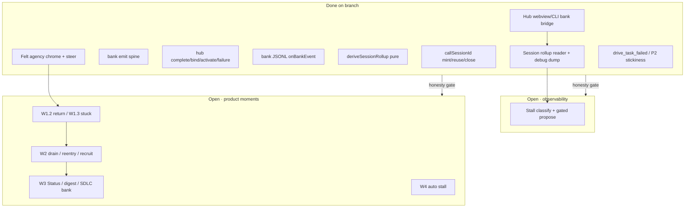

# Remaining work · Task satisfaction + session moments

**Status.** Living backlog (update as slices land)  
**Branch context.** Observability W0 kernel landed; product moments and remaining observability slices are **not** implemented.  
**Related.** [task-satisfaction-observability](../initiatives/task-satisfaction-observability/) · [session-satisfaction-moments](../initiatives/session-satisfaction-moments/) · [PRD 10](../prd/prd-task-satisfaction-observability.md) · [ARD-0015](../ard/ARD-0015-task-session-observability.md) (Proposed)

This document is the **implementation checklist** for everything still open after the planning wave and the W0 instrumentation commit. Prefer amending this file over inventing parallel backlogs.

---

## Documentation map (read before building)

| Layer | Artifact | Role |
|---|---|---|
| Doctrine | [research/15](../research/15-task-satisfaction-observability.md), [research/16](../research/16-task-as-unit-models.md) | Why task = unit; mid-plan churn vs post-success engagement |
| Product | [PRD 10](../prd/prd-task-satisfaction-observability.md) | Metrics S*/E*/P*, privacy, non-goals |
| Decision | [ARD-0015](../ard/ARD-0015-task-session-observability.md) (**Proposed**) | Local-first session observability + gated improve |
| Leadership | [BRIEF-task-satisfaction](../leadership/BRIEF-task-satisfaction.md) | Dual-proxy defaults; open forks |
| Observability slices | [task-satisfaction-observability/](../initiatives/task-satisfaction-observability/) | Slice 1 emit · Slice 2 rollup · Slice 3 diagnose/propose |
| Product moments | [session-satisfaction-moments/](../initiatives/session-satisfaction-moments/) | Nine `req-*.md` + [visual-plan](../initiatives/session-satisfaction-moments/visual-plan.md) |
| Feature specs | `features/DRV-{CALL-SESSION,TASK-METRICS,PLAN-IMPROVE,STUCK-RECOVERY,FELT-AGENCY,CLEAN-DRAIN,RETURN-LOOP,PLAN-REENTRY,STATUS-SESSIONS,SHIPPED-DIGEST,RECRUIT-STALL}.md` | Per-DRV ACs |
| Canvas | [session-satisfaction-moments-canvas.html](../../../design/canvases/session-satisfaction-moments-canvas.html) | Arc overview |
| Harness note | [09-next-task-proposer](../../drivecode-sdk/delivery/09-next-task-proposer.md) | Deterministic bank cursor; scorers propose only |
| **This file** | delivery checklist | Build order + open vs shipped; amend as work lands |

---

## 0. Snapshot: done vs open



Caption:

- Kernel correlation + pure rollup + local reader/debug dump exist; **product path** emits complete/bind/failure via hub webview bank bridge.
- Hub commands + webview protocol expose complete/bind/activate/failure with `roomId` / `callSessionId`.
- `drive_task_failed` + P2 stickiness in `deriveSessionRollup` landed (REMAINING §2.3 Option A).
- Felt agency (W1.1) chrome + mid-turn steer path landed; return loop (W1.2) + stuck recovery fork (W1.3 manual) landed.
- Status Hub fourth mode (W3.1) still open — consume `SessionRollupSource` / `readSessionRollups`.
- ARD-0015 remains **Proposed** (leadership accept still open).
---

## 1. Shipped (do not re-implement)

| Item | Where |
|---|---|
| `callSessionId` on room + bank event bases | `@cline/shared` `events.ts`, `bankEvents.ts`, `callSession.ts` |
| Leave `durationMs` when last human leaves; re-join mints new id | `DriveRoomStore.join/leave` |
| Bank emits: opened, activated (incl. create+activate), bound, completed, failed, archived, plan_step (adds), plan_archived | `bankStore.ts` |
| Hub bank log wire | `drive-bank-handlers` → `appendBankLogEvent` |
| Hub commands: `drive_bank_complete_task`, `bind_now`, `activate_plan`, `record_failure` | `hub.ts` + transport + handlers |
| Hub webview bridge: protocol frames + `drive-bank` forward + `bankSession` mutators + PlanEditor complete / Agent bind / tool failure | `apps/cline-hub` webview + server |
| Felt agency (W1.1): interrupt chrome, plan-edit consequence, recovery vs collaborative add, mid-turn steer chip | `agencyChrome.ts`, DriveCallChrome, NowNext, PlanEditor, server send steer, Composer |
| Stuck recovery (W1.3): Spotlight fork after `nowLastFailure`; gated narrow / fix-up / recruit stub / pause(Ask) | `stuckRecovery.ts`, `StuckRecoveryFork.tsx`, Chat Spotlight |
| Join/leave reply includes `callSessionId` / `durationMs` | `drive-room-handlers` |
| Pure `deriveSessionRollup` (S1–S3, E1–E3, P1–P2) | `@cline/drive` `sessionRollup.ts` |
| `drive_task_failed` emit + P2 stickiness | `bankStore.recordTaskFailure` → `deriveSessionRollup.failureStickyCount` |
| Session rollup reader + local debug dump | `@cline/core` `sessionRollupReader.ts`; hub `drive_session_rollups`; Drive Settings dump; `cline doctor session-rollups` |
| Planning docs, DRVs, visual plan, canvas | `docs/drivecode/...` |

**Verified:** `@cline/drive` / `@cline/shared` tests green; core unit green aside from known cloud git `insteadOf` artifact.

---

## 2. Observability remaining (foundation)

### ~~2.1 Hub webview + server bridge (blocks live product path)~~ ✅ done

**Why.** Kernel commands exist; Chat/Drive UI still only speaks `get|seed|create_task|edit_plan_tasks`. Completions in product sessions will not hit the bank log until this lands.

| Work | Owner | AC |
|---|---|---|
| ~~Extend `webview-protocol.ts` host↔webview frames for complete/bind/activate/record_failure~~ | `@cline/cline-hub` | Types compile; frames round-trip |
| ~~Forward in `server/drive-bank.ts` + allowlist in `server.ts`~~ | `@cline/cline-hub` | Hub invokes new `drive_bank_*` commands |
| ~~Extend `bankSession.ts` request helpers + callers (complete on task done, bind on Agent posture, failure on tool fail)~~ | hub webview | Live smoke: complete one task → bank JSONL has `drive_task_completed` with matching `callSessionId` |
| ~~Pass `roomId` + `callSessionId` from session into every bank op~~ | hub webview | Log correlation test / manual smoke |
| ~~Tests in `bankSession.test.ts`~~ | hub | Snapshot + error paths |

**Deps:** W0 (done).  
**Docs:** amend [DRV-TASK-BANK](../features/DRV-TASK-BANK.md), [slice-1](../initiatives/task-satisfaction-observability/slice-1-instrumentation.md).

**Shipped:** webview frames + server bridge; `DriveUiState.callSessionId` from join/leave `room_snapshot`; PlanEditor ✓ → `mutateBankCompleteTask`; Agent posture bind-once; failed `tool_event` → `mutateBankRecordFailure`; activate helper exported.
### ~~2.2 Slice 2 UI — local rollup surface~~ ✅ done

**Why.** `deriveSessionRollup` is pure-only; nothing reads room+bank logs into a product or debug view.

| Work | Owner | AC |
|---|---|---|
| ~~Reader: load room JSONL + bank JSONL for a `callSessionId` (or recent sessions)~~ | `@cline/core` | `readSessionRollups` / `createFsSessionRollupSource` + tests |
| ~~Debug panel or CLI dump of last N `SessionRollup`s~~ | hub + CLI | Drive Settings dump + `cline doctor session-rollups`; localhost only |
| ~~Wire rollup chips into future Status lens (see 3.6) without duplicating store~~ | composition root | Shared `SessionRollupSource` port; Status mode still open (W3.1) |

**Deps:** 2.1 for honest live data.  
**Docs:** [slice-2](../initiatives/task-satisfaction-observability/slice-2-local-session-rollup.md), [DRV-TASK-METRICS](../features/DRV-TASK-METRICS.md).

**Shipped:** FS reader over room + bank JSONL → `deriveSessionRollup`; hub `drive_session_rollups`; Drive Settings “Dump last rollups”; CLI `doctor session-rollups`.

### ~~2.3 P2 failure stickiness (event or correlated)~~ ✅ done

**Why.** Rollup `failureStickyCount` was hard-coded `0` — no failure bank event existed; only `lastFailure` on disk.

| Option | Choice |
|---|---|
| **A (shipped)** | Emit `drive_task_failed` (taskId only; note stays on disk `lastFailure`) from `recordTaskFailure` |
| B | Derive P2 offline from task files + complete events (FS archaeology) — not chosen |

**P2 definition:** count of distinct `taskId`s with ≥1 in-session `drive_task_failed` and no later `drive_task_completed` for that id (recovery pressure still open).  
**Docs:** PRD 10 P2 + [DRV-TASK-METRICS](../features/DRV-TASK-METRICS.md).

### 2.4 Slice 3 — diagnose → propose → gate

See [slice-3](../initiatives/task-satisfaction-observability/slice-3-diagnose-propose-gate.md) and [DRV-PLAN-IMPROVE](../features/DRV-PLAN-IMPROVE.md).

| Work | Owner | AC |
|---|---|---|
| Pure stall classifier (`SessionRollup` + open `lastFailure`) → reason codes | `@cline/drive` | Fixtures for low S2 / high P1 / sticky failure |
| Proposal schema `kind: planning` (evidence = event ids / paths / skill ids only) | `@cline/shared` | Forbidden-key tests |
| Accept \| reject \| mute UI (reuse learn queue + kind tag) | hub | Reject leaves disk unchanged |
| Host planning skill invocation (not in harness) | agent / `.driveagent` | Accept writes only allowed targets |

**Deps:** 2.1–2.2. Distinct from in-call [DRV-STUCK-RECOVERY](../features/DRV-STUCK-RECOVERY.md).

### 2.5 Retention caps + privacy facets

| Work | Note |
|---|---|
| Implement room/bank history caps from DRV-PRIVACY | Required before relying on durable logs for Status/digest |
| `privacy.debugRetention` facet (planned, not in live catalog) | Visible debug indicator |

---

## 3. Product moments remaining (by wave)

Requirements already exist under [session-satisfaction-moments/](../initiatives/session-satisfaction-moments/). This section is the **build order + gaps vs those reqs**.

### W1 — Keep the call alive

| ID | Component | Req | Key remaining work |
|---|---|---|---|
| W1.1 | [DRV-FELT-AGENCY](../features/DRV-FELT-AGENCY.md) | [req-felt-agency](../initiatives/session-satisfaction-moments/req-felt-agency.md) | **Landed (partial):** agency interrupt chrome (finishing/paused); PlanEditor → BankSnapshot consequence banner; recovery vs collaborative add (`nowLastFailure`); mid-turn send → steer pending prompts + Composer chip + “Steer applied”. **Still open:** interrupt redirect Now rewrite announce (W-13); optional plan-ref `source` facet; Spotlight delta beyond NowNext/agency banner |
| W1.2 | [DRV-RETURN-LOOP](../features/DRV-RETURN-LOOP.md) | [req-leave-end-return](../initiatives/session-satisfaction-moments/req-leave-end-return.md) | **Landed (partial):** `call_end` + `control.end`; pure `handoff.ts` Tier-0 packet; End narration; rejoin “since you left” line; Leave≠End chrome. **Still open:** End→next-task resume CTA / Drive tab row (W2.2 PLAN-REENTRY) |
| W1.3 | [DRV-STUCK-RECOVERY](../features/DRV-STUCK-RECOVERY.md) | [req-stuck-recovery](../initiatives/session-satisfaction-moments/req-stuck-recovery.md) | **Landed (partial):** Spotlight `StuckRecoveryFork` after `nowLastFailure` (manual-only); gated narrow / fix-up / recruit stub / pause(Ask+raise-hand); dismiss mutes identical offerKey. **Still open:** auto stall classifier (W4.1); full recruit seating (W2.3); feed narration of proposal |

**W1 honesty deps:** 2.1 bank bridge; interrupt/steer/now-next already partially shipped.

**Leadership forks still open (block freeze):**

1. Stuck fork: manual-only vs auto (default: manual first).  
2. Pause-plan semantics (default: Ask override, no new status).  
3. Must every in-band fix-up gate? (tension ARD-0008 “may propose” vs ARD-0015 accept).

### W2 — Habit + multi-agent

| ID | Component | Req | Key remaining work |
|---|---|---|---|
| W2.1 | [DRV-CLEAN-DRAIN](../features/DRV-CLEAN-DRAIN.md) | [req-clean-drain-ritual](../initiatives/session-satisfaction-moments/req-clean-drain-ritual.md) | Detect S3; single light invite; NowNext successor state so collapse ≠ failure; invite ≠ auto E1 |
| W2.2 | [DRV-PLAN-REENTRY](../features/DRV-PLAN-REENTRY.md) | [req-cross-day-return](../initiatives/session-satisfaction-moments/req-cross-day-return.md) | Drive tab row: plan title, open count, last rollup chips; amend wireframe IA |
| W2.3 | [DRV-RECRUIT-STALL](../features/DRV-RECRUIT-STALL.md) | [req-recruit-on-stall](../initiatives/session-satisfaction-moments/req-recruit-on-stall.md) | Stuck-task “Who should take this?”; structured need only; seat via hub; **agentId on complete/bind** for attribution |

**W2 forks:**

1. Clean-drain primary surface (narration vs NowNext vs Spotlight).  
2. Plan summary on list vs post-join only.  
3. Attribution: extend `drive_task_completed` with `agentId` vs session correlation only.

### W3 — Proof + guided

| ID | Component | Req | Key remaining work |
|---|---|---|---|
| W3.1 | [DRV-STATUS-SESSIONS](../features/DRV-STATUS-SESSIONS.md) | [req-status-accomplishment](../initiatives/session-satisfaction-moments/req-status-accomplishment.md) | Fourth Status mode (or adjacent); S2/S3/E1 list; drill to bank/room; port-only |
| W3.2 | [DRV-SHIPPED-DIGEST](../features/DRV-SHIPPED-DIGEST.md) | [req-value-proof-digest](../initiatives/session-satisfaction-moments/req-value-proof-digest.md) | Opt-in export schema + UI/CLI; redaction tests; default off |
| W3.3 | Amends [DRV-SDLC-GUIDE](../features/DRV-SDLC-GUIDE.md) | [req-sdlc-bankable](../initiatives/session-satisfaction-moments/req-sdlc-bankable.md) | W-44 freeze → accept path creates `DriveTask`s + plan refs so S2 can credit guided sessions |

### W4 — Auto + post-session

| ID | Component | Key remaining work |
|---|---|---|
| W4.1 | Auto stall → Spotlight fork | Classifier from 2.4 drives W1.3 without waiting for raise-hand |
| W4.2 | Post-session plan-improve | Slice 3 full loop (skills/templates), orthogonal to in-call recovery |

---

## 4. Cross-cutting / process

| Item | Status | Action |
|---|---|---|
| ARD-0015 leadership accept | Proposed | Accept or amend on status board |
| Dual proxy default (S3+E1) | Leadership default in brief | Confirm or elevate S1 |
| Accept-queue unification (`kind`: learn / planning / recovery) | Default: reuse | Spec schema once for all three |
| TASK-GRAPH indexing | Satisfaction DRVs not in phase gates yet | Add Phase 2+ optional gate note when W1 starts |
| CLI Drive join/leave parity | CLI chrome often local-only | Required if CLI counts toward metrics ([DRV-CALL-SESSION](../features/DRV-CALL-SESSION.md)) |
| `call_end` still missing from hub command union | Done (W1.2) | `HubCommandName` + transport + webview + End chrome |
| History retention caps | Open | Before Status/digest rely on logs |

---

## 5. Recommended implementation sequence

```text
1. ~~Hub bank bridge (2.1)~~ ✅
2. ~~W1.1 Felt agency~~ ✅ (chrome + steer path; redirect Now rewrite + plan-ref `source` still open — see §3 W1.1)
3. ~~W1.2 Return loop (call_end + handoff)~~ ✅ (resume CTA / Plan-reentry Drive tab still open — see §3 W1.2)
4. ~~W1.3 Stuck recovery (manual)~~ ✅ (auto classifier / full recruit still open — see §3 W1.3)
5. ~~Slice 2 UI reader (2.2)~~ ✅
6. ~~Failure event for P2 (2.3)~~ ✅
7. W2.1 Clean-drain
8. W2.2 Plan re-entry
9. W2.3 Recruit-on-stall (+ agentId)
10. W3 Status + digest + SDLC bankable
11. Slice 3 + W4 auto stall
```

No calendar estimates — order is dependency-only.

---

## 6. Documentation debt (complete before / with each build)

| When | Doc updates |
|---|---|
| After 2.1 | Mark slice-1 “product path wired”; update DRV-TASK-BANK agent tasks |
| After 2.2 | ~~Mark slice-2 UI done; link Status~~ ✅ |
| After 2.3 | ~~P2 via `drive_task_failed`; PRD 10 / DRV-TASK-METRICS~~ ✅ |
| Before W1 freeze | Resolve §3 W1 forks in BRIEF or DEC |
| On ARD-0015 accept | Flip status board Proposed → Accepted |
| After each DRV lands | Check off ACs on feature file; update this remaining list |
| Wireframe | Amend `DRIVE-TAB.md` / HTML when Plan-reentry row ships |

---

## 7. Explicit non-goals (still)

- Phone-home Drive telemetry / PostHog funnels  
- NPS / survey machinery  
- Learned sole writer for Now/Next  
- First-class Goal entity  
- Training a task model inside `@cline/drive`

---

## 8. Open questions index (consolidate)

From research / briefs / reqs — still unresolved:

1. Dual proxy: S3+E1 vs elevate duration?  
2. Accept-gate owner / unified queue?  
3. Hub task completion as hard gate for any satisfaction *claims*? (**Satisfied by 2.1 bridge.**)  
4. Healthy mid-plan add churn threshold?  
5. Backfill local history vs clock at instrumentation-complete?  
6. Stuck auto vs manual?  
7. Pause-plan meaning?  
8. Clean-drain home surface?  
9. Plan re-entry on list vs after join?  
10. `agentId` on bank complete events?  
11. Digest format / window / include P*?  
12. SDLC Musts → 1:1 tasks vs epic?

Track answers in [BRIEF-task-satisfaction](../leadership/BRIEF-task-satisfaction.md) or a DEC when decided.
