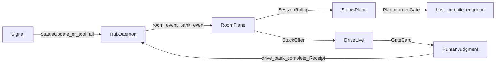

# ADLC drive factory · Overview

Back to [README](README.md). Plan only. Do not implement from this file alone.
Implementers open the linked phase file and follow its verification.

## Context

Implementation got cheap. Review, deploy, and maintain did not.
[Cloudflare’s ADLC post](https://blog.cloudflare.com/agent-development-lifecycle/)
names the failure: agents write code while humans still babysit every other
SDLC step. The answer is a software factory on agent-shaped primitives.

Drive Mode on this fork already ships rooms, Spotlight, gates, Status Hub, task
bank, stall recovery, session rollups, and DriveRun receipts. The engine is
ahead of the story. What blocks a usable factory is first-use (credentials,
TTS), one push gap (Status stops at `ui.notify`), thin product binding of
receipts, and spawn ceilings owned elsewhere.

**Why now.** MVP phases 0–5 are on main ([MVP-beta.md](../../delivery/MVP-beta.md)).
The next product move is not more chrome. It is making the shipped loop feel
like an ADLC control plane a human can start and trust.

## Scope

**In**

- ADR framing ([ADR-0028](../../adr/ADR-0028-adlc-control-plane.md))
- Credential onboarding and first-call TTS (defaults-delivery B3 / B2)
- Durable facet write for voice via existing hub config ops
- Status `critical` / `failed` → Drive stall **offer** when Drive is active
- Traces-as-product polish on existing session rollups
- Product path that binds `DriveRun` + `Receipt` on bank complete

**Out**

- Cloudflare Workflows / `@cloudflare/ci` / Workers deploy stack
- WebRTC, multi-human media, Discord channels IA
- Agents / Teams spawn UI (blocked on [enforced-authority](../enforced-authority/) E2)
- Replacing Status Hub or inventing a second trace store
- Auto-merge to production remotes
- Re-owning D1 / E2 (link and gate only)

## Constraints

- Bun only. Hub is the single writer. No second daemon.
- Privacy-strict. No new transcript/audio persistence without a visible debug flag.
- Pure policy and classifiers stay in `@cline/drive`. Hub validates at the boundary.
- No timeframes in this plan.
- Prefer deletion and wiring over new packages ([ponytail](../../../../../../.cursor/rules/ponytail.mdc) / Laziness Protocol).

## Alternatives

| Approach | Verdict |
|---|---|
| **A. Docs-only ADLC rename** | Rejected. Framing without on-ramps leaves the beta uncallable. |
| **B. New workflow engine package** | Rejected. Duplicates ChatFork / bank / stall. Violates Laziness and ADR-0028. |
| **C. Thin factory initiative over existing planes** | **Chosen.** Sequences B2/B3, one Status→Drive bridge, traces polish, receipt wire. Defers spawn UI to enforced-authority. |

## Target loop

Caption:

- Signal is a Status publish or in-call tool failure, not a new bus.
- HumanJudgment is gate / stall accept / plan-improve accept only.
- Host compile stays enqueue-only into `.drive/plan-improve/host-compile/`.
- Provenance: explorers on `status-handlers.ts`, `stallClassifier.ts`, `bankStore.ts`, `completionReceipt.ts`.

## Phases

1. [phase-1-framing.md](phase-1-framing.md) — ADR + nest index
2. [phase-2-credential-onboarding.md](phase-2-credential-onboarding.md) — start a real call
3. [phase-3-tts-first-call.md](phase-3-tts-first-call.md) — hear the partner
4. [phase-4-facet-hub-persist.md](phase-4-facet-hub-persist.md) — programmatic voice config
5. [phase-5-status-drive-bridge.md](phase-5-status-drive-bridge.md) — push into the call
6. [phase-6-traces-as-product.md](phase-6-traces-as-product.md) — improve from sessions
7. [phase-7-receipt-ship-atom.md](phase-7-receipt-ship-atom.md) — atomic done

**Parallel dependency (not owned here):** [enforced-authority](../enforced-authority/) E2 /
defaults-delivery D1 must land before any Agents spawn UI.

## Applicable skills

- **how** over hub status handlers, bank complete, and Drive voice before edits
- **diagram-first** when amending the target-loop fence
- **control-ui** for hub webview runtime proof
- **unslop** / **technical-writing** on docs and PR prose
- **deslop** before each commit
- **interrogate** on the Status→Drive bridge design before shipping phase 5
- **show-me-your-work** for the multi-PR stack decision trail
- Cursor **babysit** after each PR opens

## Verification

Project-level: see [testing.md](testing.md).
Every phase needs static green and a control-ui (or doctor) runtime check named
in the phase file.

## Implementation guidance

- Run **how** on each unfamiliar subsystem before changing it.
- Contested design (phase 5 bridge) gets **interrogate** before merge.
- `/deslop` each diff. **unslop** every prose surface.
- Keep a **show-me-your-work** trail for the stacked PRs.
- After open, **babysit** the PR to green.
- Do not expand phase file lists past ~three product files without splitting.
