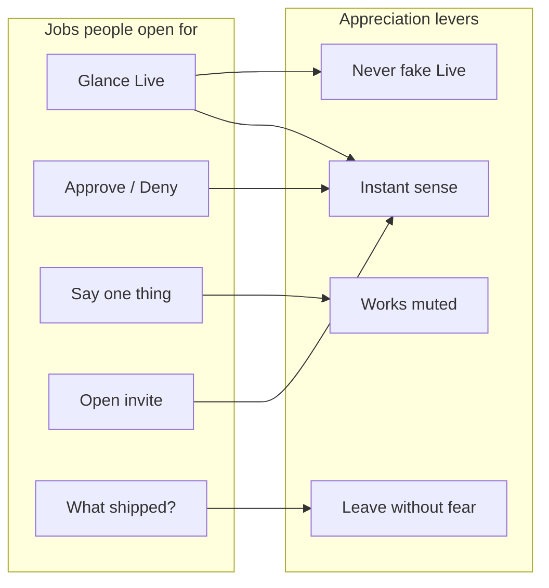
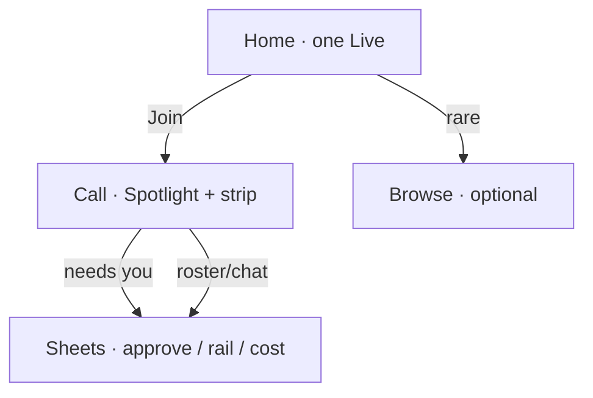

# Mobile / iOS · features users would actually want

**Status.** Product / UX architecture plan (user-value first).  
**Companion.** [GAPS.md](GAPS.md) = inventory coverage. **This file** = what to build because people will use it.  
**Parent.** [README.md](README.md).  
**Audience.** Less-technical builders + anyone checking Drive away from a desk.  
**Phone-only power users:** [POWER-USERS.md](POWER-USERS.md) (cockpit density: spend, stop-one, Live stack).

## Expert frame

Phone UX is not “desktop Hub, smaller.” It is a **different session shape**:

| Desk | Phone |
|---|---|
| Long pair-program sit | 15–90 second check-ins, occasional 3–5 min steer |
| Keyboard + big stage | Thumb + glance + one decision |
| Explore settings | Avoid settings |
| Browse many destinations | One Live thing + one action |

Architecture rule: **optimize for re-entry and decisions**, not for configuring the platform. Every feature must clear: *Would someone open the app for this alone?* If no, bury it or cut it.

- Frequency wins over completeness: five jobs, done well, beat twenty surfaces.
- Appreciation comes from *feel* (alive waits, honest states, thumb reach) as much as from routes.
- Hosted real agents are a distribution decision ([README](README.md) path H); features below still earn value on credential-free watch + self-host.

## When the phone comes out (scenarios)

1. **Ping.** Push/link/habit: “is the agent still going?” → 10s glance, close.
2. **Gate.** “Needs your OK on auth.ts” → approve/deny without sitting down.
3. **Corridor steer.** “No, use the other approach” → hold-to-talk or one line, leave.
4. **Invite open.** Someone texts a room link → join watch mode in one tap.
5. **End of day.** “What actually landed?” → short history / changelog, not a board.

If a feature does not serve one of these, it is desk software wearing a phone chrome.

## Ranked feature set

Score = **want × use × appreciate** (product judgment, not a spreadsheet).  
Ship order follows score, then MC gates.

### Tier 1 — Build these; users will return for them

| Feature | Job | Why they appreciate it | Interaction architecture |
|---|---|---|---|
| **Live glance home** | Ping | One card answers “is something happening?” | Large title + **one** Live hero + Join. No nav sprawl. Green Live only when truly live. |
| **Full-bleed Spotlight** | Ping / steer | Watching work is the product | Stage owns vertical budget; chrome is a thin safe-area strip. Never add a second permanent row for meters. |
| **Approval as a sheet** | Gate | Fast binary decision on the go | Bottom sheet, huge Allow/Deny, clear diff peek, earcon optional. One decision — no settings on the sheet. |
| **Hold-to-talk (or tap-to-talk)** | Corridor steer | Hands-busy, eyes-busy input | 52px primary control in thumb zone. Default muted + teach, or hold-hot — owner call. Always show partial transcript before send. |
| **Captions that stick when muted** | Quiet places | Same session without audio | CC opens with mute; preference sticky. Captions under Spotlight, not a separate “mode.” |
| **Raise hand that finishes warmly** | Steer without panic | Interrupt without fighting the agent | One control; visible “finishing…”; resume obvious. |
| **Leave without loss** | Safe exit | Fear kills mobile adoption | Leave confirms *room keeps running*; never “End call” as default copy. |
| **Honest Preview / demo chip** | Trust | Fake Live destroys trust once | Credential-free path always labeled. Hide no-op hub settings (Door B). |
| **Add to Home Screen** | Habit | Re-entry without browser chrome | PWA manifest, icon, standalone. Install after first successful glance or gate — not before they felt value. |

### Tier 2 — High value once Tier 1 works

| Feature | Job | Why | Architecture note |
|---|---|---|---|
| **Deep link / invite join** | Invite open | Share is how consumer products spread | `…/r/:id` → watch shell; no account wall before Spotlight if demo-allowed. |
| **“Blocked on you” badge** | Gate / Ping | Roster presence is not enough | Home Live card + in-call roster line; tap → approval or question. |
| **Dead-air activity line** | Ping during waits | Silence feels broken | Continuous NOW line + stall earcon; mark motion only for event waits. |
| **Session return / Recent** | End of day | Closure and pride | 3–5 Recent rows max; “Plan ready / Completed / Needs you” — not a full Status Hub. |
| **Handoff one-liner on leave** | Safe exit | Know what continues | One sentence + optional “notify when blocked” (needs hosted/runtime later). |
| **Share a 15–30s moment** | Social proof | Appreciation + acquisition | Schema-backed beat clip; privacy-strict; no raw audio retention. Later than glance/gate. |
| **Voice & devices mini-settings** | Steer reliability | Fix mic without Advanced | One screen: mic, TTS on/off, captions default. Nothing else. |

### Tier 3 — Nice; keep shallow or desk-only

| Feature | Phone posture |
|---|---|
| Rooms list | Browse secondary; search optional |
| Tasks / Artifacts | Open from call or Recent; not Home tabs equal to Live |
| Status board / changelog / dep-map | Tap-to-open; Mermaid **tap-to-render**; never first paint |
| Agent profile rename/ink | Advanced / “Make it yours” — delightful but not day-one |
| Cost / context drawer | Operator trust; sheet from strip, not permanent chrome |
| Landscape call | Support; don’t design primary IA around it |

### Tier 4 — Do not build as mobile features

| Temptation | Why users won’t care (or will hate it) |
|---|---|
| Full Advanced hub (MCP, plugins, hooks, schedules, models matrix) | Config work wants a desk; on phone it is anxiety |
| Provider/BYOK as first-open | Kills cold open; belongs behind “connect your keys” after delight |
| Pixel screen share / WebRTC | Heavy, fragile, wrong metaphor for agent work |
| Infinite social feed of strangers’ rooms | Not Drive’s wedge |
| Offline full agent | Fantasy; be honest about connectivity |
| Native store shell before PWA proof | Cost without evidence |
| Push storms for every tool call | Notification fatigue; push only “blocked on you” / “done” later |

## Interaction architecture (non-negotiables)

1. **One primary verb per screen.** Home → Join. Call → Hold. Sheet → Allow/Deny.
2. **Sheets over nested nav** for anything temporary (approve, roster, cost).
3. **Thumb zone:** primary control bottom-center; destructive Leave corner; never put Hold in the status bar.
4. **44px min / 52px hero**; respect `safe-area-inset-*`.
5. **Muted-first or taught-hot** — never surprise unmuted mic in public.
6. **Reduced motion still readable** — appreciation includes accessibility.
7. **Light-first consumer**; dark peer — matches how people use phones in daytime lobbies.

## What “appreciation” means in UI

Users rarely say “nice information architecture.” They feel:

| Moment | Design response |
|---|---|
| Open → understand in &lt;3s | Brand + Live card + one CTA |
| Waiting | Activity line; no silent spinner void |
| Decision | Huge targets; clear consequence (“edits auth.ts”) |
| Interrupt | Warm finish, not hard stop panic |
| Leave | Explicit persistence |
| Return tomorrow | Recent tells a story |
| Install | Icon feels like the product they already liked |

Delight features (earcons, share clip, mark peek) **amplify** Tier 1; they do not replace it.

## Suggested ship packs (user-value order)

Maps to MC phases without calendar estimates:

| Pack | Features | Gate (user-observable) |
|---|---|---|
| **Glance** | Live home, full-bleed Spotlight, honest Preview, leave-without-loss copy | Cold open → watch agent work in one hand at 360×640 |
| **Decide** | Approval sheet polish, blocked-on-you, optional earcon | Gate completable without desk |
| **Speak** | Hold/tap-to-talk + transcript confirm, sticky CC, raise-hand warmth | Corridor steer without typing |
| **Return** | Recent/history lite, handoff line | End-of-day understanding in &lt;30s |
| **Habit** | PWA install after first win | Home-screen icon opens same shell |
| **Spread** | Invite deep link, shareable moment | Link → watch; clip optional |
| **Depth** | Browse/Status lazy, voice mini-settings, cost sheet | Power without polluting Home |
| **Truth** | Hosted ADR (MC5) | Stop promising real builds if forever-demo |

## Relationship to GAPS.md

| Doc | Lens |
|---|---|
| [GAPS.md](GAPS.md) | What the inventory/demo/product are missing |
| **This file** | What to prioritize because users will want/use/appreciate it |

If GAPS lists a surface and FEATURES puts it in Tier 4, **do not fill the gap on phone** — keep it Advanced or desk Hub. Phone-only pilots who need denser control use [POWER-USERS.md](POWER-USERS.md) (power sheet), not Advanced dump.

## Open questions (user research, not styling)

1. Is the dominant mobile job **gate/approve** or **watch/steer** for the first audience? (Both Tier 1; which teaches first-open?)
2. Will users accept **watch-only** long enough to install, before hosted turns exist?
3. Is **shareable moment** retention fuel or distraction before Glance/Decide are solid?
4. Should Home show **zero** Browse until after first successful call?

## Hand back

Build the phone product as **five jobs**: glance, decide, speak, join, return — wrapped in honesty and leave-without-fear. Everything else is either amplification (delight) or desk software. Next concrete work stays **Glance pack on MC1** (`?app=1`), then Decide + Speak, then Habit (PWA).
