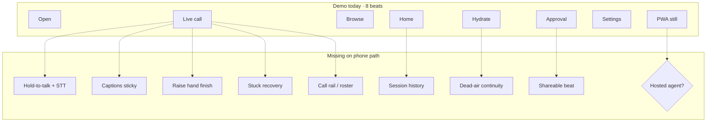
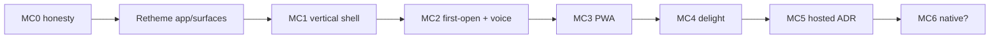

# Mobile / iOS · capability & UX gaps → fill plan

**Status.** Gap analysis against the presenter demo + surface inventory (2026-08-06).  
**Parent.** [README.md](README.md) (MC0–MC6).  
**User-value priority:** [FEATURES.md](FEATURES.md) (what to build because people will use it).  
**Visual SoT.** [mobile-drive-ios.html](../../../../design/wireframes/mobile-drive-ios.html) · [mobile-drive-ios-demo.html](../../../../design/wireframes/mobile-drive-ios-demo.html).  
**Full IA.** [mobile-drive-surfaces.html](../../../../design/wireframes/mobile-drive-surfaces.html).  
**Brand locks.** [MOBILE-BRAND-STYLING.md](../../../../design/brand/MOBILE-BRAND-STYLING.md).

## Thesis

The iOS demo sells the **look** of the consumer shell. It does not yet sell
the **capabilities** that make Drive feel like a phone product: voice as
primary input, interrupt without panic, captions when muted, recovery when
stuck, leave-without-loss, install, and an honest path when there is no
hosted agent.

Fill gaps in **capability layers**, not by adding more static screens.

- Demo covers IA beats, not live mic / CC / interrupt / recovery.
- Browse in demo is a teaser list — not rooms / tasks / artifacts / agents / status.
- PWA beat is a still; no manifest, install prompt, or standalone shell yet.
- Real agent turns stay blocked on ADR-0016 (path **H**) unless self-host.

## Coverage matrix

| Surface (inventory) | Demo | Wireframe | Product webview | Fill track |
|---|---|---|---|---|
| Press play / Open | ✓ | iOS + app | Partial (hub lobby) | MC2 script |
| Home / lobby | ✓ | iOS + surfaces | Exists (hub Home) | MC1 `?app=1` |
| Live call (Spotlight) | ✓ look | iOS + surfaces | Exists; phone chrome incomplete | MC1 |
| Call + rail | ✗ | surfaces only | Rail exists; phone default collapse in progress | MC1 |
| Captions open | ✗ | surfaces | Exists; sticky pref gap | MC2 + ux-q |
| Raise hand | ✗ (Hold chrome only) | surfaces | Wire + UI exists; finish warmth open | MC2 / MC4 |
| Stuck recovery | ✗ | surfaces | Exists; dead-air undesigned | MC4 |
| Approval gate | ✓ look | iOS + surfaces | Exists | MC1 honesty |
| Leave / handoff | ✗ | surfaces | Leave-without-loss exists | MC1 + MC2 |
| Session history | ✗ (Recent teaser) | surfaces | Rooms / history exist | MC1 browse lite |
| PWA install | ✓ still | surfaces + app | **Missing** | MC3 |
| Rooms / Tasks / Artifacts | Browse teaser | surfaces | Exists (hub) | MC1 hide depth |
| Agents / Agent profile | ✗ | surfaces | Exists | Advanced only |
| Status (board / changelog / deps) | ✗ | surfaces | Exists; Mermaid heavy on phone | Lazy / tap |
| Settings home | ✓ look | iOS | Exists | Consumer subset |
| Voice & devices | ✗ | surfaces | Exists | MC2 teaching |
| Providers / sign-in | Open SSO look | surfaces | ADR-0021 | Honesty chip |
| Advanced hub | Settings teaser | surfaces | Full hub | Door B / collapse |

## Capability gaps (what users cannot *do*)

Grouped by job. Priority = consumer path first; Advanced stays collapsed.

### A · Join & watch (trust ladder: See)

| Gap | Why it hurts | Fill |
|---|---|---|
| No real `?app=1` composition | Demo HTML ≠ product; drift risk | **partial** — hub strips nav + Join/Continue lobby; PWA/brand still open |
| Spotlight not full-bleed on phone | Stage loses to chrome (known 9 px lesson) | MC1 + ux-quality phase 2 layout contract |
| Landscape untested in demo | Rotate → broken strip | Surfaces already models it; MC1 gate at 1280×640 phone landscape |
| Credential-free path can lie | Looks live with no agent | Keep Preview chip; Door B hide no-ops (MC0 done in docs; enforce in webview) |

### B · Steer by voice (trust ladder: Control)

| Gap | Why it hurts | Fill |
|---|---|---|
| Hold-to-talk is chrome only | Primary verb is fake in demo | Wire Web Speech / drive-audio on mobile Safari; Permissions-Policy on hosted |
| Voice default undecided | Muted-safe vs hot-from-beat-one | Owner decision #2; ship teaching chip either way |
| Captions not in demo loop | Silent / public places need eyes | Sticky CC in call strip; auto-open on mute (ux-quality) |
| Raise-hand / interrupt missing from demo beats | “Steer” story incomplete | Add beat after hydrate; product: pause-after-tool finish warmth |
| No text fallback teaching | STT fails → dead end | Composer always one tap away; demo should show both |

### C · Decide & recover

| Gap | Why it hurts | Fill |
|---|---|---|
| Approval is static sheet | No earcon, no return-to-Spotlight | MC4 approval earcon + sheet → stage handoff |
| Stuck / dead air undesigned | Waiting feels broken | Activity line + stall earcon (MC4); mark motion = event wait only |
| Leave / handoff absent | Fear of losing work | Explicit “Leave · room keeps running” beat + product copy |
| Session history shallow | Cannot return to a moment | Home Recent → real history; shareable beat later (MC4) |

### D · Browse without hub sprawl

| Gap | Why it hurts | Fill |
|---|---|---|
| Demo Browse ≠ five browse surfaces | Reviewers think Browse is done | Either deepen demo beats **or** label Browse as teaser until MC1 |
| Status Mermaid on first paint | Phone jank | Tap-to-render below breakpoint (22-default-posture) |
| Artifacts / agents deep | Consumer overload | Keep under Browse; default Home stays call-first |

### E · Install & distribute

| Gap | Why it hurts | Fill |
|---|---|---|
| No web manifest / icons / theme-color | “App” is a browser tab | MC3 |
| No install prompt path | Drop-off after delight | MC3 + first-open script close |
| Home-screen name open | Brand ambiguity | Owner decision #3 |
| Hosted real turns blocked | Mass market cannot self-host | MC5 ADR; until then honest demo / self-host CTA |
| Native shell | Store discovery | MC6 YAGNI until MC3–4 retention evidence |

### F · Operator instruments (phone-sized)

From [21-operator-experience](../../research/21-operator-experience.md) — do **not** add a second chrome row on phone:

| Gap | Phone rule | Fill |
|---|---|---|
| Cost / context invisible | Drawer or sheet, never strip | ux-quality Understand drawer |
| Roster = presence only | Task line in rail sheet | Collapsed rail + “blocked on you” |
| Workers = count badge | Stop-one in sheet | Control rung; not Home |

## UX feature gaps (feel, not routes)

| Gap | Demo / wireframe today | Target feel |
|---|---|---|
| Continuous “something happening” | Hydrate spin only | Dead-air activity line every wait |
| One-hand reach | Hold centered (good) | All strip actions ≤ thumb arc; 44px min |
| Safe areas | Device chrome drawn | Real `env(safe-area-inset-*)` in MC1 |
| Reduced motion | Not demonstrated | Mark settle still readable (DRIVE-MARK) |
| Haptics | None | PWA / native later; web Vibration API optional YAGNI |
| Share moment | None | 15–30s schema-backed clip (MC4); no raw audio retain |
| Invite / deep link into call | “invite link” copy only | `cline.drivemode.ai/r/…` join (hosted-preview + MC2) |
| Push / re-engage | None | YAGNI until hosted path; notifications need runtime |
| Offline | None | Explicit non-goal (no offline hub fantasy) |
| App/surfaces amber Live + dark-only | Diverges from brand | Retheme to MOBILE-BRAND-STYLING before MC1 demos |

## Fill plan (gates only)

Reuse MC phases; attach concrete capability packs. No calendar estimates.

| Pack | Phase | Ships when |
|---|---|---|
| **Brand align** | pre-MC1 | App + surfaces light + green Live; official mark; refreshed screenshots |
| **Composition root** | MC1 | `?app=1`: Join/Continue home; full-bleed Spotlight; 44px strip; rail collapsed; landscape OK |
| **Call verbs** | MC1→MC2 | Hold-to-talk wired; CC sticky; raise-hand in strip; leave-without-loss copy |
| **First-open script** | MC2 | Press-play → fixture room; Preview honesty; invite deep link optional |
| **Install** | MC3 | Manifest, icons, standalone, mic policy headers |
| **Alive waits** | MC4 | Dead-air line, stall/approval earcons, shareable beat (privacy-strict) |
| **Browse lite** | MC1 adjacent | Rooms/tasks reachable; Status Mermaid tap-to-render; Advanced collapsed |
| **Hosted truth** | MC5 | Owner accept/reject ADR-0016 amendment; stop fake “build in app” promises if reject |
| **Native** | MC6 | Only if PWA retention fails |

### Demo enrichment (optional, cheap)

Presenter HTML can teach capabilities before webview ships — **only** if beats stay honest (Preview chip):

1. Raise hand → agent finishing state  
2. Captions open on mute  
3. Stuck / “still working” activity line  
4. Leave / handoff  
5. Session history return  

Do **not** grow the demo into a second product (drive-web Reading A). Cap new beats; prefer MC1 webview.

## Explicit YAGNI (still)

- Native before PWA proof  
- Pixel screen share / WebRTC stage  
- Multi-human TikTok Live rooms  
- Offline hub / full local agent on device  
- Third mobile design system  
- Push notifications without hosted runtime  
- Parallel settings catalog beside facets  

## Owner decisions that unblock fills

Carried from [README](README.md); mapped to gaps:

| # | Decision | Unblocks |
|---|---|---|
| 1 | Amend ADR-0016 for hosted consumer? | Pack Hosted truth; real turns vs forever-demo |
| 2 | Voice default muted vs hold hot? | Call verbs teaching chip |
| 3 | Icon name “Drive” vs “Cline Drive”? | MC3 splash + manifest |
| 4 | Freemium if hosted? | MC5 economics UX (cost drawer) |
| 5 | Force MC3 onto roadmap now? | Install pack sequencing (recommend **yes**) |

## Hand back

**Shipped look ≠ shipped product.** Prefer [FEATURES.md](FEATURES.md) Tier 1–2 over filling every inventory ✗.

1. Retheme app/surfaces (brand checklist).  
2. MC1 `?app=1` — **Glance pack** (Live home + full-bleed Spotlight + honest Preview + leave copy).  
3. Decide + Speak packs; then Habit (PWA).  
4. Optionally add capability beats to the iOS demo (raise hand, captions, leave) without dropping Preview honesty.  
5. Draft MC5 ADR in parallel — do not wait on it for MC1–MC4.
