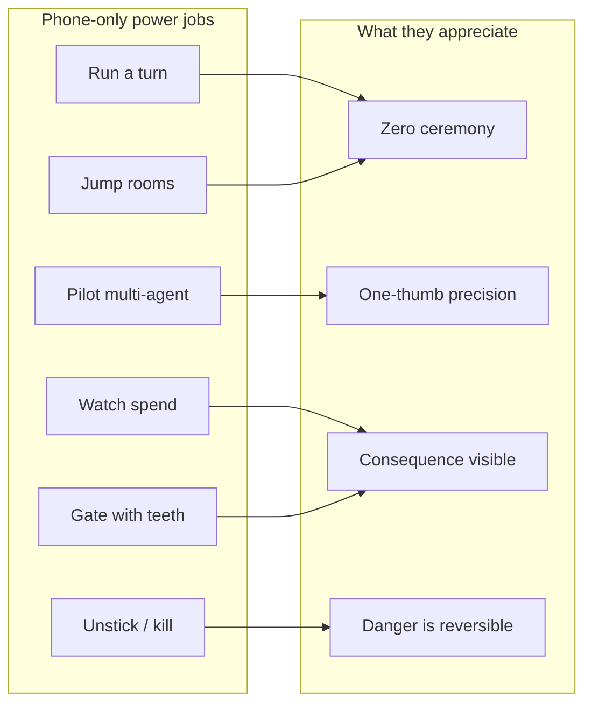
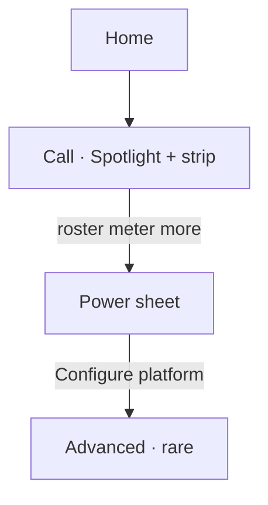

# Mobile / iOS · phone-only power users

**Status.** Product / UX architecture (power audience).  
**Companion.** [FEATURES.md](FEATURES.md) = mainstream phone jobs. **This file** = people who *live* on the phone and still want real control.  
**Parent.** [README.md](README.md).  
**Operator depth.** [21-operator-experience](../../research/21-operator-experience.md).

## Who this is

Not “desk power user checking Slack.” These people:

- Run agents from a phone as the **primary** surface (commute, couch, travel, no laptop ritual)
- Already understand Drive (rooms, Spotlight, gates, interrupt)
- Will abandon the product if mobile feels like a **toy watch-only** client
- Still won’t tolerate desktop Hub IA stuffed into 390pt

They want **operator density**, not more destinations.

## How they differ from FEATURES.md

| Mainstream phone ([FEATURES](FEATURES.md)) | Phone-only power |
|---|---|
| 15–90s glance | 3–20 min steer sessions are normal |
| One Live card | Several rooms / agents in flight |
| Allow/Deny is enough | Want diff depth, scope, blast radius |
| Hold-to-talk is the verb | Voice **plus** addressable text + packs |
| Hide Advanced | Progressive **power sheet**, not a second app |
| “Blocked on you” badge | Stop-one-worker, redirect, spend cap |
| Trust via honesty chip | Trust via instruments (cost, model, context) |

Shared non-negotiables: full-bleed Spotlight, leave-without-loss, muted-safe defaults, no fake Live.

## What they would actually want

### Tier P1 — Without these, they leave for desktop

| Feature | Why a phone-only power user cares | Interaction |
|---|---|---|
| **Task-line roster** | Presence is useless; they need *what each agent is doing* + elapsed | Sheet from strip; each row = task + state + stop |
| **Stop one / redirect one** | Count badge `3` is an insult when spend is real | Swipe or long-press row → Stop · Redirect · Focus |
| **Session spend + burn** | They are buying autonomy; blind spend is anxiety | Compact meter on strip or pull-up; tap → cost sheet (tokens, USD, model) |
| **Gate with blast radius** | Approve isn’t cosmetic — files, scope, reversible? | Sheet: diff peek + “touches N files” + Allow / Deny / Allow once |
| **Address before send** | Multi-agent rooms need @agent / pack without desk chips | Hold opens talk; long-press Hold or composer chip sets address set |
| **Raise hand + steer continuity** | Real pilots interrupt mid-flight often | Warm finish; auto-focus composer/voice after pause |
| **Room switcher (fast)** | Multiple Live rooms; Home with one hero is too consumer | Home: Live stack (2–3) or swipe between rooms; search later |
| **Composer always reachable** | STT fails in wind/crowd; power users type | Strip: Hold primary, text secondary one tap; not buried in Chat only |

### Tier P2 — Makes phone feel like a real cockpit

| Feature | Why | Interaction |
|---|---|---|
| **Predict next action** | Operator ladder: Predict before Control | NOW/NEXT line under Spotlight with “about to…” |
| **Context / compaction warning** | Silent rewrite loses trust | Banner when compaction imminent; not a settings page |
| **Files touched this session** | Review without laptop | Sheet list → tap file → diff peek |
| **Model per agent (read + switch lite)** | Power users change models under load | Roster row overflow → model picker (short list), not full catalog |
| **Spawn / pack drop** | Seat a pack without Hub | “Add pack” in room sheet; governance caps still apply (ADR-0023) |
| **Handoff + resume bookmark** | Leave and return mid-strategy | Recent shows resume point; deep link to same Spotlight beat |
| **Blocked / done push (strict)** | Phone-only means they aren’t staring | Only `blocked on you`, `spend cap`, `session done` — never every tool |
| **Mute TTS independently** | Public spaces; keep mic semantics | Mic ≠ agent voice (already product-correct; expose clearly on phone) |

### Tier P3 — Delight / leverage for elites

| Feature | Note |
|---|---|
| Shareable beat clip | Still useful; power users share with teammates |
| Live Activity / lock-screen (native later) | Glance spend + blocked without opening app — MC6 only |
| External keyboard shortcuts | iPad / paired keyboard; map desk hotkeys sparsely |
| Widget: “Needs you” count | Habit surface after PWA/native |
| Voice “wake” | YAGNI until hold/tap proven; privacy + false triggers |

### Explicit non-wants (even for power users on phone)

| Still no | Reason |
|---|---|
| Full 34-facet settings matrix | Configuration is desk work; expose **five** lethal controls max |
| MCP / plugins / hooks browsers | Authoring surface ≠ pilot surface |
| Analytics dashboards | Prove on desk; phone gets spend + done |
| Pixel WebRTC stage | Wrong cost/fragility for agent work |
| Social stranger feed | Not the wedge |
| Hiding instruments to “look simple” | Power users feel condescended; use progressive disclosure instead |

## Progressive disclosure architecture

One shell. Two depths. No second codebase.

| Layer | Contains |
|---|---|
| **Default** | Live stack, Join, Spotlight, Hold, CC, Leave, Approval |
| **Power sheet** | Roster task lines, stop/redirect, spend, files touched, address, packs, model lite |
| **Advanced** | Providers, MCP, facets, Analytics — warn “better on desk” |

Consumer path never opens Power sheet automatically. Power users find it once (⋯ or swipe-up) and it sticks as preference (`powerChrome: expanded` local).

## Session shape (phone-only)

1. Open → Live stack (not marketing splash if already installed)  
2. Tap room → Spotlight already mid-turn  
3. Read task lines / spend in &lt;2s  
4. Gate or steer (voice/text + address)  
5. Kill one worker if runaway  
6. Leave; room continues; push only if blocked  

Success metric (qualitative): *“I didn’t need my laptop for this turn.”*

## Tension to resolve (owner)

| Tension | Options |
|---|---|
| Consumer Home = one hero vs power Home = Live stack | **Recommend:** installed/returning users get Live stack; first-open / Preview keeps one-hero teaching |
| Cost on strip vs clean chrome | Meter as **optional pill**; default on for `powerChrome`, off for consumer |
| Model switch on phone | Shortlist only; full catalog desk |
| Push | Opt-in; three event classes max |

## Ship packs (power overlay)

Builds on FEATURES packs; does not replace Glance/Decide/Speak.

| Pack | Adds for phone-only power |
|---|---|
| **Glance+** | Live stack (2–3), blocked badge, spend pill |
| **Pilot** | Task-line roster, stop/redirect, address chips |
| **Gate+** | Blast radius + files touched on approval |
| **Predict** | NOW/NEXT consequence line; compaction warn |
| **Alert** | Strict push classes (hosted/runtime dependent) |

## Hand back

Phone-only power users want a **cockpit**, not a spectator app and not a shrunken Hub. Give them consequence (spend, task lines, stop-one, gate depth) inside sheets — keep Spotlight sacred. Mainstream FEATURES Tier 1 stays the default skin; power is one swipe away, remembered.
