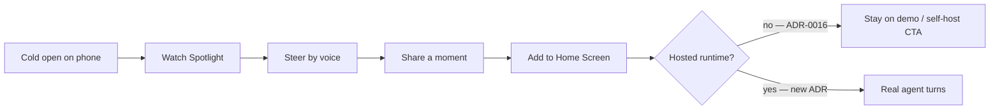

# mobile-consumer · Drive as a phone-first product for less-technical users

**Status:** plan (opened 2026-08-05)  
**Audience shift:** from “developer installs a local hub” → “anyone with a phone joins a call with an agent and *watches work happen*”  
**Ambition:** TikTok-grade motion, pacing, and zero-friction first open — applied to **drive coding**, not a clone of a For You feed  
**Related:** [drive-web](../drive-web/), [hosted-preview](../hosted-preview/), [00-vision](../../foundation/00-vision.md), [ADR-0016](../../adr/ADR-0016-distribution-and-positioning.md), [ADR-0021](../../adr/ADR-0021-drive-credential-onboarding.md), [ux-quality](../ux-quality/)

## Why this exists

The technical hub (20+ nav destinations, providers, MCP, facets) wins power users.
The market that is *orders of magnitude larger* is people who will never open a
terminal: founders, PMs, designers, students, operators who want something built
while they watch and steer in plain language.

That product is still Drive — Spotlight, interrupt, leave-without-loss — but the
**shell and first five seconds** must feel like a consumer app, not a dashboard.

“TikTok-level” here means:

| Steal from consumer apps | Map onto Drive |
|---|---|
| Instant open, no ceremony | Tap → already in a call / demo call |
| Vertical primary surface | Spotlight fills the phone; chrome is a thin strip |
| Voice / gesture over forms | Hold-to-talk default; text secondary |
| Continuous “something is happening” | Dead-air design as first-class (activity line, earcons) |
| Shareable moment | 15–30s clip of a Spotlight beat (later) |
| Install in one gesture | PWA “Add to Home Screen” before native stores |

It does **not** mean an infinite scroll of stranger content. Drive’s wedge stays
**event-sourced shared work you steer** ([ADR-0016](../../adr/ADR-0016-distribution-and-positioning.md) wedge).

## The hard fork (owner decision)

[ADR-0016](../../adr/ADR-0016-distribution-and-positioning.md) locked beta as
**public self-hosted**: clone, run a local hub, no multi-tenant hosted service.
[hosted-preview](../hosted-preview/) tiers 1–3 are pages; **tier 4 (hosted hub)
contradicts ADR-0016**.

A less-technical mass market **cannot** start with `git clone` + API keys.

| Path | Who it serves | ADR-0016 |
|---|---|---|
| **M — Mobile shell on tiers 1–3** | Anyone with a phone; credential-free watch / guided tour | Compatible today |
| **H — Hosted runtime (tier 4+)** | Real agent turns for people without a daemon | **Requires superseding or amending ADR-0016** + ADR-0021 credential story |

**Recommendation:** ship **M** hard (acquire and prove delight), draft the ADR
amendment for **H** in parallel, do not pretend a mock transport is a finished
consumer product.



## Product shape (mobile)

One composition. First viewport = brand + one verb + Spotlight. No nav rail of
Settings / MCP / Analytics.

```text
┌─────────────────────┐
│ Drive          Live │
│                     │
│    SPOTLIGHT        │  ← full-bleed work surface
│    (agent share)    │
│                     │
│  captions / NOW     │
│                     │
│  [hold to talk]     │  ← primary input
│  🎙 ✋  Leave        │  ← 44px strip + safe area
└─────────────────────┘
```

Collapsible rail (roster/feed) stays available for power moves — default
**closed** on phone (narrow call IA from the ux-quality stack). Consumer mode
never surfaces hub Door-B settings that no-op.

Wireframe: [mobile-drive-app.html](../../../../design/wireframes/mobile-drive-app.html) (first-open beats).  
**Full surface map:** [mobile-drive-surfaces.html](../../../../design/wireframes/mobile-drive-surfaces.html) — every consumer + advanced page, portrait & landscape, three phone sizes.  
**Modern light / iOS:** [mobile-drive-ios.html](../../../../design/wireframes/mobile-drive-ios.html) — **2026 frontier shell**: full-bleed Spotlight, liquid-glass chrome, light-first brand (toggle dark); Open / Home / Call / Approval / Settings. Assets: [mobile-drive-ios-light.png](../../../../assets/hub/mobile-drive-ios-light.png), [mobile-drive-ios-dark.png](../../../../assets/hub/mobile-drive-ios-dark.png).  
**Presenter demo:** [mobile-drive-ios-demo.html](../../../../design/wireframes/mobile-drive-ios-demo.html) — single-phone autoplay / click-through of the full consumer loop.  
**Branding / styling locks:** [MOBILE-BRAND-STYLING.md](../../../../design/brand/MOBILE-BRAND-STYLING.md) — light-first token sheet; liquid glass + Spotlight plane locks; retire amber Live; iOS wireframe is visual SoT.  
**Native SwiftUI (on-device):** [`apps/drive-ios`](../../../../../../apps/drive-ios/) — Open / Home / Call / Approval / Settings fixtures.  
**Cross-device backlog:** [multi-device](../multi-device/) + skill `multi-device-backlog`.  
**Capability / UX gaps → fill plan:** [GAPS.md](GAPS.md) — demo vs inventory vs product; voice / interrupt / PWA / hosted packs.  
**Features users want:** [FEATURES.md](FEATURES.md) — jobs (glance / decide / speak / join / return); Tier 1–4 priority; interaction architecture.  
**Phone-only power users:** [POWER-USERS.md](POWER-USERS.md) — operator cockpit on phone (task lines, spend, stop-one, Live stack); progressive power sheet.  
**Power roadmap:** [ROADMAP.md](ROADMAP.md) · design [mobile-drive-power.html](../../../../design/wireframes/mobile-drive-power.html) (PU0–PU2 shipping).

## Surface inventory (mobile app)

Primary chrome is call-first. Hub power destinations are not deleted — they sit
under **Advanced** so the less-technical home stays one composition.

| Tier | Surfaces |
|---|---|
| **Core loop** | Press play, Home/lobby, Live call, Call+rail, Captions, Raise hand, Stuck recovery, Approval gate, Leave/handoff, Session history, PWA install |
| **Browse** | Rooms, Tasks, Artifacts, Agents, Agent profile, Status (board / changelog / dep-map simplified) |
| **Settings** | Settings home, Voice & devices, Providers/sign-in, Advanced hub (Analytics, Models, MCP, Plugins, Skills, Rules, Hooks, Tools, Channels, Schedules, Account) |

**Layouts.** Portrait = vertical Spotlight + bottom strip. Landscape = Spotlight
column + controls column (hold-to-talk / rail / strip). Compact 360×640,
standard 390×844, large 430×932 — switch live in the surfaces wireframe.

## What we build (phased)

No calendar estimates. Gates only. Prefer reuse of drive-web / hub webview over
a third app.

### Phase MC0 · Audience + honesty contract

**Goal.** Name who this is for; ban lying chrome on the consumer path.

**Changes.** This README; HANDOFF pointer; wireframe. Explicit “preview / demo”
marker on credential-free phone opens ([22-default-posture](../../research/22-default-posture.md)).

**Gate.** A stranger reading the wireframe can say what the app does in one
sentence. Docs gate green.

### Phase MC1 · Vertical call shell (real webview)

**Goal.** Phone-first layout of the *same* Drive call loop — not a marketing
page with a GIF.

**Changes.** Consume [drive-web](../drive-web/) browser host + collapsible rail
work. Strip hub nav for a `?app=1` / mobile composition root: Home is Join /
Continue call only. Spotlight full-bleed; hold-to-talk primary; 44px strip.

**Gate.** Usable at 360×640 with one hand. Time-to-first-watch &lt; one viewport
of chrome. No Settings / MCP in the default chrome.

### Phase MC2 · Consumer first-open script

**Goal.** First open teaches the product without docs.

**Changes.** Guided tour overlay on real UI (drive-web phase 4 beats, shortened
for phone). Press-play; muted pacing; sticky captions. Instant join into a
fixture room — no providers screen.

**Gate.** Cold open on a phone browser: user sees agent work and can raise a
hand / speak (Web Speech) without creating an account.

### Phase MC3 · PWA install

**Goal.** “Add to Home Screen” feels like an app icon, not a browser tab.

**Changes.** Web manifest, icons, theme-color, standalone display. Mic
`Permissions-Policy` on `cline.drivemode.ai` ([hosted-preview](../hosted-preview/)).
No offline hub fantasy.

**Gate.** Install prompt path documented; standalone window runs the call shell;
mic policy verified.

### Phase MC4 · Delight loop (TikTok-grade pacing)

**Goal.** Waiting and success feel alive.

**Changes.** Dead-air activity line + stall earcon; approval earcon on; task-
complete off ([22-default-posture](../../research/22-default-posture.md)).
Motion on Spotlight card land / raise-hand. Optional shareable beat capture
(schema-backed, privacy-strict — no raw audio retention).

**Gate.** Fixture multi-tool turn never feels silent; raise-hand shows finishing
state; reduced-motion still readable.

### Phase MC5 · Hosted path decision (ADR)

**Goal.** Decide whether mass-market real agents are in scope.

**Changes.** Draft ADR amending or superseding ADR-0016 for a hosted / freemium
runtime; address ADR-0021 key broadcast. If rejected, MC stays demo + self-host
CTA forever and we stop promising “just open the app and build.”

**Gate.** Written owner accept/reject. No silent drift into tier 4.

### Phase MC6 · Native shells

**Goal.** Store presence and on-device iteration when PWA is not enough — or when
owners want a native SwiftUI client for development (this fork).

**Changes.** [`apps/drive-ios`](../../../../../../apps/drive-ios/) SwiftUI shell
(Open / Home / Call / Approval / Settings). Capacitor/RN remains an alternate
thin wrap around drive-web if preferred later. Track parity via
[multi-device](../multi-device/).

**Gate.** On-device smoke of Tier 1 jobs; MATRIX rows for ios move `wip`→`done`
as hub adapters land. Android stays YAGNI until ios+pwa Tier 1 green.

## Explicit non-goals (this initiative)

- Replacing the desktop hub power surface (keeps existing IA for power users)
- Multi-human TikTok Live rooms (still a non-goal under current ADR-0016)
- Pixel screen share as the agent stage
- Building a second protocol or second agent registry
- Shipping native **instead of** PWA proof as the only path (PWA remains MC3;
  SwiftUI `apps/drive-ios` is for on-device iteration + store-later, tracked in
  [multi-device](../multi-device/))

## Relationship to ux-quality / drive-web

| Track | Job |
|---|---|
| [ux-quality](../ux-quality/) | Raise award bar on **existing** hub surfaces (honesty, layout, a11y) |
| [drive-web](../drive-web/) | Same webview on a conformant browser host |
| [hosted-preview](../hosted-preview/) | Publish tiers 1–3 at `cline.drivemode.ai` |
| **mobile-consumer** | **New composition + audience** — phone-first consumer shell, PWA, hosted ADR fork |

ux-quality phases 0–2 remain prerequisites for MC1 (honest states, stage budget,
collapsible rail). MC does not invent a parallel layout system.

## Open decisions (owner)

1. **Amend ADR-0016 for a hosted consumer path?** Recommended: draft yes for
   MC5; ship MC0–MC4 without waiting.
2. **Default voice on first open?** Mic muted (safe) + one-tap “tap to talk”
   teaching, or hold-to-talk hot from beat one with a clear mute?
3. **Brand name on the home screen icon** — “Drive” alone vs “Cline Drive”?
4. **Freemium model for hosted turns** (if H) — included tokens vs BYOK after
   demo. BYOK alone will not convert this audience.
5. **Force MC3 (PWA) onto the roadmap now?** Recommended: yes — install is the
   consumer product, not an optional phase 8.

## Hand back

Mobile consumer is a **shell and distribution** problem first, then a hosted-
runtime ADR. Reuse the Drive call loop; hide the hub. Prove delight on phone
with a credential-free watch path before App Store / Play Store.

Next concrete build after this plan: **MC1** on top of drive-web + collapsible
rail — `?app=1` composition root with vertical Spotlight. Apply
[MOBILE-BRAND-STYLING.md](../../../../design/brand/MOBILE-BRAND-STYLING.md)
before restyling app/surfaces wireframes (green Live, light default). Gap
priority and capability packs: [GAPS.md](GAPS.md).
