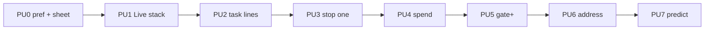

# Power users · roadmap & feature list

**Status.** Delivery roadmap (design + implementation).  
**Audience thesis.** [POWER-USERS.md](POWER-USERS.md)  
**Mainstream phone.** [FEATURES.md](FEATURES.md)  
**Coverage gaps.** [GAPS.md](GAPS.md)  
**Design.** [mobile-drive-power.html](../../../../design/wireframes/mobile-drive-power.html)

## Principle

One shell. Consumer default. **Power sheet** for pilots who live on phone.  
Do not ship a second Hub. Do not wait for hosted ADR to start cockpit density.

## Feature list (build order)

| ID | Feature | Design | Impl surface | Gate |
|---|---|---|---|---|
| **PU0** | Power chrome pref + power sheet shell | Wireframe sheet | `drive-power-chrome.ts`, `DrivePowerSheet`, strip open | Pref persists; sheet lists roster without stealing Spotlight |
| **PU1** | Live stack on Drive home | Wireframe Home | `DriveLiveStack` + `DriveView` + `roomsSource` | ≤3 live rooms; Open joins; empty = hide |
| **PU2** | Task-line roster | Wireframe roster rows | `rosterTaskLine` + `Roster` | Working agent shows `nowTitle`; no title = status only |
| **PU3** | Stop / redirect one worker | Sheet row actions | Wire to fork retain/stop ops + roster sheet | One thumb stop; Leave ≠ End |
| **PU4** | Session spend pill | Strip pill | Call strip + session usage fold | Shows $ / tokens when known; hidden when unknown (honest) |
| **PU5** | Gate blast radius | Approval sheet+ | `GateFeedCard` / pending panel | Diff peek + files touched + Allow once |
| **PU6** | Address before send (visible) | Composer chips | Persistent address chip + long-press Hold | Current `addressSet` always visible in call |
| **PU7** | Predict / compaction warn | NOW line | `NowNext` + compaction banner | “About to…” before act; warn before rewrite |
| **PU8** | Files touched sheet | Power sheet tab | Stage/card projection | List → diff peek |
| **PU9** | Model lite switch | Roster overflow | Shortlist picker | Not full catalog |
| **PU10** | Strict push classes | — | Hosted/runtime dependent | blocked / spend cap / done only |
| **PU11** | Live Activity / widget | Native | MC6 only | YAGNI until PWA habit proven |

## This PR ships

| ID | What |
|---|---|
| Docs | This roadmap; POWER-USERS link |
| Design | `mobile-drive-power.html` — Home Live stack, call + power sheet, gate+ |
| **PU0** | Pref + `DrivePowerSheet` + strip control |
| **PU1** | `DriveLiveStack` on Drive lobby |
| **PU2** | Roster task line from bank `nowTitle` |

PU3+ stay sequenced here; implement in follow-up PRs (stacked).

## Non-goals (roadmap)

- Full Advanced hub on phone  
- Spend UI that invents numbers when usage is unknown  
- Native shells before PWA (MC3)  
- Replacing consumer FEATURES Tier 1 default

## Hand back

Next stacked PR after this lands: **PU3 stop-one** + **PU4 spend** (needs honest usage plumbing into call session).
