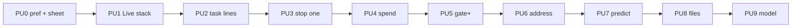

# Power users · roadmap & feature list

**Status.** Delivery roadmap (design + implementation).  
**Audience thesis.** [POWER-USERS.md](POWER-USERS.md)  
**Mainstream phone.** [FEATURES.md](FEATURES.md)  
**Coverage gaps.** [GAPS.md](GAPS.md)  
**Design.** [mobile-drive-power.html](../../../../design/wireframes/mobile-drive-power.html)

## Principle

One shell. Consumer default. **Power sheet** for pilots who live on phone.  
Do not ship a second Hub. Do not wait for hosted ADR to start cockpit density.

## Feature list (build order)

| ID | Feature | Design | Impl surface | Gate |
|---|---|---|---|---|
| **PU0** | Power chrome pref + power sheet shell | Wireframe sheet | `drive-power-chrome.ts`, `DrivePowerSheet`, strip open | Pref persists; sheet lists roster without stealing Spotlight |
| **PU1** | Live stack on Drive home | Wireframe Home | `DriveLiveStack` + `DriveView` + `roomsSource` | ≤3 live rooms; Open joins; empty = hide |
| **PU2** | Task-line roster | Wireframe roster rows | `rosterTaskLine` + `Roster` | Working agent shows `nowTitle`; no title = status only |
| **PU3** | Stop / redirect one worker | Sheet row actions | `drive.fork.cancel` + power sheet Stop | One thumb stop; Leave ≠ End |
| **PU4** | Session spend pill | Strip pill | `callSpend` fold on `turn_done` | Shows $ / tokens when known; hidden when unknown (honest) |
| **PU5** | Gate blast radius | Approval sheet+ | `gatePaths` + `GateFeedCard` Once | Path chips when parseable; Approve → Once label |
| **PU6** | Address before send (visible) | Composer chips | `addressSet` on UI + `DriveAddressChip` | Current address always visible in call |
| **PU7** | Predict / compaction warn | NOW line | `NowNext` “about to” + power Now/About to | nextTitle labeled; compaction warn **deferred** (no hub event) |
| **PU8** | Files touched sheet | Power sheet tab | `stageCards` edit category | List edit cards; empty when none |
| **PU9** | Model lite switch | Roster overflow | Power Model tab shortlist | `provider:model` from last-used + current |
| **PU10** | Strict push classes | — | Hosted/runtime dependent | **Blocked** until hosted path (MC5) |
| **PU11** | Live Activity / widget | Native | MC6 only | **YAGNI** until PWA habit proven |

## Shipped in hub

| ID | What |
|---|---|
| **PU0–PU2** | Pref, Live stack, roster task lines |
| **PU3** | `drive.fork.cancel` webview + Stop on matching / orphan workers |
| **PU4** | Call spend accumulator + strip pill + sheet (honest empty) |
| **PU5** | Blast-radius path chips; primary gate action labeled **Once** |
| **PU6** | `addressSet` mirrored from room snapshot; persistent To chip |
| **PU7** | “About to” label on next task (compaction warn deferred) |
| **PU8** | Files tab from Spotlight edit cards |
| **PU9** | Model shortlist tab in power sheet |

## Deferred / YAGNI

| ID | Why |
|---|---|
| **PU7 compaction banner** | No hub webview compaction event yet (settings-only today) |
| **PU3 redirect** | No dedicated redirect op — address chip + stop cover the job |
| **PU10** | Needs hosted runtime + push channel (MC5) |
| **PU11** | Native / Live Activity after PWA proof (MC6) |

## Non-goals (roadmap)

- Full Advanced hub on phone  
- Spend UI that invents numbers when usage is unknown  
- Native shells before PWA (MC3)  
- Replacing consumer FEATURES Tier 1 default

## Hand back

Power cockpit PU0–PU9 are in the hub webview. Next product work: wire **hosted push** (PU10) only after MC5 ADR; keep deepening gate path extraction if tool inputs gain structured file lists.
