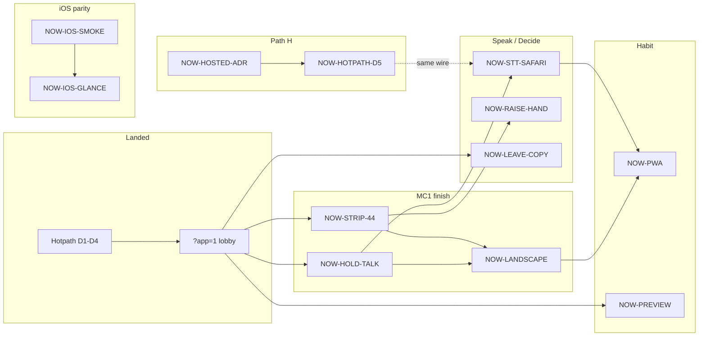

# portfolio-now · remaining work as a DrivePlan

**Status:** active (bootstrap)  
**Why:** Dogfood Drive’s own bank / Status dependency map / multi-device backlog
instead of a second spreadsheet. This file is the **Now** sequencer; the demo
fixture mirrors it under `?demoPlans=1`.

**Related:** [mobile-consumer](../mobile-consumer/), [multi-device](../multi-device/),
[drive-hotpath](../drive-hotpath/), [adlc-drive-factory](../adlc-drive-factory/),
[ux-quality](../ux-quality/), [ADR-0000 status board](../../adr/ADR-0000-status-board.md)

## How to dogfood

```bash
# Status Hub dependency map — Now plan is the last rail group
bun run --cwd apps/cline-hub dev
# open printed URL → /status?demoPlans=1&statusMode=dependency-map

# Consumer call shell
# open printed URL → /drive?app=1
```

| Surface | What you see |
|---|---|
| Status `?demoPlans=1` | Plan **P006 · Now · consumer path** with NOW-* tasks + edges |
| Multi-device BACKLOG / MATRIX | Device parity for the same jobs |
| This README | Owner gates, YAGNI, and the prose contract |
| DriveKanban (optional) | `bun scripts/seed-drive-kanban.mjs` still seeds historic TASK-GRAPH; Now cards stay here until Interop ADR-0019 hosts write them |

## Done on the hotpath PR track (context, not Now)

Slices **1–4** of [drive-hotpath](../drive-hotpath/) / [ADR-0029](../../adr/ADR-0029-room-hotpath-redesign.md):
fold checkpoint, delta publish, in-process stage projector, layout sheets +
`?app=1` Join/Continue lobby. **Slice 5** (cloud signaling) is **unblocked** —
path H accepted ([DEC-mobile-consumer-owner](../../decisions/DEC-mobile-consumer-owner.md));
keep it behind MC1 call verbs unless a real-turn demo forces it.

## Dependency map (Now)



Caption:

- Solid edges = preferred build order (MC1 verbs before hosted ops).
- Path H owner gate is **closed** (accepted); D5 is engineering.
- iOS glance (B02) can proceed in parallel with MC1 finish; it does not block PWA.
- PWA display name: **Cline Drive**. Mic default: **muted** (enable via strip).

## Now plan (DrivePlan shape)

Status vocabulary matches multi-device: `done` · `wip` · `todo` · `blocked` · `yagni`.

| Task id | Title | Status | Depends on | Gate / note |
|---|---|---|---|---|
| NOW-APP-SHELL | `?app=1` nav strip + Join/Continue lobby | **done** | — | Hotpath D4 + MC1 partial |
| NOW-SHEETS | Plan / audit / captions as strip sheets | **done** | NOW-APP-SHELL | Hotpath D4 residual |
| NOW-HOLD-TALK | Hold-to-talk primary on `?app=1` call | **done** | NOW-APP-SHELL | 52px press-hold; temp-unmute for utterance; desk mic/composer demoted |
| NOW-STRIP-44 | 44px call strip + one-hand reach | **done** | NOW-APP-SHELL | App strip: mic · hand · CC · Leave (`size-11`) |
| NOW-LANDSCAPE | Landscape call shell usable | todo | NOW-HOLD-TALK, NOW-STRIP-44 | Surfaces HTML models it; webview unproven |
| NOW-RAISE-HAND | Raise-hand finishing chrome on phone | todo | NOW-STRIP-44 | F06; strip already has control on hub |
| NOW-LEAVE-COPY | Leave-without-loss copy (not End) | todo | NOW-APP-SHELL | F07 / F14 |
| NOW-STT-SAFARI | Hold-to-talk + STT on Safari / iOS | todo | NOW-HOLD-TALK | B04; Permissions-Policy on hosted |
| NOW-PREVIEW | Preview honesty chip contract all devices | todo | NOW-APP-SHELL | B05 / F08 |
| NOW-IOS-SMOKE | SwiftUI Open→Home→Call→Approval→Settings smoke | wip | — | B01 `apps/drive-ios` |
| NOW-IOS-GLANCE | iOS fixtures read hub room snapshot (glance) | todo | NOW-IOS-SMOKE | B02 |
| NOW-PWA | Web manifest + standalone + mic policy | todo | NOW-LANDSCAPE, NOW-STT-SAFARI | MC3 / B03 remainder |
| NOW-FIRST-OPEN | Credential-free first-open → fixture room | todo | NOW-HOLD-TALK, NOW-PREVIEW | MC2 |
| NOW-HOSTED-ADR | Owner accept ADR-0016 path H | **done** | — | [DEC-mobile-consumer-owner](../../decisions/DEC-mobile-consumer-owner.md) |
| NOW-HOTPATH-D5 | Cloud signaling (same wire, hosted writer) | todo | NOW-HOSTED-ADR | Prefer after NOW-HOLD-TALK / NOW-STRIP-44 |

## Broader portfolio (not Now — still open)

These are real gaps. They stay **out of the Now sequencer** so agents do not
thrash. Pull a row into Now only when it unblocks a consumer job.

### ADLC factory ([adlc-drive-factory](../adlc-drive-factory/))

| Phase | Work | Status |
|---|---|---|
| 2 | Credential onboarding banner | landed |
| 3 | First-call TTS enable (B2) | open |
| 4 | Voice facets via `drive_config_put` | open |
| 5 | Status→Drive stall offer bridge | open |
| 6 | Traces as product | open |
| 7 | Receipt ship atom on complete | open |

### Authority / evidence

| Track | What’s left |
|---|---|
| [ADR-0025](../../adr/ADR-0025-enforced-authority.md) | Finding 1 rows after E1 L1 |
| [ADR-0026](../../adr/ADR-0026-evidence-backed-done.md) | Full claim class + BACKLOG render |
| [ADR-0019](../../adr/ADR-0019-driveplan-kanban-interop-wire.md) | Thick Kanban/hub host adapters (managed execution, not board sync) |

### UX quality / drive-web

[ux-quality](../ux-quality/) phases over real webview + [hosted-preview](../hosted-preview/)
tiers 1–3. Brand align (green Live, light-first) before restyling demos —
[MOBILE-BRAND-STYLING](../../../../design/brand/MOBILE-BRAND-STYLING.md).

### Historic TASK-GRAPH DRV rows

Many Phase 1–4 `DRV-*` cards in the demo fixture are still `pending` /
`in_progress` relative to the original graph. Prefer **Now** for consumer
delivery; use historic DRV ids only when a Now task explicitly cites one.

## Owner decisions (closed 2026-08-07)

Canonical: [DEC-mobile-consumer-owner](../../decisions/DEC-mobile-consumer-owner.md).

| # | Answer | Effect |
|---|---|---|
| 1 | **Yes** — path H | NOW-HOSTED-ADR done; NOW-HOTPATH-D5 todo |
| 2 | **Default muted**; strip = enable-mic toggle | NOW-HOLD-TALK teaching assumes muted start |
| 3 | **Cline Drive** | NOW-PWA manifest `name` / `short_name` |
| 4 | **Yes** — force MC3 | NOW-PWA stays in Now |
| 5 | **Cline default (freemium)**; BYOK secondary | Hosted turns = Sign in with Cline; no Drive plan chrome |

Owner gates closed. Next build: **NOW-HOLD-TALK** + **NOW-STRIP-44**. D5
unblocked, sequenced after those unless a hosted demo pulls it forward.

## Explicit YAGNI (still)

- Android before ios + pwa Tier 1 green  
- Live Activities / App Store before PWA retention evidence  
- MCP as phone↔room bus  
- Pixel WebRTC stage / multi-human TikTok rooms  
- Offline hub on device  

## Hand back

1. Next consumer build: **NOW-LANDSCAPE** / **NOW-RAISE-HAND** / **NOW-LEAVE-COPY** (MC1 polish), or **NOW-PREVIEW**.  
2. Keep Status Hub open on `?demoPlans=1` while implementing — the map is the board.  
3. Schedule **NOW-HOTPATH-D5** after call verbs unless a hosted demo forces it earlier.  
4. After a Now task ships: flip status here, in [multi-device MATRIX](../multi-device/MATRIX.md), and in the demo fixture (same id).
