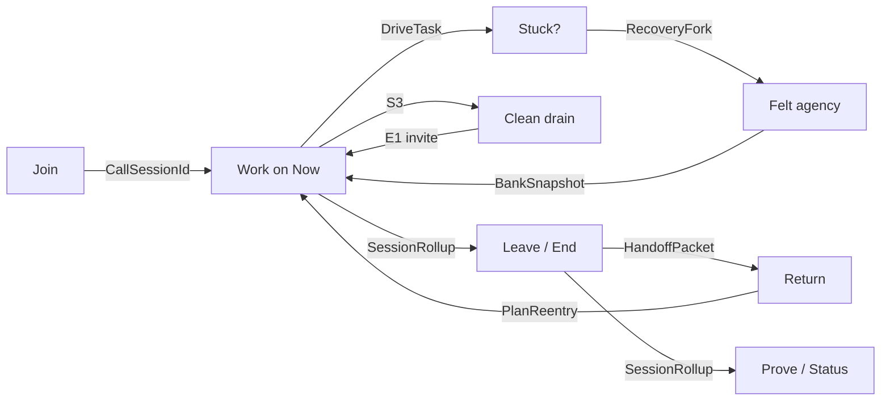

# Session satisfaction moments · Overview

**Status:** active (requirements / planning; build order in [REMAINING](../../delivery/REMAINING-task-satisfaction.md))  
**Depends on:** [task-satisfaction-observability](../task-satisfaction-observability/) slices 1–2 for honest signals; slice 3 for post-session improve (orthogonal to in-call recovery).

## Purpose

Observability answers *what happened*. These components answer *what the user experiences* when satisfaction is won or lost.

## Implementation status

| Wave | Status |
|---|---|
| W0 honesty (obs slice 1–2 kernel) | **Partial** — emit + rollup helper landed; hub webview bridge + UI open |
| W1–W4 product moments | **Not started** — reqs + DRVs written |
| Slice 3 / auto stall | **Not started** |

Track detail: [REMAINING-task-satisfaction.md](../../delivery/REMAINING-task-satisfaction.md).

## Session arc (product spine)

Caption:

- Stuck recovery and felt agency keep the *current* session alive.
- Clean-drain invites the next goal without surveys.
- Leave/end/return close the north-star loop (“would they start another?”).
- Status + digest make accomplishment legible outside the call chrome.

## Delivery waves (capability order)

| Wave | Components | Honesty gate |
|---|---|---|
| **W0** | Observability slice 1–2 | Events + rollups trustworthy |
| **W1** | Felt agency, Leave/End return, Stuck recovery (manual/`lastFailure`) | Bank ops for failure + complete |
| **W2** | Clean-drain ritual, Cross-day re-entry, Recruit-on-stall | S3/E1 + recruit index |
| **W3** | Status sessions lens, Shipped digest, SDLC→bank freeze | Product (not debug) Status |
| **W4** | Auto stall→fork (classifier), post-session plan-improve | Slice 3 |

## Non-goals (initiative-wide)

- Phone-home satisfaction telemetry
- Learned sole writer for Now/Next
- NPS / survey machinery
- First-class Goal entity

## Open leadership forks

See [visual-plan.md](visual-plan.md) § Decision forks and each `req-*.md` open questions.
