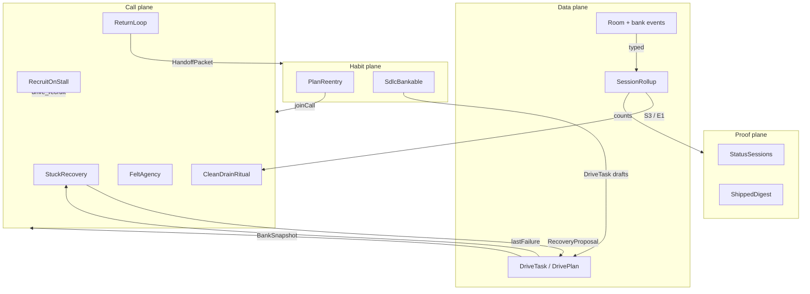
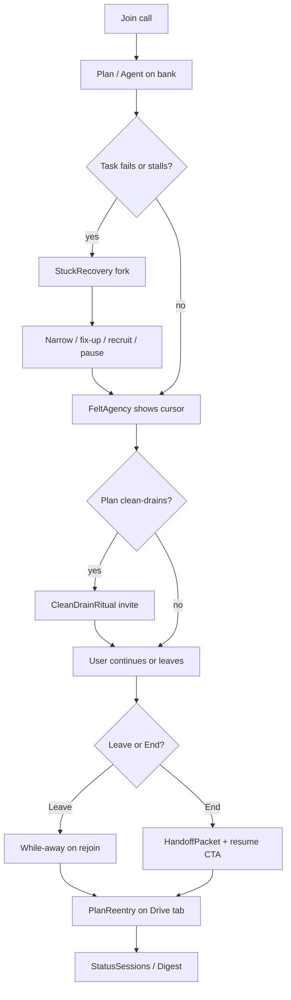
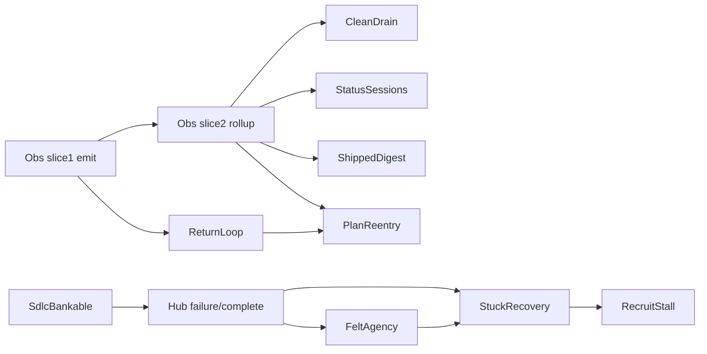
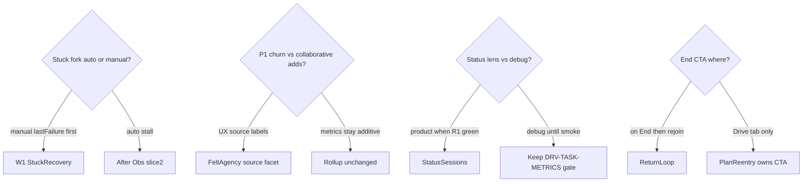
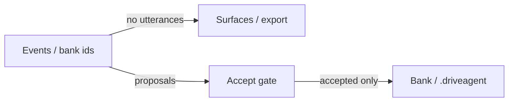

# Visual plan · Session satisfaction moments

**Grade.** Nest Tier A Mermaid — parse-validate before merge.  
**Canvas.** [session-satisfaction-moments-canvas.html](../../../../design/canvases/session-satisfaction-moments-canvas.html)  
**Initiative.** [README.md](README.md)

Diagram first. Captions carry only what diagrams cannot.

---

## 1. System map (components × planes)

Caption:

- Call plane keeps the live session satisfying.
- Habit plane brings users back across days / guided starts.
- Proof plane is local and opt-in — not phone-home analytics.
- Data plane is shared with observability initiative (same events/rollups).

---

## 2. Session arc (user journey)

Caption:

- Every diamond is a product moment with a named `req-*.md`.
- Metrics (S*/E*/P*) observe the same arc; they do not replace the moments.

---

## 3. Dependency DAG (build order)

Caption:

- Felt agency can start as UI projection once bank snapshots update.
- Auto stall→fork waits on rollups; manual `lastFailure` fork can ship earlier.
- Digest and Status share `SessionRollup`; do not duplicate stores.

---

## 4. Component matrix

| Component | User job | Primary signal | Surface | DRV |
|---|---|---|---|---|
| Stuck recovery | Unstick Now without abandoning Drive | `lastFailure` / stall | Spotlight fork + accept | DRV-STUCK-RECOVERY |
| Felt agency | See that my steer/edit mattered | cursor / plan-ref change | NowNext + Spotlight | DRV-FELT-AGENCY |
| Clean-drain ritual | Celebrate + optionally ask for more | S3 true | Narration / NowNext successor | DRV-CLEAN-DRAIN |
| Return loop | Leave safely; End with proof; resume | handoff + bank | Feed + End CTA | DRV-RETURN-LOOP |
| Plan re-entry | Pick up unfinished work next day | open count + last rollup | Drive tab row | DRV-PLAN-REENTRY |
| Status sessions | See accomplishment across sessions | S2/S3/E1 | Status lens | DRV-STATUS-SESSIONS |
| Shipped digest | Export what Drive shipped | rollup export | Opt-in export | DRV-SHIPPED-DIGEST |
| Recruit-on-stall | Get the right agent for a stuck task | stuck task → recruit | Task card + seat | DRV-RECRUIT-STALL |
| SDLC bankable | Guided work still counts as tasks | freeze → DriveTasks | Plan posture accept | amends DRV-SDLC-GUIDE |

---

## 5. Decision forks (resolve before freeze)

Caption:

- Recommended defaults: manual fork first; UX source labels + rollup still counts adds; product Status when R1 green; End shows packet + Drive tab owns cross-day CTA.

---

## 6. Privacy spine (all components)

Caption:

- Same rails as ADR-0004 / ADR-0015.
- Digest is the only user-triggered export path in MVP.

---

## Open questions (initiative)

1. Unified accept queue for recovery + learn + planning (`kind` tags)?
2. `pause plan` semantics (Ask override vs new status)?
3. Attribution `agentId` on `drive_task_completed` vs session correlation only?
4. Clean-drain ritual home: narration vs Spotlight vs NowNext successor?
5. Drive tab plan summary on list vs post-join only?

Detailed ACs live in each `req-*.md`. **Full remaining implementation checklist:** [REMAINING-task-satisfaction.md](../../delivery/REMAINING-task-satisfaction.md).
