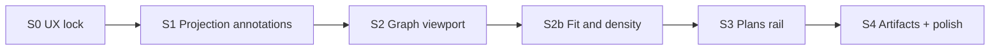

# status-dependency-graph · Delivery slices

Implements [DRV-DEP-MAP](../../features/DRV-DEP-MAP.md) against the [UX.md](UX.md) experience. No calendar estimates — slice by dependency and verifiable exit.

## S0 · UX lock (docs)

- Land DRV + initiative UX + HTML wireframe.
- Exit: `bun run check:drivecode-docs`; Mermaid validated; wireframe linked from design/wireframes README.

## S1 · Projection annotations

- Extend pure dependency projection with optional `planIds[]` per node, optional edge artifact labels keyed by `from → to`, and **progressive display IDs** (`T###` / `P###`) for tasks and plans.
- Keep team runtime untouched; annotations and IDs come from bank/demo adapters at the composition root (mint at create; view does not invent IDs from titles).
- Document / enforce the ID format from [UX.md](UX.md#progressive-ids-tasks-and-plans) when wiring bank create paths (align with DRV-TASK-BANK store if that lands first).
- Exit: `@cline/shared` tests for projection + ID fields; `bun run build:sdk`.

## S2 · Graph viewport + selection

- Replace card grid with layered graph in hub webview.
- Pan / zoom; click node → detail dock; preserve keyboard + live region.
- Exit: hub component tests for empty, select, integrity banner; manual smoke on `?demoPlans=1&statusMode=dependency-map`.

## S2b · Fit & density (all tasks on screen)

Implements the [UX fit ladder](UX.md#fit--density-all-tasks-on-screen-at-start):

1. **Fit camera** — first paint, `Fit`, and viewport resize frame every node (padding). Selection-aware Fit frames the selection set when non-empty.
2. **Viewport-fit gaps** — layer/row spacing derived from viewport size; do not ship fixed large gaps that only become usable after extreme scale-down.
3. **LOD** — hide edge labels and shorten titles below a readability zoom threshold; restore on zoom-in, hover, or selection.
4. **Adaptive orientation** — flip LR ↔ TD from graph vs viewport aspect when chips would otherwise be unreadably small.
5. **Escape hatch** — plan hulls and/or completed stacks only when the demo-scale graph still overflows after 1–4.

- Exit: unit tests for bbox fit + gap computation; hub smoke that the full demo fixture is inside the viewport after open and after `Fit`; wireframe matches the same rules.

## S3 · Plans rail

- Right rail lists plans with **`P###`**, colors, and titles; filter highlights members.
- Node plan accents wired to projection `planIds`; nodes show **`T###`** (prefer ID over title under overview LOD).
- Search / filter matches progressive ID prefixes.
- Exit: rail empty state + filter + ID label tests; screenshot refresh.

## S4 · Artifacts + polish

- Edge labels when annotation present (respect LOD from S2b); edge select in detail.
- Demo fixture supplies sample artifacts; production stays unlabeled until a real source exists.
- Responsive rail collapse; reduced-motion camera; DEMO.md + assets updated.
- Exit: DEMO runbook path works; a11y smoke (keyboard + alert + live region).
