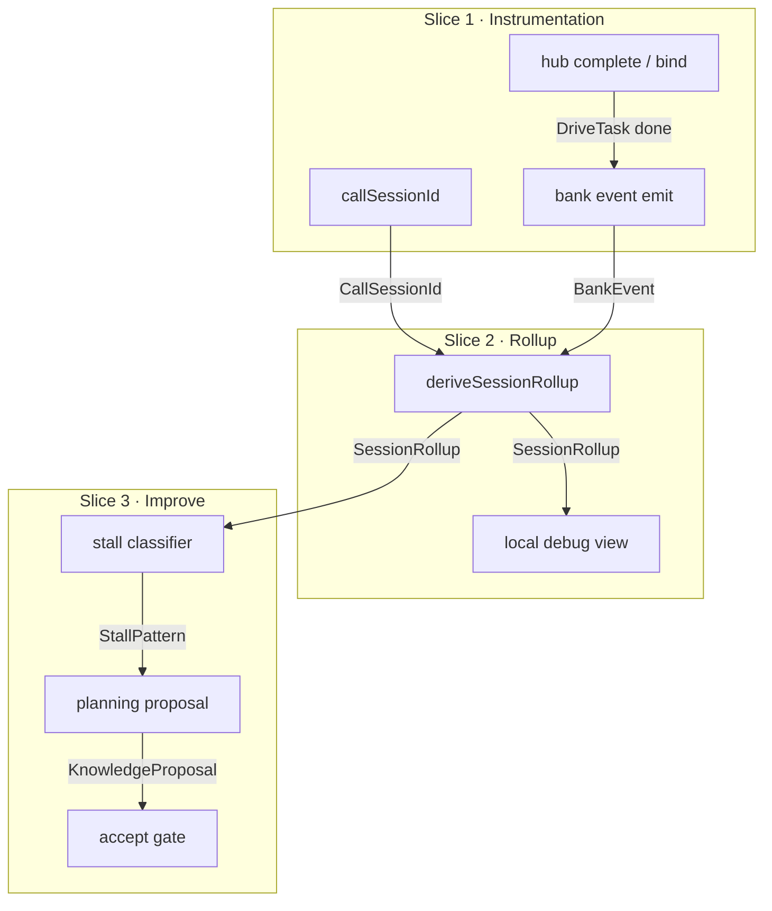

# Task satisfaction observability · Overview

**Status:** active (planning). Implementation blocked on bank emit / hub complete gaps tracked in [task-bank-drive-loop](../task-bank-drive-loop/).

## Purpose

Make Drive session health measurable in **tasks**, then actionable without violating privacy.

Caption:

- Slice 1 is the honesty gate for all later claims.
- Slice 2 never phones home.
- Slice 3 writes durable skills only after accept.

## Principles

- Tasks are the unit of measurement (ADR-0015 / research 16).
- Deterministic Now/Next cursor stays product truth.
- Post-success plan continuation is engagement, not failure churn.
- Same privacy spine as ADR-0004.

## Slice order

| Slice | Outcome | Primary DRV |
|---|---|---|
| [1 · Instrumentation](slice-1-instrumentation.md) | Correlated room + bank lifecycle stream | DRV-CALL-SESSION, DRV-TASK-BANK gaps |
| [2 · Local rollup](slice-2-local-session-rollup.md) | S*/E*/P* from events; debug UI | DRV-TASK-METRICS |
| [3 · Diagnose → gate](slice-3-diagnose-propose-gate.md) | Stall → proposal → accept | DRV-PLAN-IMPROVE |

## Out of scope

- Cloud satisfaction funnels
- Learned sole writer for next task
- Merging with phase-gate [prd-success-metrics](../../prd/prd-success-metrics.md)

## Success

Leadership can review a **local** smoke session rollup and decide whether Drive is helping users complete plans — and a stalled session can produce a gated planning proposal with evidence ids only.
