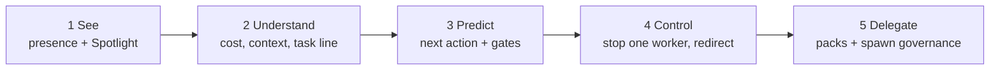
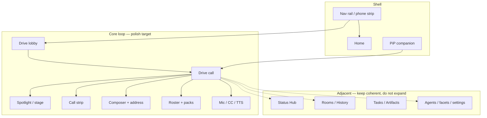
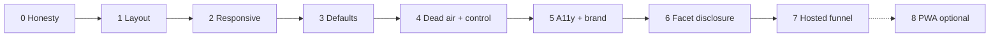

# ux-quality · Award-winning web + mobile experience backlog

**Status:** plan (opened 2026-08-05)  
**Surfaces:** hub webview (`apps/cline-hub/src/webview`) and the same code on a phone browser via [drive-web](../drive-web/README.md) + [hosted-preview](../hosted-preview/README.md)  
**Not:** a new product shell, a second demo canvas, or native iOS/Android apps  
**Baseline score:** [meta/reviews/2026-07-31-product-review.md](../../../../meta/reviews/2026-07-31-product-review.md) (~7/10 UX; a11y 6.5; first impression 6)

This initiative inventories every user-facing web/mobile surface, names the gaps between shipped hub UI and award-winning quality, and sequences work with acceptance gates. It prefers deletion and reuse over new systems. Implementation starts only when the owner accepts the open decisions below.

## Context

Drive is Discord-style pair-programming call rooms in Slack-like chrome. Vision locks instant join, interruptible partners, and private-by-default ([foundation/00-vision.md](../../foundation/00-vision.md)). Configuration is a 34-facet catalog with smart defaults and power-user depth ([foundation/06-platform-config.md](../../foundation/06-platform-config.md); catalog code under `sdk/packages/shared/src/drive/facets/`). Brand tokens live in [design/brand/CLINE-BRAND-TOKENS.md](../../../../design/brand/CLINE-BRAND-TOKENS.md). Defaults research is [research/22-default-posture.md](../../research/22-default-posture.md).

`drive-web` already chose the only sane prototype path. Ship the **real webview** on a conformant browser host ([ADR-0024](../../adr/ADR-0024-drive-web-runtime.md)), not a third layout that drifts from the product. Hosted preview is `cline.drivemode.ai` ([hosted-preview](../hosted-preview/README.md)), tiers 1–3 only. Tier 4 (hosted hub) stays out.

Default-posture shipping work is sequenced in [delivery/defaults-delivery.md](../../delivery/defaults-delivery.md) (tranches A–F). Operator gaps (meter, participant state, dead air, trust ladder) are in [research/21-operator-experience.md](../../research/21-operator-experience.md). This initiative is the **UX quality bar and surface map** that consumes those plans — it does not duplicate their task tables.

## What “award-winning” means here

Not more destinations. One composition that feels inevitable:

| Bar | Pass condition |
|---|---|
| **Intuitive** | First join needs no docs: muted mic teaches control; Spotlight answers “what is it doing”; raise-hand is obvious |
| **Beautiful** | Brand tokens + stage-as-monitor metaphor; chrome never wins the vertical budget fight |
| **Fast** | Stage ≥ 320 px at design floor; first paint on phone skips Mermaid; within-turn waiting has continuous activity |
| **Delight** | Actionable earcons only; interrupt/finish warmth; leave without loss; return moments |
| **Defaults → power** | Safe useful defaults for everyone; 34-facet catalog progressive-discloses for power users (06) |
| **Honest** | No silent fallbacks, no stub settings, no fabricated rooms (ADR-0024 §5) |

Trust ladder from operator research — each rung needs the one below:

MVP over-delivered **See** and reached for **Delegate**. Award UX closes **Understand → Control** on the call surface without stealing stage height (drawer/overlay, not a new chrome row).

## Surface map (core vs adjacent)

## Scope

**In**

- Inventory of hub routes and in-call chrome that exist or must exist for web + phone browser
- Interaction patterns per surface (join, steer, interrupt, settings, status, leave/end)
- Quality gaps (speed, delight, defaults, customization, a11y, mobile)
- BUILD / EXISTS / YAGNI triage, especially mobile-native
- Phased build order with acceptance gates (no calendar estimates)

**Out**

- Implementing the phases in this PR
- Native App Store / Play Store apps
- Hosted multi-tenant hub (ADR-0016 + hosted-preview tier 4)
- Inventing a second settings system beside the facet catalog
- Rewriting the demo canvas as the product (drive-web Reading A)

## Constraints

- Same React tree for desktop hub and phone browser. Responsive shell, not a fork.
- Hub remains the single writer of room truth. Web preview uses mock / memory host over existing wire shapes.
- Silent degradation is banned (ADR-0024 §5; 22-default-posture "looks fine and is lying").
- Privacy-strict defaults stay (no transcript/audio retention facets).
- Prefer existing initiatives over parallel UX tracks. This backlog sequences and gates them; it does not replace [session-satisfaction-moments](../session-satisfaction-moments/), [drive-web](../drive-web/), [drive-audio](../drive-audio/), or facet work in 06.

## Alternatives (pick one posture)

| Approach | Verdict |
|---|---|
| **A.** Polish `drive-product-demo.html`, then port look-and-feel | Rejected. Already cost a 370 px vs 9 px stage split ([drive-web](../drive-web/README.md)). |
| **B.** Raise the real webview to award quality; responsive = mobile | **Chosen.** One codebase, one layout contract, hosted preview inherits fixes. |
| **C.** Ship native mobile apps (Swift/Kotlin or RN/Capacitor) | YAGNI until a self-hosted phone browser loop fails real users. Mic + STT + call strip work in mobile Safari/Chrome first. |

## Surface inventory

Routes and chrome from `apps/cline-hub/src/webview/src/App.tsx` (`VIEW_PATHS`, nav groups) plus Drive call modules under `drive/`. Status = shipped code path today, not maturity marketing.

### Shell and navigation

| Surface | Path / home | Status | Primary interactions |
|---|---|---|---|
| App chrome + nav rail | `App.tsx`, `lib/nav-rail.ts` | Exists | Collapse/expand rail; navigate; focus rings; ≤720px rail becomes top strip |
| Brand home | `/` `HomeView` | Exists | Enter Drive / Chat; overview cards |
| PiP partner companion | `drive/PipPartner.tsx`, ADR-0006 | Exists | Mute, raise hand, leave, expand into Drive call |
| Credential onboarding banner | `drive/CredentialOnboardingBanner.tsx` | Exists | Dismissible first-run (22-default-posture: not blocking) |

### Drive core loop (must be award-grade)

| Surface | Path / home | Status | Primary interactions |
|---|---|---|---|
| Drive lobby | `/drive` lobby (`lib/drive-shell.ts`) | Exists | Pick/join room; see presence; open history |
| Drive call | `/drive?id=` call mode | Exists | Join; watch Spotlight; steer; interrupt; leave vs end |
| Drive history | `/drive?mode=history` | Exists | Re-enter past sessions / handoffs |
| Call strip | `drive/DriveCallChrome.tsx` | Exists | Mic, volume, share pin, mode, raise-hand chrome, leave |
| Room chrome | `drive/DriveRoomChrome.tsx` | Exists | Roster, narration banner, voice bar, strip dock, plan-improve gates |
| Spotlight / stage | `drive/Spotlight.tsx`, `StickyStagePane.tsx`, `ScreenArtifact.tsx` | Exists | Agent share cards; pin; contain-fit (still weak at some viewports) |
| Roster + packs | `drive/Roster.tsx`, `RosterPackLibrary.tsx`, `Recruit*` | Partial | Seat, pack add, recruit-on-stall |
| Participant sheet | `drive/ParticipantSheet.tsx` | Exists | Per-member detail |
| Chat / composer (call feed) | `Chat.tsx` (lazy from App) | Exists | Address, send, steer, raise-hand shortcut |
| Transcript / captions | `drive/voice/DriveTranscriptPanel.tsx` | Exists | Open CC; sticky preference still a known gap on demo path |
| Voice settings | `drive/voice/DriveSettingsPanel.tsx`, mic bar, devices | Exists | Mic muted default; TTS; earcons; hardware prefs |
| Stuck recovery | `drive/StuckRecoveryFork.tsx` | Exists | Narrow / fix / recruit / pause when stalled |
| Agency interrupt chrome | `drive/agencyChrome.ts` | Exists | "Finishing current step" after raise-hand |
| Agent directory / profile | `/agents`, `AgentDirectory.tsx`, `AgentProfilePage.tsx` | Exists | Appearance, policy, route suggest |
| Demo share route | `/drive?demoShareScreen=1` | Exists | Credential-free Spotlight demo (seed for drive-web) |

### Drive adjacent product surfaces

| Surface | Path / home | Status | Primary interactions |
|---|---|---|---|
| Rooms gallery | `/rooms` `rooms-view.tsx` | Exists | Open/restart room (join is restart) |
| Artifacts gallery | `/artifacts` `artifacts-view.tsx` | Exists (was "planned" in older demo badges) | Browse / filter artifacts |
| Tasks | `/tasks` `tasks-view.tsx` | Exists | Task bank / plan rows |
| Status Hub | `/status` `status-view.tsx` | Exists | Lenses `board` \| `changelog` \| `dependency-map` via `?statusMode=` |
| Analytics | `/analytics` `analytics-view.tsx` | Exists | Session rollups; deep-link to rooms |
| Marketplace | `/marketplace/*` → mcp/plugins/skills | Exists | Install customizations |
| Customizations | `/rules` `/hooks` `/mcp` `/plugins` `/skills` `/agents` `/tools` | Exists | Extensions view sections |
| Settings | `/settings/*` | Exists | General, Providers, MCP, Channels, Schedules, Account |
| Models | `/models` | Exists | Provider/model selection |
| Channels / Schedules / Account | matching paths | Exists | Hub connectors and account |

### Must exist for web + mobile quality (product, not necessarily new routes)

| Need | Why | Prefer reuse |
|---|---|---|
| Layout contract (stage vertical budget) | Gate failure: stage ~9 px at 1280×640 | drive-web phase 1; extract canvas rule into real CSS |
| Honest offline / no-hub states | Silent fallbacks lie | ADR-0024; hide Door-B settings that no-op (22-default-posture) |
| Responsive call shell | Phone is a first-class join target | drive-web phase 3; touch targets, safe areas, no-hover |
| Defaults that teach | Mic muted, TTS path, spend visible, earcon split | 22-default-posture; wire into Drive Settings + strip |
| Facet-backed settings IA | 34 facets, lanes durable/live/ephemeral | 06 + `sdk/.../facets`; do not add ad-hoc keys |
| Dead-air / within-turn waiting | Voice silence is corrosive | Existing stall stack + drive-audio; product review finding 9 |
| Funnel to hosted preview | Cold visitors never see the product | hosted-preview tiers 1–3; fix README CTA class of bugs |
| A11y floor on shipped tokens | `--dim` fails WCAG AA; muted pacing | index.css + sticky CC + reduced-motion without starving reading time |
| Leave / End / return moments | Satisfaction arc | session-satisfaction-moments (mostly landed); residual polish only |

### Explicit non-surfaces (YAGNI for this initiative)

- Native mobile apps (SwiftUI / Kotlin / RN / Capacitor shell)
- WebRTC multi-human media plane
- Pixel screen capture as default agent stage
- Separate "mobile UX" design system or component library
- New analytics product beyond `/analytics`
- Settings pages that stub hub commands on the credential-free preview

## Interaction patterns (core loop)

Map to vision qualities and shipped chrome. Gaps are where award quality fails.

| Pattern | User intent | Where it lives | Gap vs award quality |
|---|---|---|---|
| Instant join | Open room, already in | Lobby → Join call (`DriveCallChrome`) | Join plumbing still eats hero moments; hang on "Checking…" without demo flag |
| Watch | See partner work on Spotlight | `Spotlight`, stage cards | Vertical budget stolen by chrome; contain-fit incomplete; ultrawide void |
| Steer | Redirect without stopping | Composer, steer queue facet #16, Now/Next | Felt-agency moments exist; need always-visible cursor of control |
| Interrupt | Cheap pause, not yank | Raise hand → `agencyChrome` / `call_raise_hand` | Long tools need immediate "finishing…" + hard-cancel one press away (DRV-INTERRUPT) |
| Mute / speak | Control when heard | Mic default muted; captions | TTS off with unfinished enable path (22-default-posture); earcons not yet split |
| Gate / approve | High-impact consent | Plan improve / approval chrome | Facet #26 policy over existing approval plumbing |
| Stuck recover | Unstick without leaving | `StuckRecoveryFork` | Wire stall classifier into continuous dead-air UX |
| Leave vs End | Drop in/out vs close with handoff | Strip Leave; header End | Keep distinction obvious on narrow widths |
| Return | Cross-day re-entry | History, plan reentry, Status sessions | Residual from session-satisfaction-moments |
| Customize | Rename, ink, packs, power facets | Agent profile, RosterPack, settings | Facet UI incomplete vs 34-row catalog; progressive disclosure missing |
| Prove | What shipped | Status / Analytics / digest | Opt-in digest; avoid phone-home |

## Gaps (shipped hub → award-winning)

Grouped by the dimensions the task named. Cite evidence; prefer fixing root over adding chrome.

### Speed

- Stage vertical budget failure (drive-web measured ~9 px stage). Fix layout contract before micro-animations.
- Mermaid cost on phones (~1.5 MB). Lazy / tap-to-render below breakpoint (22-default-posture).
- Within-turn dead air. Reuse stall recovery; add continuous activity line + earcon on stall (product review #9).
- First paint on hosted preview. No Google Fonts CDN (review #9 security); subset WOFF2 inline.

### Delight

- Presence, warmth, pacing are product features (00-vision). Earcons only when actionable (join/leave + approval on; task-complete off).
- Wow beats (`walkthrough.animation`, approval sign-off, live CC) underserved vs demo promises (review #8). Sequence by demo-promise coverage, do not invent new wow systems.
- Brand tokens already specified. Align hub `index.css` with CLINE-BRAND-TOKENS; fix maturity vs live color collision (review medium UX).

### Defaults

- Apply 22-default-posture recommendations as the product opinion for users who never open settings.
- Open bets still owner-owned (fork depth 1, no spend cap, task-complete earcon off). See Open decisions.

### Customization

- Mechanism exists (facets). UI must progressive-disclose. Power facets behind Advanced; smart defaults on the call strip.
- Appearance + RosterPack are the identity wedge (06). Ship those before CLI parity facet #34.

### Accessibility

- Contrast. `--dim` fails AA on smallest text (review). Fix tokens in hub CSS so canvas and app inherit.
- Captions. Sticky user CC preference; two-line slots; muted pacing from word count (review #4–5).
- Reduced motion. Keep exemplary motion reduction; do not starve reading time.
- Touch. ≥44 px targets; safe-area insets; no hover-only controls (drive-web phase 3).
- Keyboard. Space must activate focused controls, not global playback hijack (review a11y medium).

### Mobile

- Same webview, responsive. `max-[720px]` rail already flips; call chrome does not yet meet phone join quality.
- PWA. Optional later if "Add to Home Screen" earns its keep after responsive call works. Not a phase 0.
- Native apps. YAGNI until responsive + mic permissions on `cline.drivemode.ai` prove insufficient.

## BUILD vs EXISTS vs YAGNI

| Item | Verdict | Notes |
|---|---|---|
| Hub routes + Drive call chrome | EXISTS | Polish in place under `apps/cline-hub/src/webview` |
| Facet catalog types/registry | EXISTS | `sdk/packages/shared/src/drive/facets/` |
| Raise-hand / interrupt chrome | EXISTS (wire + UI); deepen pause-after-tool | DRV-INTERRUPT tasks still open in core loop |
| Stuck recovery UI | EXISTS | Extend into dead-air continuity |
| Session satisfaction moments | MOSTLY EXISTS | Residuals only; do not reopen initiative |
| drive-web layout contract | BUILD | Phase 1 gate; unblocks everything |
| Browser host / mock transport | BUILD | ADR-0024; widen demoShareScreen seam |
| Responsive / touch shell | BUILD | drive-web phase 3; this initiative's mobile answer |
| Hosted preview publish | BUILD | hosted-preview; site repo owns DNS/headers |
| Defaults / TTS first-call prompt | BUILD | Small UI over existing settings model |
| Facet settings progressive disclosure | BUILD | Reuse settings views; no second catalog |
| A11y token + CC sticky | BUILD | Small diffs in CSS + voice panels |
| Native iOS/Android apps | YAGNI | Phone browser first |
| Hosted multi-tenant hub | YAGNI / forbidden | ADR-0016 |
| Third demo implementation | YAGNI | Delete drift; do not add |
| Separate mobile design system | YAGNI | Tokens + responsive layout only |
| WebRTC / pixel stage MVP | YAGNI | Vision non-goal |

## Recommended build order

Nine small phases (0–8). Each is independently shippable. Honesty and layout before delight; operator instrumentation rides on phases 3–4 without a new surface system. No calendar estimates.

### Phase 0 · Subtract lying UX

**Goal.** Remove silent fallbacks and dishonest chrome so later polish is trustworthy.

**Status.** Core hang + bank degradation notice landed on main (#140, #143). Residual closed on the phase-0 implementation branch: `/agents` directory no longer substitutes an empty list for a hub timeout.

**Changes.** Audit 3 s correlator fallbacks named in ADR-0024; fail visibly when hub/capabilities missing. Hide settings that no-op on web preview (22-default-posture Door B). Kill or relabel fabricated lists if any remain.

**Gate.** On a no-hub open of `/drive` (non-demo), user sees an honest blocked state within one viewport, never an infinite "Checking…" or a fake populated room. `bun -F @cline/cline-hub test` green for touched modules.

### Phase 1 · Layout contract (inherits drive-web §1)

**Goal.** Spotlight stage owns vertical budget. Same CSS for hub and hosted preview.

**Changes.** Extract the canvas rule drive-web already named (call strip below stage, Now/Next one line, no plan editor eating call height). Touch `drive-view` / room chrome / stage panes only as needed.

**Gate.** Stage ≥ 320 px tall at 1280×640 in both themes with feed open (drive-web gate). Verify with `control-ui` (or equivalent CDP measure), not eyeballing alone. Prefer a tiny re-runnable height assert script as the lever.

### Phase 2 · Responsive call shell (inherits drive-web §3)

**Goal.** Usable join → watch → steer → leave at 360×640 portrait through ultrawide.

**Status.** Collapsible rail **locked** ([call-narrow-ia.html](../../../../design/wireframes/call-narrow-ia.html)). Shipped: call-strip 44px + safe-area + `prefers-color-scheme`; phone defaults feed **collapsed**; open rail `min(230px, 72%)`; Spotlight toggle 44px + “roster and chat” label. Residual: Roster|Feed tabs inside the rail (stacked today), control-ui measure at 360×640.

**Changes.** Touch targets, safe areas, no-hover paths, `prefers-color-scheme`. Redesign narrow IA as if phone were day-one (bottom sheet for roster/settings vs cramped rail), without a second codebase.

**Gate.** Manual/control-ui script at 360×640 and 1280×640. All call-strip actions reachable without hover. No horizontal scroll on core loop. Mic permission path documented for hosted `_headers` (`microphone=(self)` only).

### Phase 3 · Defaults that teach (+ operator See→Understand)

**Goal.** Out-of-box posture matches 22-default-posture; rung 2 of the trust ladder appears on the call without a settings scavenger hunt.

**Changes.** Mic muted (already). TTS off **with** first-call enable prompt. Earcon split. Spend + context % in the **existing call-strip row** (defaults-delivery C1–C3; never a new chrome row that shrinks the stage). Captions sticky preference. Participant **task line** on roster (cheapest felt-control win from 21-operator-experience).

**Gate.** Fresh profile walkthrough. One join teaches mute ownership and how to enable voice. Room answers spend + context without opening Status. Stage height at 1280×640 still ≥ 320 px after the meter lands. No durable privacy regression. Unit tests on settings model defaults.

### Phase 4 · Core-loop delight, dead air, and Control

**Goal.** Interrupt, stall, and waiting feel senior-engineer warm; rung 4 starts (stop/redirect one worker) without a new product area.

**Changes.** Wire stall classifier into continuous activity + approval earcon. Raise-hand finishing chrome + hard-cancel. Prefer existing `StuckRecoveryFork` / `agencyChrome` over new panels. Turn the workers count badge into an accountable list with stop (21-operator-experience #3) — drawer/overlay, not stage chrome. Optionally land cheapest demo wow (`walkthrough.animation`) if director ops already exist and owner picks Open decision 5.

**Gate.** Live or fixture multi-tool turn. Raise hand mid-turn shows finishing state; stall shows activity; one worker can be stopped without ending the call. No new top-level nav destination.

### Phase 5 · Accessibility and brand floor

**Goal.** AA contrast on shipped tokens; keyboard and captions equal citizens; brand tokens coherent.

**Changes.** Fix `--dim` (and related) in `index.css`. Sticky CC; two-line captions; Space key hygiene. Align accent/live/maturity colors with CLINE-BRAND-TOKENS without purple-on-everything kitsch.

**Gate.** Contrast check on smallest text ≥ 4.5:1. Muted autoplay/demo path remains readable. Focus order through strip + composer documented in the PR.

### Phase 6 · Customization progressive disclosure

**Goal.** Power users reach 34 facets; everyone else meets appearance + packs + a short Advanced list.

**Changes.** Settings IA maps to facet catalog phases in 06. Identity (appearance, RosterPack) first. Hide unfinished facets rather than stubbing. Reuse `settings-view` / `extensions-view` / agent profile editors.

**Gate.** Catalog listDefs filter by phase drives visible sections. Changing a durable facet mid-call obeys lane rules (no live overwrite from disk). No new settings bag.

### Phase 7 · Hosted preview funnel

**Goal.** A stranger on a phone opens `cline.drivemode.ai` and understands Drive without a daemon.

**Changes.** Execute hosted-preview tiers 1–3 after phases 1–2 land in the artifact. Honest quiet "preview" marker. Mermaid lazy on small viewports. README/product CTAs point at live URL (fixes review finding 1 class).

**Gate.** Cold open on phone browser. Tour or lobby reachable credential-free. Mic policy header correct. No tier-4 hub.

### Phase 8 · Optional PWA (only if phase 2–7 still hurt install)

**Goal.** Add-to-home-screen if evidence says bookmarks fail.

**Changes.** Minimal web manifest + icons. No offline hub fantasy.

**Gate.** Owner explicitly opts in after using responsive web. Otherwise mark YAGNI and stop.

## Verification (all phases)

**Static.** Typecheck / package tests for touched packages. After SDK facet edits, `bun run build:sdk`. Docs. `bun run check:drivecode-docs` when this nest changes.

**Runtime.** Browser surface via `control-ui` (cursor-team-kit). Measure real layout (stage height, 360×640 join). Do not accept "it compiles" or screenshot proxies alone (**prove-it-works**).

**No native mobile control skill.** Phone verification is responsive Chrome/Safari (or device farm later). Flagged explicitly.

## Implementation guidance

When executing phases, implementers must apply:

- **how** over unfamiliar subsystems before editing them
- **interrogate** on contested IA (narrow call chrome, TTS prompt copy)
- **experience-first** when polish fights engineer convenience
- **laziness-protocol** / **subtract-before-you-add**. Delete lying UI before adding delight
- **sequence-verifiable-units**. One phase, one gate, then merge
- `/deslop` before commit; **unslop** / **technical-writing** on prose
- **show-me-your-work** decision trail if the stack spans many PRs
- **control-ui** for runtime proof on hub webview

Related skills in-repo. `diagram-first` only if a phase needs a new structural diagram; prefer linking existing canvases.

Split this README into `overview.md` + `phase-N-*.md` only when implementation starts and file size hurts review. Until then one file is the inventory.

## Open decisions (owner)

1. **Accept 22-default-posture bets as shipping defaults?** Especially no spend cap, fork depth 1, task-complete earcon off. Research lists these as least-sure.
2. **Narrow-width call IA.** **Locked: collapsible columns/rail** (not bottom sheet as default). Wireframe: [call-narrow-ia.html](../../../../design/wireframes/call-narrow-ia.html). Sheet remains OK for deep settings / one-shot approvals.
3. **Operator panel placement.** In-call drawer/overlay vs beside-call (21-operator-experience open question). Recommendation: drawer that does not compete with stage height.
4. **Hosted preview honesty level.** Quiet persistent preview marker (recommended) vs stronger "not a live agent" chrome.
5. **PWA.** Stay YAGNI until after phase 7, or force phase 8 into the committed roadmap?
6. **Wow-slice priority.** Insert `walkthrough.animation` into phase 4, or keep delight strictly stall/interrupt until core loop gates are green?
7. **Upstream vs fork packaging** for public funnel copy (review strategy theme). Affects CTA tone on `cline.drivemode.ai`, not layout code.

## Applicable skills / sibling initiatives

| Sibling | Relationship |
|---|---|
| [drive-web](../drive-web/) | Owns layout contract, mock host, responsive shell. This backlog consumes its gates. |
| [hosted-preview](../hosted-preview/) | Owns publish path for phases 7–8 artifacts. |
| [drive-audio](../drive-audio/) | Voice, earcons, captions. Phase 3–4 depend on it. |
| [session-satisfaction-moments](../session-satisfaction-moments/) | Leave/end/return/stuck mostly landed. Residuals only. |
| [status-dependency-graph](../status-dependency-graph/) | Status lens UX locked. Do not re-litigate. |
| [defaults-delivery](../../delivery/defaults-delivery.md) | Concrete A–F work items for posture; phases 0/3 consume it. |
| Facet / platform config (06, DRV-PLATFORM-CONFIG) | Customization spine for phase 6. |

## Hand back

Phases 0→7 are the recommended sequence (8 optional). Mobile means responsive webview, not native. Award quality is the core call loop under an honest layout contract, taught by safe defaults, with operator Understand→Control on the strip/drawer, and a11y/brand as floors. Everything else is either already shipped or YAGNI.

Owner accepts open decisions, then implementation begins from phase 0 on a stacked PR train.
