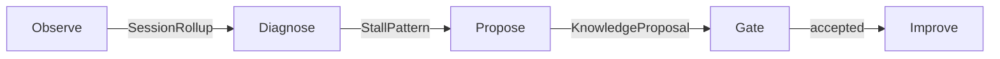

# Leadership brief · Task-centric session satisfaction

**Audience.** SE lead / PM  
**Status.** Planning wave input (2026-07-30)  
**Decisions pending.** [ADR-0015](../adr/ADR-0015-task-session-observability.md) (Proposed)  
**Depth.** [PRD 10](../prd/prd-task-satisfaction-observability.md), [research/15](../research/15-task-satisfaction-observability.md), [research/16](../research/16-task-as-unit-models.md)  
**Remaining implementation:** [REMAINING-task-satisfaction.md](../delivery/REMAINING-task-satisfaction.md)

## Session Satisfaction & Closed-Loop Improvement

### 1. Problem statement

Drive mode succeeds only when **tasks complete**. Plans sequence tasks (ADR-0008); there is no first-class Goal — `plan.title` is the session’s intent. If tasks stall, churn, or never drain, users leave mid-session and do not return. That is a **retention risk**, not a polish issue.

Existing `prd-success-metrics.md` covers phase gates and privacy CI. It does **not** measure whether a Drive session felt successful to the user. We need product metrics that answer: *did this session get work done, and did the user stay in the loop?*

### 2. North-star product question

> After a Drive session, did the user get enough completed work — and enough control over the plan — that they would start another?

Everything below is a proxy for that question. No single counter is the north star; the families together are.

### 3. Metric families

| Family | Named metrics | How they action |
|--------|---------------|-----------------|
| **Satisfaction proxies** | Call join→leave duration; tasks completed / session; plan clean-drain | Diagnose short/failed sessions; prioritize completion paths |
| **Engagement** | User sets a new goal (`plan.title` / intent refresh); adjusts plan; directs more tasks after a success | Distinguish “done and gone” from “done and still driving” |
| **Plan quality** | Mid-plan task-add churn; tasks-per-session; cursor progress vs thrash | High churn → planning skill; stable drain → keep deterministic cursor |
| **Failure recovery** | Stuck → analyze → propose → human accept rate | Drive the closed loop; never auto-mutate plans without gate |

**Task-as-unit:** `DriveTask` is the fundamental unit. “Next task” today is the **deterministic plan cursor**. Learned predictors may **propose** only; they are never sole writers of the plan.

### 4. Closed-loop

Caption:

- Observe uses typed events (ids), not utterances.
- Gate is the same governance family as ADR-0004.
- Improve updates skills/templates only on accept.

### 5. Phased delivery (capability order)

1. **Instrumentation first** — Complete bank events; `callSessionId`; hub can complete tasks.
2. **Local dashboards** — Rollups over local structured logs (no phone-home).
3. **Gated improvement skills** — Diagnose → propose → human accept.

### 6. Explicit non-goals and privacy rails

**Non-goals**

- First-class Goal entity (session intent stays on `plan.title`).
- Replacing the deterministic plan cursor with a learned sole writer.
- Absorbing session satisfaction into the phase-gate PRD as a substitute.
- Transcript retention or utterance-level analytics for MVP learning.

**Privacy rails (ADR-0004 / DRV-PRIVACY)**

- No phone-home Drive telemetry in MVP.
- No transcript retention.
- Learn / improve path is **gated**.
- Diagnostics use **event ids and structured fields**, not user utterances.

### 7. Open questions for leadership

1. Is **plan clean-drain + post-success engagement** the preferred dual proxy for “session satisfaction,” or should join→leave duration be elevated?
2. Who owns the **accept gate** for proposed planning skills (unify with learn queue?)?
3. Should hub **task completion** be a hard launch gate for any satisfaction dashboard?
4. How much mid-plan **task-add churn** is healthy collaboration vs plan failure?
5. When bank events and `callSessionId` land, do we backfill local-only historical sessions or start the metric clock at instrumentation-complete?

## Recommended defaults (until overturned)

| Fork | Default |
|---|---|
| Dual proxy | S3 clean-drain + E1 post-success continue |
| Accept UI | Reuse gated-learn queue pattern; bank proposals tagged `kind: planning` |
| Dashboard gate | No public “satisfaction” claims until R1 instrumentation complete |
| Learned next-task | Research only; proposer behind accept |
