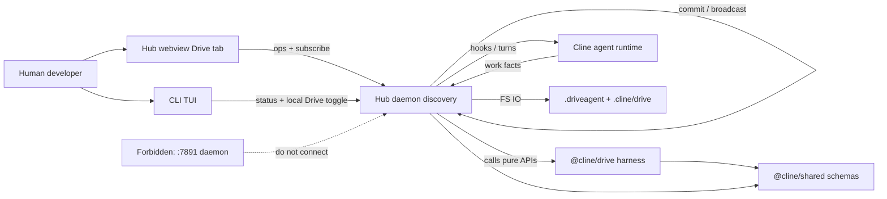
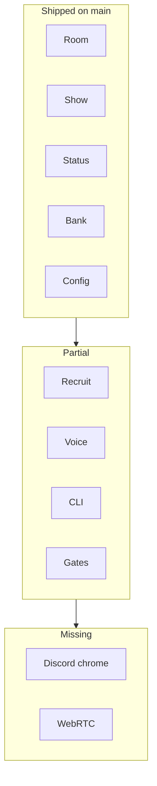
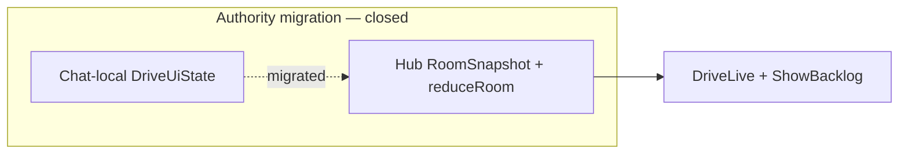

# Systems analysis · cline-drivecode (Drive product)

**Document type.** Professional systems analysis (product + architecture).
**Audience.** SE leads, PMs, implementers, reviewers.
**Status.** Living analysis — re-baselined against main post-#58 / #80.
**Date.** 2026-07-30 (re-baseline). Prior scaffold-era draft: 2026-07-25.
**Method.** Context → actors → functions → structure → data → interfaces → behavior → NFRs → failures → as-is/to-be → recommendations.

Companion docs: [HANDOFF.md](../../../HANDOFF.md), [REMAINING-task-satisfaction.md](../delivery/REMAINING-task-satisfaction.md), [06-sdk-leverage.md](../../drivecode-sdk/delivery/06-sdk-leverage.md), [LEADERSHIP-BRIEF.md](LEADERSHIP-BRIEF.md), [01-architecture.md](../foundation/01-architecture.md), [ops/hub-drive-ops.md](../ops/hub-drive-ops.md), [05-workflows.md](../foundation/05-workflows.md), [../drivecode-sdk/02-architecture.md](../../drivecode-sdk/foundation/02-architecture.md).

---

## 1. Executive summary

**cline-drivecode Drive** is a **collaboration harness** that makes Cline feel like a Discord-style pair-programming call inside Slack-like chrome. It does not replace Cline’s agent runtime. It wraps that runtime with rooms, roster, addressing, an events-first stage, privacy-strict defaults, recruitable agent portfolios, and on-demand senior SDLC guidance.

| Dimension | Finding |
|---|---|
| Product maturity (docs) | High — vision, 45 workflows, facets, ADRs/DECs, gates |
| Runtime maturity (code) | Medium–high — hub rooms, `@cline/drive` harness, Show director, Status Hub, task-satisfaction on main |
| Critical path | Product gaps (GATES UI, recruit Add, pack library, reconnect) + satisfaction residuals |
| Highest product risk | Stale plans claiming scaffold-only |
| Architectural spine | **Harness proposes → Host commits → Apps project** |
| Single writer | Hub via discovery, not hardcoded `:25463` |

**Recommendation.** Treat §13.0 as as-is. Prefer nest [HANDOFF.md](../../../HANDOFF.md) + [REMAINING-task-satisfaction.md](../delivery/REMAINING-task-satisfaction.md). Do not reopen #58. Phase 4 ≠ PR #82.

---

## 2. Purpose and scope

### 2.1 Problem the system solves

Solo Chat is a transcript with tools. Drive is a **shared work call**: presence, addressable partners, interruptible turns, a stage of structured work, and leadership guidance for builders who need requirements and decision discipline—not only code generation.

### 2.2 In scope

- Drive tab IA (rooms, roster, transcripts, stage, address)
- Hub-owned room state and ops
- `@cline/drive` pure harness (policies, reducers, host port, compile/recruit scoring)
- Facet config + `AgentProfile` + `RosterPack`
- `.driveagent/` authoring homes + gated knowledge
- Hub webview + CLI TUI surfaces (VS Code later)
- SDLC leadership workflows (W-40–W-45)

### 2.3 Out of scope (binding)

- Second daemon / `:7891`
- Second agent runtime
- Prompts in Drive facets
- Pixel/WebRTC agent stage (MVP)
- Multi-human media plane (phase 5 design only)
- Silent transcript retention
- Mandatory process wizard before join

### 2.4 Adjacent systems

| System | Relationship |
|---|---|
| Cline core / hub / agents | Host platform; Drive binds via hub + hooks |
| cursor-drive / claude-drive | Prior art only; port skills/policies, not transport |
| BRIEF / personal knowledge graphs | Pattern source for homes + gated learn |

---

## 3. System context



**Context statement.** External actors interact only through approved surfaces (webview, CLI). All durable room truth and durable Drive config mutations pass through the hub. Pure Drive logic is importable by hub and browsers alike; it never opens sockets or files. CLI Drive today is status + local toggle only — it does **not** `call_join`.

---

## 4. Stakeholders and actors

### 4.1 Stakeholders

| Stakeholder | Interest | Success signal |
|---|---|---|
| Target developer | Call-shaped pair programming | Phase 1 smoke + M0 qualitative pass |
| Less-experienced builder | Guidance without ceremony | W-40/W-45 work; “just build X” escapes |
| Agent author | Portable homes + recruit | Compile fixture + lexical recruit |
| Privacy-conscious user | No silent retention | M7/M8 CI + ADR-0004 |
| Fork maintainer | Coherent package graph | `@cline/drive` in monorepo; no syncTypes |
| Future second host | Portable harness | Host port + fail-closed conformance |

### 4.2 Actors (runtime)

| Actor | Type | Authority |
|---|---|---|
| Human host | Primary | Joins, addresses, steers, gates, accepts learn |
| Pair partner | Agent | Default seated senior engineer |
| Specialist | Agent | Phase 4; isolation required |
| Hub | System | **Only writer** of room + durable facets |
| `@cline/drive` | System | Proposes; never commits |
| Hooks / session | System | Turn loop; emits work facts |
| Webview / CLI | System | Project events; ephemeral chrome only |

---

## 5. Functional decomposition

Functions map to workflow groups. Features are the build units; workflows are the smoke units.

| Function area | Workflows | Primary features |
|---|---|---|
| F1 Session lifecycle | W-01–W-07 | DRV-DRIVE-TAB, ROOM-MVP, LEAVE-END, TOGGLE |
| F2 Work loop | W-08–W-14 | PARTNER-MVP, KERNEL, STEER, INTERRUPT, MODE |
| F3 Stage & share | W-15–W-17 | STAGE, SHARE, EVENTS, NARRATION |
| F4 Addressing & roster | W-18–W-19, W-35–W-39 | ADDRESS, ROSTER, PROFILE, PACK, RECRUIT, GRAPH, SHEET, HOME |
| F5 Voice | W-20–W-23, W-34 | MIC, TTS, CAPTIONS, HOOK-POLICY |
| F6 Safety & privacy | W-24–W-26 | GATES, PRIVACY |
| F7 Multi-agent | W-27–W-29, W-33, W-36 | TEAM-OPT, ISOLATION, ROSTER-PACK |
| F8 Parity & recovery | W-30–W-32 | CLI-PARITY, ROOM-MVP, LEAVE-END |
| F9 SDLC leadership | W-40–W-45 | SDLC-GUIDE, STAGE, NARRATION, SKILL-PORT |

**MVP product spine (must feel real):** F1 + F2 + F9(discovery/teach) + privacy invariants, with F3/F4 mechanisms introduced as soon as stage/address land.

---

## 6. Logical architecture

### 6.1 Layer cake

| Layer | Package / app | Verb |
|---|---|---|
| Presentation | `apps/cline-hub`, `apps/cli` | **Project** |
| Host binding | `@cline/core` hub (`collaboration`, `drive-config`, `drive-host`) | **Commit** |
| Harness | `@cline/drive` | **Propose** |
| Contracts | `@cline/shared` (`src/drive/*`) | Define |
| Agent runtime | `@cline/agents` + core session | Emit work facts |

### 6.2 Component responsibilities

| Component | Does | Does not |
|---|---|---|
| Drive tab | List/join rooms; render roster/stage/transcript/address | Own room truth |
| Chat Join | Shortcut into active room | Be the product home |
| Hub collaboration | Validate ops; mutate room; broadcast; snapshots | Implement UI policy twice |
| `@cline/drive` | Modes, narration, interrupt, reduceRoom, projectStage, pack expand, compile pure, recruit score, host port decls | FS, sockets, prompts store |
| Facet store | Durable typed config via hub IO | Mid-call overwrite of live from durable |
| Driveagent home | Canonical authoring + knowledge | Hot-swap seated definition mid-turn |
| Gates | Taxonomy + feed projection over approvals | Parallel approval subsystem |
| SDLC guide | Guidance intents + stage artifact cards | Join wizard / process lobby |

### 6.3 Clarification vs older package map

`01-architecture.md` once bundled “room ops + broadcasts” under core. Systems view splits:

- **Pure fold** `reduceRoom` / `projectStage` → `@cline/drive` (shared by hub and webview)
- **Commit/broadcast** → `@cline/core` hub

This prevents a second reducer in the webview (the in-repo `syncTypes` failure mode).

---

## 7. Deployment / physical view (MVP)

```text
Developer machine (localhost only)
├── Hub process .............. discovery (prefer free default; not hardcoded :25463)
├── Hub webview .............. UI client (subscribe + ops)
├── CLI (optional) ........... status + local Drive toggle (no call_join yet)
├── Workspace FS
│   ├── .cline/drive/*.json .. durable facets (hub-written)
│   └── .driveagent/<slug>/ .. agent homes (+ .derived/)
└── No :7891 process ......... asserted in tests
```

**Network policy.** MVP does not phone home Drive events. Privacy class forbids raw audio/transcripts on the wire beyond localhost hub traffic.

**Dev port note.** Hub discovery binds a free default unless `CLINE_HUB_PORT` is set explicitly; product identity is discovery, not a memorized port. Drive capability descriptors must declare the actual `writerEndpoint`.

---

## 8. Data architecture

### 8.1 Domain objects

```text
Workspace
  CallRooms[] → Room
    participants[] { id, kind, role, seatSources[], mute, stale? }
    roomTranscript / agentStreams (projections)
    stage { sharer, projection }
    addressSet
    focus / subMode / interrupt state
Config (peer of rooms)
  AgentProfile[] → AgentRef
  RosterPack[]
  Facet catalog values
DriveagentHome
  agent.yaml, permissions.yaml, env.yaml
  knowledge/{catalog,nodes,edges}
  .derived/graph.json
```

### 8.2 Persistence lanes

| Lane | Examples | Writer | Survives restart |
|---|---|---|---|
| Durable | profiles, packs, facet prefs, homes | Hub / host FS ops | Yes |
| Live | roster, addressSet, sharer, subMode | Hub room ops | No (memory) |
| Ephemeral | scroll, drafts, collapsed panels | Client only | No |
| Derived | `graph.json` | Compile pipeline | Optional commit |
| Forbidden durable | full transcripts, audio | — | Must not |

**Seeding rule.** Durable may seed live at `createOrAttach`. Durable must not overwrite live mid-call.

**Binding rule.** Appearance reprojects every broadcast. Definition binds at seat; edits mark stale until reseat.

### 8.3 Event spine

All surfaces converge on a versioned `DriveEvent` union (`DRV-EVENTS`): presence, call state, work/stage cards, narration, steer, interrupt, gate, handoff, guidance artifacts. Schemas structurally exclude raw audio and full transcript blobs.

---

## 9. Interface catalog

### 9.1 Network

| Interface | Contract |
|---|---|
| Hub WebSocket | Ops + subscribe; snapshot then live events on reconnect |
| Forbidden | Default anything to `:7891` |

### 9.2 Hub ops (logical)

See [ops/hub-drive-ops.md](../ops/hub-drive-ops.md). Families:

- Room/call: join, leave, end, mute, stage, mode, address, raise hand, steer, focus
- Roster: seat, unseat, add/remove pack
- Recruit: query-only; seat via separate op
- Config/home: get/put facets, profile patch, home get/put, compile
- Gates/learn: resolve gate; propose/resolve learn

### 9.3 Landed APIs (post-#58 / #80)

| API | Owner | Status |
|---|---|---|
| `DriveEvent` parse/types | `@cline/shared` | Landed |
| `transitionDriveMode`, `narrate`, `classifyInterrupt` | `@cline/drive` | Landed |
| `reduceRoom`, `projectStage`, `resolveAddress`, `expandRosterPack` | `@cline/drive` | Landed |
| `compileDriveagentHome`, `scoreRecruit` | `@cline/drive` | Landed (harness) |
| `DriveHostPort` + `HostCapabilities` + conformance | `@cline/drive` | Landed |
| `commitRoomOp`, broadcast, durable IO | `@cline/core` | Landed |
| Hub discovery / room subscribe | `@cline/core` hub | Landed |
| Show director / backlog | hub + `@cline/drive` | Landed |
| Status Hub / task-satisfaction emit path | hub + shared | Partial — see REMAINING |

### 9.4 Open product / UX freeze list

Still open for product freeze (not “missing package APIs”):

1. **GATES UI** — feed-card approve/deny over existing approval plumbing (`DRV-GATES`)
2. **Recruit Add** — seat from recruit pick (query exists; Add UX incomplete)
3. **Reconnect** — snapshot + live recovery UX (W-31)
4. **Human participant id** across webview + CLI
5. **CLI parity** — `call_join` / full room ops (today: status + local Drive toggle only)
6. **Voice STT** — mic → confirm heard text (Phase 3)

---

## 10. Behavioral analysis (control & data)

### 10.1 Join (control)

1. UI → `call_join` / `joinCall()`
2. Hub validates → `createOrAttach`
3. Seat human + pair partner (seed defaults)
4. Broadcast state
5. Clients `reduceRoom`
6. Focused room only may run turns

### 10.2 Addressed send + work (control + data)

1. Set `addressSet`
2. Resolve address (empty pack → reject, never widen)
3. Optional honest prompt rewrite via hooks
4. Host commits turn to agent runtime
5. Work facts → Drive events
6. Narration policy may emit decision cards
7. Broadcast → stage/feed projections

### 10.3 Gate (control)

1. Classify tool → gate event
2. Feed card approve/deny/allow-session
3. Hub resolves; deny forces replan (no silent retry)
4. Session allows die on leave

### 10.4 Recruit → seat (control)

1. `drive_recruit` query over compiled graphs
2. Human picks
3. `room_seat` with `seatSources`
4. Cap / teamOpt / isolation enforced
5. Address set not auto-expanded

### 10.5 SDLC guidance (control + data)

1. Intent phrase → guidance loop (not join wizard)
2. Stage cards: problem → requirements → options → decision → checklist
3. “Just build X” → escape to work loop
4. Artifacts session-tier unless explicit export/accept

---

## 11. Non-functional requirements

| ID | Category | Requirement | Verification |
|---|---|---|---|
| NFR-P1 | Privacy | No durable transcript/audio by default | Schema + FS tests M7/M8 |
| NFR-P2 | Privacy | Learn is propose→accept | ADR-0004 + UI/tests |
| NFR-S1 | Safety | High-impact tools gated | DRV-GATES M12–M14 |
| NFR-A1 | Architecture | Single writer hub | Port assert M5; code review |
| NFR-A2 | Architecture | One runtime path via compile | No-prompt-in-facet M6 |
| NFR-A3 | Architecture | One room reducer | Import from `@cline/drive` only |
| NFR-R1 | Reliability | Reconnect = snapshot + live | ROOM-MVP ACs / W-31 |
| NFR-R2 | Reliability | Idempotent join/leave/end | Unit tests |
| NFR-U1 | Usability | Instant join, no wizard | W-01 / M1 |
| NFR-U2 | Usability | Drive tab primary; Chat shortcut | IA + smoke |
| NFR-U3 | Usability | On-demand SDLC guidance | M17–M20 |
| NFR-P3 | Performance | Focus-room: no background turn spend | DEC focusPolicy |
| NFR-C1 | Compatibility | Bun only; Node ≥22 runtime | CI |
| NFR-C2 | Compatibility | Localhost-only MVP | Bind tests |
| NFR-O1 | Operability | Hub-down empty state actionable | W-31 |
| NFR-O2 | Observability | Redacted logs; no utterance metrics store | PRIVACY |
| NFR-T1 | Testability | Pure policies unit-tested without hub | `@cline/drive` tests |
| NFR-T2 | Testability | Conformance fail-closed fakeHost | SDK plan Phase 2 |

---

## 12. Failure modes (FMEA-lite)

| Failure | Effect | Detection | Mitigation |
|---|---|---|---|
| Hub down | No room authority | Client empty state | W-31 copy + start command |
| Version skew | Corrupt projections | Schema major mismatch | Hard stop; refuse quiet degrade |
| Second reducer in webview | Divergent UI truth | Code review / import lint | Reducers only from `@cline/drive` |
| Scaffold treated as product | False trust | Leadership risk flag | Replace Chat state in Phase 1 |
| Dual prompt stores | Drift / leaks | M6 CI | DEC-agent-SoT |
| Recruit writes seats | Race / bypass caps | Op review | Query-only recruit |
| Empty pack → everyone | Misdelivery | Address tests | Reject empty resolve |
| teamOpt without isolation | Workspace corruption | Capability check | Fail closed |
| Silent learn | Privacy breach | Audit / tests | ADR-0004 |
| Durable overwrites live | Mid-call surprise | Lane tests | Seed-only rule |
| Approval fatigue | Users bypass | Metrics M13/M14 | Tight taxonomy; thresholds |
| Guidance lecture blocks join | Churn | Product review | On-demand + escape hatch |
| Stale “scaffold-only” plans | Misprioritized work | Doc review vs §13.0 | Prefer HANDOFF + REMAINING |

---

## 13. As-is vs to-be

> **Living-diagram note (2026-07-30).** §13.0 is the current as-is. §13.1 below was the pre-landing inventory.
> Treat dashed rows as **designed-vs-actual closed**. Current truth: nest
> [HANDOFF.md](../../../HANDOFF.md), [architecture.md](../../../reference/architecture.md),
> [ops/hub-drive-ops.md](../ops/hub-drive-ops.md), [REMAINING-task-satisfaction.md](../delivery/REMAINING-task-satisfaction.md).
> Cline skills: `diagram-first`, `diagram-show`.

### 13.0 Current as-is (2026-07-30 re-baseline)

| Plane | Reality |
|---|---|
| Room | **Shipped** — hub rooms, `call_*` / `drive.*`, `RoomSnapshot` + `reduceRoom` |
| Show | **Shipped** — Show director, backlog, sticky stage |
| Status | **Shipped** — Status Hub; task-satisfaction emit path on main (residuals in REMAINING) |
| Bank | **Shipped** — task bank / session bank surfaces on main |
| Config | **Shipped** — facets, durable `.cline/drive`, hub IO |
| Recruit | **Partial** — compile/score landed; Add UX / pack library open |
| Voice | **Partial** — policy hooks; STT product open |
| CLI | **Partial** — status + local Drive toggle; no `call_join` |
| Gates | **Partial** — taxonomy landed; feed-card UI open |
| Discord chrome | **Missing** — not a shipping surface |
| WebRTC / pixel stage | **Missing** — out of MVP |



**Phase note.** Phase 4 (CLI parity + isolation / teamOpt) is **not** PR #82. Do not conflate the two.

### 13.1 As-is (code) — historical snapshot (2026-07-25)

| Then present | Then absent (now landed unless noted) |
|---|---|
| `DriveCallChrome`, local `DriveUiState` | `@cline/drive` package — **landed**; prefer hub `RoomSnapshot` + `reduceRoom` |
| Chat Join + persona string inject | Hub collaboration rooms — **landed** (`call_*` / `drive.*`) |
| CLI `Ctrl+Shift+D` local flags | Drive tab / Status Hub — **landed** in hub webview |
| Example `.driveagent` fixture (docs) | Home loader / compile / recruit — partial; see DRV features |
| Plans, wireframes, ADRs/DECs | Shared drive schemas — **landed** in `@cline/shared` |
| — | Show director dual backlog — **landed** (DRV-SHOW-BACKLOG on main) |



### 13.2 To-be (MVP product)

| Capability | Phase gate | Reality (2026-07-30) |
|---|---|---|
| Schemas, kernel, privacy, facets, home compile fixture | Phase 0 | **Done** on main |
| Hub rooms, Drive tab, sheet, gates MVP, discovery/teach | Phase 1 | Rooms + Drive tab on main; **GATES UI** still open |
| Stage, address, packs, recruit, SDLC stage cards | Phase 2 | Stage + show director on main; **packs / recruit Add** open |
| Voice | Phase 3 | Open (STT) |
| CLI parity, isolation + teamOpt | Phase 4 | Open — **≠ PR #82** |
| Multi-user media design review | Phase 5 | Open |

### 13.3 Migration of authority

```text
Chat-local DriveUiState  ──done──►  Hub RoomSnapshot + reduceRoom
@cline/drive harness (#58) ──done──►  Propose APIs on main (host commits via hub)
systemPrompt persona side channel ──►  Hooks rewrite allowlist + Drive active
ConfiguredAgent-only mental model ──►  .driveagent compile → single runtime
Show reactive-only stage  ──done──►  ShowBacklog + DirectorScript + StickyStagePane
```

---

## 14. Traceability matrix (sample)

| Business need | Workflow | Feature | NFR | Phase |
|---|---|---|---|---|
| Join a call instantly | W-02 | ROOM-MVP, DRIVE-TAB | U1 | 1 |
| See partner work | W-15 | STAGE, EVENTS | A1 | 2 |
| Interrupt safely | W-11/W-12 | INTERRUPT, KERNEL | R2 | 0–2 |
| Approve dangerous acts | W-24 | GATES | S1 | 1 |
| Private by default | W-26 | PRIVACY | P1 | 0 |
| Recruit specialist | W-38 | RECRUIT, GRAPH | — | 2 |
| Learn requirements | W-40/W-41 | SDLC-GUIDE | U3 | 1–2 |
| Decide before coding | W-42/W-44 | SDLC-GUIDE | — | 1–2 |
| Same call in TUI | W-30 | CLI-PARITY | — | 4 |

Full workflow coverage: [MATRIX-workflow-coverage.md](MATRIX-workflow-coverage.md).

---

## 15. Quality attributes tradeoffs

| Choice | Gains | Costs |
|---|---|---|
| Events-first stage | Searchable, private, cheap | Less “literal screen share” feel until later |
| Single hub writer | No CRDT; clear authority | Hub availability is critical path |
| Compile homes | Portfolio + one runtime | Migration + compile UX |
| Focus-room only | Predictable cost | No background multi-room agents in MVP |
| Lexical recruit | Ships without embeddings | Weaker fuzzy matching |
| On-demand SDLC | Teaches without lobby | Must avoid accidental lecture mode |

---

## 16. Recommendations (SE lead)

### 16.1 Immediate (product gaps + residuals)

1. Work from [REMAINING-task-satisfaction.md](../delivery/REMAINING-task-satisfaction.md) and nest [HANDOFF.md](../../../HANDOFF.md) — not scaffold-era critical-path lists.
2. Ship **GATES UI** (feed cards over existing approval plumbing).
3. Finish **recruit Add** + pack library seating UX.
4. Harden **reconnect** (snapshot + live; W-31 empty states).

### 16.2 Near-term product bar

Close the open freeze list in §9.4 enough that Drive tab feels authoritative end-to-end. Keep CLI as status/toggle until true room parity is scheduled (Phase 4).

### 16.3 Explicit non-work

- Do **not** reopen #58 (`@cline/drive` harness landed).
- Do **not** confuse PR #82 with Phase 4 (CLI parity + isolation / teamOpt).
- Do not invest in richer Chat Drive chrome that diverges from hub snapshots.
- Do not start WebRTC.
- Do not enable `teamOpt` without isolation.
- Do not open a separate `drivecode-sdk` repo.
- Do not treat stale “scaffold-only” plans as current truth — use §13.0.

### 16.4 E2E slice order (dependency-honest, post-landing)

```text
§13.0 as-is (rooms / show / status / bank / config)
    → GATES UI + reconnect UX
        → Recruit Add + pack library
            → Satisfaction residuals (REMAINING)
                → Voice STT
                    → CLI parity + isolation/teamOpt  (Phase 4 ≠ #82)
```

---

## 17. Open questions still owned by humans

| ID | Question | Default if silent |
|---|---|---|
| Q1 | Accept ADR-0001–0004 + DEC bundle? | **Closed — Accepted** |
| Q2 | Accept ADR-0015 (task-session observability)? | **Proposed** — leadership accept still open; see [ADR-0015](../adr/ADR-0015-task-session-observability.md) |
| Q3 | Human participant id scheme across clients? | Stable per hub connection + workspace; document in ROOM-MVP |
| Q4 | When do TextChannels appear in chrome? | Hidden until a PRD exists (domain may reserve the array) |
| Q5 | Who owns GATES feed-card UI delivery? | [DRV-GATES](../features/DRV-GATES.md) — taxonomy landed; UI / hub projection still open |

---

## 18. Document control

| Version | Change |
|---|---|
| 2026-07-25 | Initial E2E systems analysis from leadership wave + plan/code inventory |
| 2026-07-30 | §13 living-diagram refresh; point at HANDOFF / architecture / hub-drive-ops / Cline diagram skills |
| 2026-07-30 | Re-baseline post-#58 / #80: §1 maturity Medium–high; §13.0 current as-is; §9.3 landed APIs; §16/§17 updated |

When implementation lands, update §13.0 as-is and tick §9.4 items as frozen. Do not fork a second analysis doc—amend this one.
