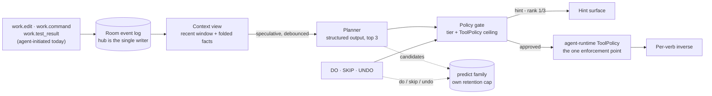

# PRD 11: Magic Hotkey (DO · SKIP · UNDO)

## Problem

[21-operator-experience](../research/21-operator-experience.md) states the gap in
one sentence: Drive "asks a user to hand an agent the keys and then gives them a
windscreen with no instrument panel." Presence is solved. Acting on what presence
shows you is not.

The cost is paid in micro-frictions. A test fails, you read the traceback, you
find the file, you open it, you fix it, you go hunting for the command that
reruns just that test. Every one of those steps is knowable from what already
happened, and every one of them costs a saccade, a chord, and usually a mouse
trip. Drive currently has exactly two ways to act: type a sentence to the agent,
or drive the IDE yourself. Neither is the right size for "yes, that one."

Two adjacent facts make this worse than an ergonomics complaint:

1. **The product cannot learn what the operator wants** because it never records
   agreement or disagreement in a form anything could train on.
   [16-task-as-unit-models](../research/16-task-as-unit-models.md) left this as
   open question 3 and could not answer it for want of labels.
2. **Rejection is currently silent.** When Drive proposes something wrong, the
   operator ignores it. Silence is unattributable — busy, away, or disagreeing
   all look identical.

## Solution

One always-on prediction of the operator's next action, and three keys to answer
it.

| Key | Meaning | Effect |
|---|---|---|
| **DO** | "Yes, that one." | Executes the ranked-first candidate, subject to its tier |
| **SKIP** | "Not that — what else?" | Advances to the next candidate. Executes nothing, ever |
| **UNDO** | "Wrong, take it back." | Reverts the last executed candidate and marks it wrong |

The operator's fingers are already trained: an editor accepts a completion with
one key, dismisses it with another, and reverts with a third. Magic Hotkey
generalizes that from the next *token* to the next *action*.

A hint is always visible with its rank — `rerun failed test · 1/3` — so the
operator never presses blind. At most three candidates are precomputed on each
context change, so DO is a cached lookup and SKIP is a local index bump; neither
waits on a model call. The list wraps and always ends in `do_nothing`, which is a
first-class honest answer rather than a failure.

The planner returns JSON and cannot execute. Tiering, the whitelist, and the
confidence floor are host code. Detail and rationale:
[ADR-0036](../adr/ADR-0036-next-action-triad.md).

### The codebase is the signal source

> **Vocabulary.** The source proposal calls its sensor layers "providers." That
> word is already taken: `.cline/drive/providers/` holds STT/TTS manifests
> ([ADR-0010](../adr/ADR-0010-provider-harness-byok.md)). This PRD says **signal
> source**.

The source proposal predicted over desktop activity — frontmost app, clipboard,
window titles. That is rejected here (ADR-0036 decision 1), and the substitution
is an upgrade rather than a compromise: software work is already instrumented,
and a typed event beats a guess about a window title.

**What is observed today, precisely.** Three `DriveEvent` members already carry
what this feature needs, minted hub-side through `DriveRoomStore.recordWork`:

| Event | Payload | Reads as |
|---|---|---|
| `work.test_result` | `label`, `passed` | a test run and its verdict |
| `work.edit` | `path`, `summary?` | a file changed |
| `work.command` | `command`, `exitCode?`, `failed?` | a command and how it exited |

**What is not observed.** These fire for work *Cline performed*. Operator-initiated
saves, commits, and branch switches produce no event anywhere, and `apps/vscode`
is now a thin SDK shell with no editor-observation surface to borrow. v0 ships
against the signals that exist (ADR-0036 decision 2). This is a real narrowing of
the source proposal's flagship flow and is called out again under Phasing.

### Verb whitelist (v0)

Tier is derived from revertibility and capped by the `ToolPolicy` already in
force (ADR-0036 decisions 6 and 7). The triad never executes anything the
operator has not already allowed the agent to do.

| Tier | Verbs | On DO |
|---|---|---|
| 1 — inert or invertible | `do_nothing`, `open_implicated_file`, `show_diff`, `focus_now_task`, plus any command verb the tool policy already auto-approves | Execute |
| 2 — recoverable but disruptive | `rerun_failed_test`, `run_tests`, `stage_changes`, `switch_branch`, `restore_checkpoint` (each when not already auto-approved) | Arm, then execute on a second DO |
| 3 — irreversible | `push`, `open_pr`, `merge`, `delete_branch`, `reset_hard`, anything that sends or publishes | **Never executed.** Rendered as a suggestion |

`restore_checkpoint` sits in Tier 2 rather than Tier 1 despite being the "undo"
verb, because the checkpoint's granularity is a whole user run: predicting it
correctly still means discarding more than the last action (ADR-0036 decision 8).

Tier 3 verbs stay in the candidate list on purpose. A correct suggestion the
operator carries out themselves is still a correct prediction, and it still
labels. Tier 3 is *suggest-only*, which is not the same as `enabled: false` —
that would hide the candidate and destroy the label.

### Playbooks tune behavior without code

Prediction policy that is specific to a repo or a workflow ("after a failed test
and an edit under the implicated path, rerun that test") lives in small markdown
files loaded into the planner's context — the skills pattern this product already
uses, per [DRV-SKILL-PORT](../features/DRV-SKILL-PORT.md). Editing a playbook is
how the operator corrects a wrong prediction permanently. Playbooks never widen
the whitelist or change a tier; those stay in host code (ADR-0036 decisions 5–7).

## Goals

- **G1 — Kept-rate at or above 60%.** Share of DOs not followed by an UNDO,
  measured after prompt and playbook iteration (M3 gate).
- **G2 — DO-to-effect under 200 ms at p50,** and SKIP-to-next-hint with no
  model call on the path. Both follow from speculative precompute.
- **G3 — Rejection becomes attributable.** Every disagreement is an explicit
  SKIP event instead of silence.
- **G4 — A labeled corpus exists** under gated-learn rules, sufficient to answer
  [16](../research/16-task-as-unit-models.md) open question 3 with measurement.

## Non-goals

- Desktop-wide sensing, synthetic keystrokes, screen or pixel capture.
- Observing operator-initiated editor, git, or terminal activity (ADR-0036
  decision 2). v0 sees agent-initiated work only.
- Multi-step autonomy. One DO is one verb.
- A `DriveTask` ranker, or any second writer of the plan cursor.
- A second approval plane parallel to `ToolPolicy`.
- Passive observation of the operator's unprompted actions (ADR-0036 decision 10).
- Shipping or training a model. v0's planner is Claude.
- Voice or chat control of the triad.

## Personas

| Persona | Need |
|---|---|
| Operator mid-loop | Act on what the instrument panel shows without leaving the keyboard |
| Reviewer | Move between a failing test, its traceback, and the implicated diff in single presses |
| Skeptic | See what the product thinks before it does anything, and disagree cheaply |
| Privacy-conscious dogfooder | Know exactly what the label log contains and that it never leaves the machine |

## User stories

1. As an operator, the agent's test run emits `work.test_result` with
   `passed: false`; the hint reads `rerun failed test · 1/3` and DO-DO reruns
   exactly that test.
2. As an operator, the hint is not what I wanted; SKIP shows the next candidate
   instantly and nothing executed.
3. As an operator, DO did something I did not want; UNDO reverts the file effects
   and tells me plainly what it could not revert, and the candidate is marked
   wrong.
4. As a reviewer, the hint offers `show_diff` after a run of agent edits and one
   press puts the diff in front of me.
5. As an operator on a Tier 2 verb, the first DO arms and tells me what it will
   do; a second DO executes it; anything else disarms.
6. As an operator, a `push` is genuinely the right next action; the hint says so
   and does nothing, and I push it myself.
7. As a skeptic, nothing is predictable right now; the hint reads `do_nothing`
   and says so plainly instead of inventing work.
8. As a privacy-conscious dogfooder, I can read the label log and find ids,
   hashes, verb names, and outcomes — no file contents, no prose, no utterances.
9. As an operator, my SKIP followed by a DO on the second candidate is recorded
   as a preference between two candidates for the same state.

## Requirements

### Functional

| ID | Requirement |
|---|---|
| MHK-01 | A hint surface shows the current top candidate and its rank (`verb · n/m`) whenever a candidate set exists. |
| MHK-02 | DO executes the candidate at the current index, subject to the policy gate. |
| MHK-03 | SKIP advances the index, wraps at the end, and never reaches the actuator at any tier. |
| MHK-04 | UNDO reverts the last executed candidate and records the reversal. Each executing verb supplies its own inverse, or opens its own checkpoint via the `createCheckpoint` injection hook; the per-run session checkpoint is too coarse to serve as a generic per-verb undo. |
| MHK-04a | UNDO states what it did **not** revert. Coverage stops at tracked and non-ignored-untracked files in one worktree — never terminal, network, browser, or database effects, and never a gitignored file. |
| MHK-05 | The candidate set holds at most three ranked, distinct candidates and always includes `do_nothing`. |
| MHK-06 | Candidates are recomputed speculatively on context change, debounced; DO and SKIP read the cached set. |
| MHK-07 | The policy gate assigns every candidate a tier before it is offered; an unknown verb is refused, not defaulted. |
| MHK-08 | A Tier 2 candidate arms on first DO with a message naming the effect, and executes only on an immediately following DO. |
| MHK-09 | Any change of context, a SKIP, or a UNDO disarms a pending Tier 2 candidate. |
| MHK-10 | Tier 3 candidates render as suggestions and have no path to the actuator. |
| MHK-11 | A verb's tier is capped by the `ToolPolicy` already in force; the triad never executes what the agent would have needed approval for. |
| MHK-11a | Execution reuses the existing `ToolPolicy` resolution and host approval callbacks — one policy table, one set of callbacks. No second approval plane is built ([DRV-GATES](../features/DRV-GATES.md) names that as this area's top risk). How a non-turn invocation reaches that policy inside the latency budget is ADR-0036 Open 6. |
| MHK-12 | A candidate below the confidence floor renders as a hint but does not execute on DO. |
| MHK-13 | Every offer and every button press is written hub-side to a fourth `DriveLogEnvelope` family (`predict`) with its own retention cap — not onto the room union, whose oldest-first trim would evict it. |
| MHK-14 | Prediction event schemas are `.strict()` and carry `schemaVersion`; new fields on existing kinds are optional forever, per the repo's event-evolution rule. |
| MHK-15 | "Kept" is derived from the event stream — a `predict.do` with no matching `predict.undo` — and is never stored as a field. |
| MHK-16 | The triad never writes `.drive/bank/` or room state, and never moves `nowTaskId` / `nextTaskId`. |
| MHK-17 | The operator can disable prediction entirely; disabled means no planner calls and no `predict.*` events. |

### Non-functional

| ID | Requirement |
|---|---|
| MHK-N1 | DO-to-effect p50 under 200 ms for a Tier 1 verb; SKIP has no model call on its path. |
| MHK-N2 | Event payloads carry ids, hashes, paths, verb names, and outcomes only. `DRIVE_EVENT_FORBIDDEN_KEYS` already rejects `transcript`, `audio`, `image`, `bytes`, `dataUri` and siblings at parse time; prediction events inherit that gate rather than restating it in prose. |
| MHK-N3 | Label storage is local, in the [ADR-0015](../adr/ADR-0015-task-session-observability.md) rollup lane. No phone-home. |
| MHK-N4 | No second daemon and no new port. The hub stays the single writer. |
| MHK-N5 | Verb semantics, tier outcomes, and rank display are identical across hub, VS Code, and TUI; chrome may differ. |
| MHK-N6 | The hint surface is keyboard-reachable and screen-reader legible, and never steals focus. |
| MHK-N7 | A planner failure degrades to `do_nothing` with a stated reason — never to a silent execution or a stale candidate. |

## Phasing

Each milestone is demoable on its own.

| Milestone | Scope | Exit |
|---|---|---|
| **M0** | Context view, planner, hint surface, `predict.*` events. DO executes nothing; **SKIP is live**. | Prediction quality measurable at zero execution risk, with explicit negatives logged from the first session |
| **M1** | DO executes Tier 1; UNDO with per-verb inverses and an honest coverage statement. | A wrong DO is always one key from reverted, and the operator is told what stayed |
| **M2** | Tier 2 arming, Tier 3 suggest-only rendering, chained DOs. | The full triad demo runs end to end without a mouse |
| **M3** | Eval script: kept-rate, skip-depth, skip-to-DO conversion, latency, per-verb breakdown. | G1 measured rather than asserted |
| **M4** | A second signal source behind the same seam — the first candidate is operator-initiated activity, which is the narrowing ADR-0036 decision 2 imposes and needs its own consent decision first. | The seam survives contact with signals it was not designed around |

M0 is deliberately the Wizard of Oz: it collects explicit rejections before it
can execute anything, which is the cheapest way to find out whether the
prediction is worth wiring an actuator to.

## Success metrics

**Leading.** Kept-rate. DOs per session. Skip-rate. **Skip-depth** — how many
SKIPs precede a DO, which measures ranking quality independently of candidate
quality. Skip-to-DO conversion, where a skip chain ending in a DO is a recovered
miss rather than a failure. p50 DO-to-effect.

**Lagging.** Still in use after the novelty passes. Corpus size under gated-learn
rules. Per-verb kept-rate spread, which localizes where prediction is actually
smart.

**Kill criterion.** Kept-rate under 30% after M3 iteration means the prediction
is not good enough to act on. Keep the corpus, keep the hint surface as a
read-only instrument panel, and drop the actuator.

## Decision record

Architecture decision: [ADR-0036](../adr/ADR-0036-next-action-triad.md).

This PRD answers [16-task-as-unit-models](../research/16-task-as-unit-models.md)
open question 3 in the product's terms: a learned proposer graduates on measured
replay accuracy and a non-regressing kept-rate, and even then it only proposes.
It does not amend
[09-next-task-proposer](../../drivecode-sdk/delivery/09-next-task-proposer.md) —
rules 1 through 5 hold unchanged, and MHK-16 is the requirement that keeps them
holding.

## References

- Operator gap: [21-operator-experience](../research/21-operator-experience.md)
- Model thesis and training plan: [29-large-task-models](../research/29-large-task-models.md)
- Task-as-unit research: [16-task-as-unit-models](../research/16-task-as-unit-models.md)
- Harness boundary: [09-next-task-proposer](../../drivecode-sdk/delivery/09-next-task-proposer.md)
- Privacy: [DRV-PRIVACY](../features/DRV-PRIVACY.md), [ADR-0004](../adr/ADR-0004-gated-learn-privacy.md)
- Approval surface: [DRV-GATES](../features/DRV-GATES.md), [ADR-0025](../adr/ADR-0025-enforced-authority.md)
- Observability lane: [ADR-0015](../adr/ADR-0015-task-session-observability.md), [PRD 10](prd-task-satisfaction-observability.md)
- Multi-surface parity: [DEC-multi-device-parity](../decisions/DEC-multi-device-parity.md)
