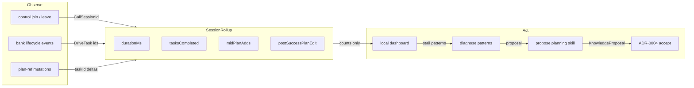

# 15 · Task-centric session satisfaction (research)

**Status.** Research / exploration — feeds [PRD 10](../prd/prd-task-satisfaction-observability.md), [ADR-0015](../adr/ADR-0015-task-session-observability.md), initiative [task-satisfaction-observability](../initiatives/task-satisfaction-observability/).  
**Companion.** [16-task-as-unit-models.md](16-task-as-unit-models.md) (task-as-unit metaphor + next-task proposers).  
**Does not replace.** [prd-success-metrics.md](../prd/prd-success-metrics.md) (phase gates / privacy CI).

## Problem

Drive retention depends on whether sessions **complete work**. Users who join a call, watch tasks stall, and leave mid-plan are unlikely to return. Today we can smoke “call feel” and privacy invariants, but we cannot answer: *did this session get tasks done, did the plan hold, and did the user keep directing?*



Caption:

- Inputs are typed events and bank ops — never utterances or audio.
- Rollups are local aggregates keyed by call session.
- Improvement writes only after gated accept (same privacy spine as ADR-0004).

## What already exists

| Primitive | Role for satisfaction | Gap |
|---|---|---|
| `control.join` / `control.leave` (`at`) | Call duration | No `callSessionId`; no `durationMs` on leave/end |
| `DriveTask` / `DrivePlan` (ADR-0008) | Unit of work + sequencer | Hub complete/bind path incomplete |
| Bank events (`drive_task_*`, `drive_plan_*`) | Lifecycle stream | Store emits subset; hub bank handlers omit `onBankEvent` |
| `work.*` room events | Tool proxies | Not bank tasks; useful as secondary signal |
| [prd-success-metrics](../prd/prd-success-metrics.md) | Phase / CI gates | Explicitly not session satisfaction |
| ADR-0004 gated learn | Safe improve path | Not wired to stall diagnosis |

## Metric families (product)

### A. Satisfaction proxies

| ID | Metric | Derive from | Reading |
|---|---|---|---|
| S1 | Session duration | leave.`at` − join.`at` (or mode-on→off) | Alone is weak; pair with completions |
| S2 | Tasks completed / session | `# drive_task_completed` with matching `callSessionId` / `roomId` | Primary accomplishment signal |
| S3 | Plan clean-drain | Activate→archive with zero **additive** mid-plan task ids | Plan quality + completion |

### B. Engagement (positive)

| ID | Metric | Derive from | Reading |
|---|---|---|---|
| E1 | Post-success plan continue | Plan edit or new plan activate **after** ≥1 task complete in session | User trusts the loop enough to ask for more |
| E2 | Intent refresh | Active plan title/intent change after drain or mid-session redirect | New goal without abandoning Drive |
| E3 | Tasks / session-minute | S2 / (S1 minutes) | Throughput proxy; interpret with churn |

### C. Plan quality / failure

| ID | Metric | Derive from | Reading |
|---|---|---|---|
| P1 | Mid-plan add churn | Plan-ref adds after activate / plan lifetime | High = under-planned or thrashing |
| P2 | Failure stickiness | Distinct taskIds with ≥1 `drive_task_failed` and no later `drive_task_completed` in-session (disk `lastFailure` is the note; event is taskId-only) | Recovery pressure |
| P3 | Fix-up sibling rate | New tasks appended while open task has `lastFailure` | Healthy recovery vs plan collapse |

### D. Closed-loop actionability

| ID | Metric | Derive from | Reading |
|---|---|---|---|
| A1 | Diagnose→propose rate | Sessions with stall pattern that emit a proposal | System can act |
| A2 | Propose→accept rate | Gated accepts of planning-skill / plan-template proposals | Human trust in improvements |

## Goal alignment (honest mapping)

There is **no** first-class `Goal` on the bank. Use:

| User language | Primitive |
|---|---|
| Goal / intent | Active `DrivePlan.title` (+ ordered `taskIds`) |
| Unit of accomplishment | `DriveTask` → `done` → archive |
| Aligned with goal | Completed tasks whose ids were on the plan at activate (S3) **or** explicitly accepted mid-plan adds (still “aligned,” but churned) |
| Goal change | New/activated plan or title refresh (E2) — engagement when after success |

Do not invent `goalId` or `aligned:boolean` fields for MVP metrics.

## Instrumentation prerequisites

Before any dashboard can be trustworthy:

1. **Call session binding** — stable `callSessionId` (or join event id) on room + bank log correlation; real `roomId` into bank store ([DRV-CALL-SESSION](../features/DRV-CALL-SESSION.md)).
2. **Complete bank event emission** — open / bound / completed / archived / plan activated / plan archived / plan-ref changed ([DRV-TASK-BANK](../features/DRV-TASK-BANK.md) completion).
3. **Hub task complete / bind / activate** — so production sessions emit the stream.
4. **Retention caps** — DRV-PRIVACY history caps before relying on durable logs.

## Privacy rails (binding)

- No phone-home Drive telemetry in MVP (DRV-PRIVACY, prd-success-metrics non-goal).
- No transcript / audio in rollups; no utterance text to “compute satisfaction.”
- Evidence for learn proposals = event ids, artifact paths, skill ids (ADR-0004).
- Local aggregation / opt-in export / visible debug only.

## Closed loop

```text
Observe (typed events)
  → Diagnose (S*/E*/P* patterns)
  → Propose (planning skill / plan template / fix-up)
  → Gate (accept | reject | mute)
  → Improve (durable skill or knowledge only on accept)
```

Stuck sessions (low S2, high P1/P2) trigger diagnose → propose. Successful sessions with E1 are **positive** — do not treat “more tasks after success” as churn.

## Open questions

1. Preferred dual proxy for “session satisfaction”: **S3 + E1**, or elevate S1?
2. How much mid-plan add churn is healthy collaboration vs plan failure?
3. Accept-gate owner for planning-skill proposals (same UI as learn queue?).
4. Backfill local history vs start metric clock at instrumentation-complete?
5. Relationship of director `DoBacklogItem.goal` strings to plan.title for alignment reporting?

## References

- [prd-task-satisfaction-observability.md](../prd/prd-task-satisfaction-observability.md)
- [prd-task-bank-drive-loop.md](../prd/prd-task-bank-drive-loop.md)
- [ADR-0008](../adr/ADR-0008-task-bank.md), [ADR-0004](../adr/ADR-0004-gated-learn-privacy.md)
- [DRV-LEAVE-END](../features/DRV-LEAVE-END.md), [DRV-PRIVACY](../features/DRV-PRIVACY.md)
- Code: `sdk/packages/shared/src/drive/{events,bankEvents,bank,logEnvelope}.ts`, `sdk/packages/drive/src/bankStore.ts`, hub `drive-bank-handlers.ts`
