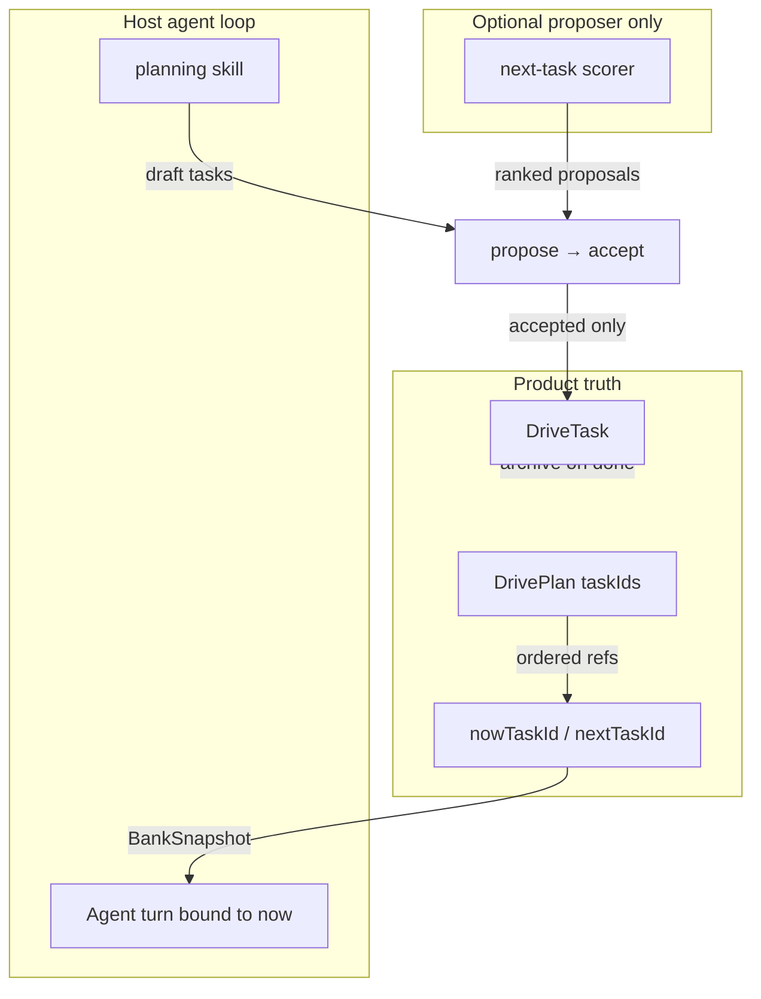

# 16 · Task-as-unit models (research)

**Status.** Research — conceptual groundwork. Product truth remains [ADR-0008](../adr/ADR-0008-task-bank.md). Harness angle: [drivecode-sdk/delivery/09-next-task-proposer.md](../../drivecode-sdk/delivery/09-next-task-proposer.md).  
**Related.** [15-task-satisfaction-observability.md](15-task-satisfaction-observability.md).

## Thesis

Large language models are measured and trained in **tokens**. Drive mode’s fundamental unit of measurement should be **tasks** (`DriveTask`): discrete, implementable work with acceptance criteria that the bank archives when done.

This is a **product and measurement** claim first. A learned “task model” (next-task prediction over trajectories) is optional research — never the sole writer of the live plan cursor.



Caption:

- Deterministic cursor is always explainable from disk.
- Host planning skills and any learned scorer only **propose**.
- Accept gate (ADR-0004 pattern) is the only path into durable bank / knowledge.

## Analogy (and its limits)

| Token world | Drive world | Limit |
|---|---|---|
| Token = atomic stream unit | `DriveTask` = atomic implementable unit | Tasks are human-meaningful; tokens are not |
| Context = ordered tokens | Active plan = ordered task ids | Plans are editable; contexts usually are not rewritten mid-decode the same way |
| Next-token prediction | Next-task **cursor** (greedy = plan order) | Product next ≠ ML sample |
| Training corpora | Session event trajectories (ids only) | Privacy forbids transcript dumps |
| Perplexity / CE loss | Completion / clean-drain / churn metrics | Product KPIs ≠ training objectives |

**Do not overload** waves `TokenQueue` (start-rate limiter) or LLM context tokens — different nouns.

## What “task model” means in three layers

### 1. Measurement model (ship)

Define success in **task outcomes per call session**: completed, failed-with-`lastFailure`, mid-plan adds, clean-drain. See research 15 metric families S*/E*/P*.

### 2. Sequencing model (ship)

“Predict the next task” in product = `deriveBankSnapshot`: `now = open[0]`, `next = open[1]`. Covered-check refuses unbound Agent mutations.

### 3. Learned proposer (research / later)

A model that scores candidate next tasks or plan structures from structured histories. Constraints:

- Output is a **proposal** (sibling fix-up, replan refs, planning-skill patch).
- Never writes `.drive/bank/` or room state alone.
- Trains only on privacy-allowed fields (event ids, outcomes, skill ids, artifact paths).
- Lives outside the shipped meta-harness runtime (Omnigent/Drive out-of-scope: eval / prompt optimization as core).

## Action loop when tasks do not complete

```text
recordTaskFailure / stall pattern
  → analyze structured session log (event ids)
  → planning skill proposes deeper / better-scoped tasks
  → human accept | reject | mute
  → accepted → durable skill or bank mutation via hub
```

This reuses ADR-0004 governance. Auto-writing “better plans” from silent transcript analysis is rejected.

## Risks of conflating metrics with training

| Risk | Mitigation |
|---|---|
| Optimize tiny tasks / premature archive | Prefer clean-drain + acceptance prose quality over raw count |
| Retention creep for “training data” | Local rollups; gated evidence; no utterance store |
| Second agent runtime in harness | Proposer stays host-side or offline; harness proposes ops only |
| Un-auditable Now/Next | Learned ranks never replace `BankSnapshot` cursor |
| Gaming silent retries | Align with M13 (no silent retry after gate deny) |

## Open questions

1. Should planning-skill proposals share the learn accept UI or get a bank-specific queue?
2. Is “tasks per minute” a leadership KPI or only a diagnostic?
3. When (if ever) does a learned proposer graduate from research to default Plan-posture assist?

## References

- [ADR-0008](../adr/ADR-0008-task-bank.md), [PRD 9](../prd/prd-task-bank-drive-loop.md)
- [drivecode-sdk/00-discovery-omnigent.md](../../drivecode-sdk/foundation/00-discovery-omnigent.md)
- [drivecode-sdk/09-next-task-proposer.md](../../drivecode-sdk/delivery/09-next-task-proposer.md)
