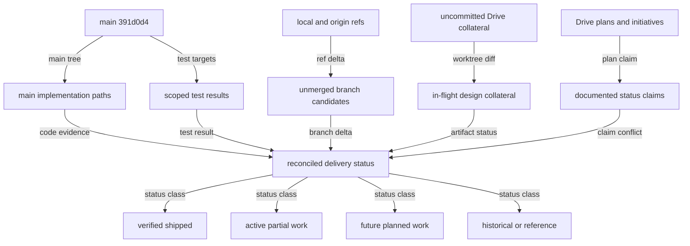

# Drive implementation and backlog reconciliation

**Status:** audit snapshot; no product behavior changed 
**Baseline:** `main` at `391d0d4ecfc17f093ed84e930316516ba352f94f` (`chore(demo): build-artifact.mjs — single-file demo distributions`, 2026-08-01) 
**Scope:** Drive Mode, Spotlight, Status Hub, Drive task/session work, and every locally available local / `origin/*` branch ref. 
**Companion:** [evidence and branch ledger](17-implementation-backlog-evidence.md)

## Audit topology

Caption:

- `main` code plus passing scoped tests are the standard for **verified shipped**.
- A branch that is not an ancestor of `main` is not automatically outstanding: several were squash/replay landed and are grouped as historical below.
- Uncommitted plans and static demos are useful evidence of intent, but are never evidence that a product capability shipped.
- Source: current Git refs, the Drive plan corpus, and mainline source paths listed in the companion ledger.

## Executive conclusion

The core product is substantially farther along than the feature-plan checklists imply. `main` contains a durable Status Hub, real hub-owned rooms and Spotlight event plumbing, the Show director/backlog, a broad `@cline/drive` kernel, and the task-satisfaction/session-moment spine. Those pieces should not be replanned as greenfield work.

The immediate problem is status drift, not a shortage of ideas. The audit found **149 unchecked boxes in 46 Drive plan files** (137 under `features/`), including implementation tasks that are demonstrably present on `main`. The original phase roadmap also still reads as though Phase 0–3 were future work. Treating those checklists as the live backlog will duplicate already-merged work.

Use the following classification consistently from here forward:

| Class | Meaning | Backlog treatment |
|---|---|---|
| **Verified shipped** | Present on `main`, with source evidence and usually focused tests | Close historical delivery tasks; retain only regression/extension work |
| **Active partial** | A real foundation exists, but a product acceptance boundary remains unmet | Keep a narrowly named implementation item |
| **Planned** | Design and/or demo exists, but no product implementation is evidenced on `main` | Keep as a future initiative; do not mark a demo as shipping it |
| **Decision-gated** | The product direction has not been accepted or intentionally sits beyond the current phase | Keep as a decision, not an engineering task |
| **Reference / historical** | Plan or branch explains delivered work or a prior investigation | Mark reference, archive, or add a resolution banner |

## What is verified on `main`

| Workstream | Verified implementation | What remains outside that claim |
|---|---|---|
| **Status Hub** | SQLite status store, monotonic `seq`, transactional supersession, `report_status`, hub commands/events, attention paging, live notifications, and browser Board / Changelog / Dependency map / Sessions lenses | The browser dependency map is intentionally a semantic card grid; it is not the planned spatial graph or Plans rail |
| **Dependency analysis** | Pure `buildDependencyMap()` computes stable keys, layers, ready/waiting state, and missing/cycle warnings; the browser renderer is keyboard-accessible | Historical/persisted task graphs and disconnected-loading recovery are not present |
| **Drive room and Spotlight core** | Hub-owned room snapshots, `call_join`, leave, mute, stage, mode, address, roster-pack, work-card, end/rejoin, and tool-event bridging are real implementation paths | Rooms are in memory only; the product does not have durable/recovered rooms or a multi-human media plane |
| **Show backlog director** | Enqueue/rank/present/script/policy/producer/router slices and Spotlight convergence landed; the initiative is a reference plan, not new implementation work | New Spotlight screen-frame UX is a separate planned initiative |
| **Task/session satisfaction** | Bank event instrumentation, session rollups, failure stickiness, felt-agency controls, recovery fork, clean drain, re-entry, recruit-on-stall, Status Sessions, digest, SDLC bankable tasks, plan-improve gate, and retention caps landed | Privacy presentation, host skill compile, feed narration, learn-queue integration, and some governance decisions remain |
| **Recruit and RosterPack foundations** | Scoring/expansion, durable pack registry, hub add/remove, and the stall-recruit picker exist | There is no general Add → Recruit flow or pack library/editor product surface |
| **Drive product home** | Browser Drive view gives a default pairing-room preview, join/return action, roster/Spotlight summary, and Status entry point | It is a single default room (`DRIVE_DEFAULT_ROOM_ID`), not the planned Discord-like channels or rooms browser |
| **Demo artifact foundation** | The tracked product-demo canvas and artifact packaging landed through #91, #94, and #98 | A static demo should only claim the maturity of the underlying product capability; it does not turn planned PiP, Gates UI, rooms IA, audio, or screen-frame work into shipped behavior |

## Recommended cleanup before selecting another feature

This is the shortest path to a usable backlog. It is documentation and triage work, not a rewrite of the product.

| Order | Cleanup item | Evidence | Recommended disposition |
|---|---|---|---|
| 1 | Declare the source-of-truth triad | `SYSTEMS-ANALYSIS` §13, nest `HANDOFF.md`, and `REMAINING-task-satisfaction.md` are already the only documents that reflect current state reliably | State this at the top of each active plan index; defer to those sources when plan prose conflicts |
| 2 | Reconcile historical feature checklists | 149 unchecked tasks include room, tab, stage, roster, toggle, Driveagent home, recruiter foundations, and Gates taxonomy that are already on `main` | Mark delivered work `[x]` or move it to a historical-delivery table; leave only actual acceptance gaps unchecked |
| 3 | Reclassify `TASK-GRAPH.md` | It presents Phase 0–3 gates as future work and contains stale fixed-port wording | Mark it as a historical dependency roadmap or re-baseline every phase against `main`; do not use it as an executable lowest-red-gate algorithm until then |
| 4 | Resolve the uncommitted demo collateral | The tracked `drive-product-demo.html` is already on `main`; the untracked initiative and explainer are documentation/indexing around it | Classify the initiative as **reference**, distinguish static demo maturity from product maturity, then deliberately commit or discard the collateral |
| 5 | Close the historical product review | `meta/reviews/2026-07-31-product-review.md` reads as live remediation, but its main remediation wave landed in #94–#98 | Add a resolution banner and small landing matrix; preserve genuinely planned S9/dead-air work as planned |
| 6 | Normalize feature status headers | Current plans mix unchecked boxes, prose banners, and initiative state | Add `Status`, `Reconciled against`, `Actual remaining scope`, and `Canonical backlog` fields to each DRV plan as it is touched |

## Live implementation backlog

The sequence below is a recommendation for a small, truthful backlog. It deliberately separates product gaps from design-only future tracks.

### Current product gaps

| Band | Work package | Why it is still open | Entry evidence / acceptance boundary |
|---|---|---|---|
| **Now** | **Gates feed UI and expiry policy** | The taxonomy exists, but users cannot reliably see/approve/deny a high-impact action in the room feed | Build approval cards plus approve/deny flow, expiry rules, room-feed projection, and an explicit owner; reconcile `DRV-GATES` |
| **Now** | **Room continuity and human identity** | Rooms disappear on hub restart; degraded snapshot/recovery UX and cross-surface human participant identity are incomplete | Define hub-down / `room_not_found` behavior, live-snapshot recovery, acceptance coverage, and the participant-id contract for webview and CLI |
| **Now** | **General Recruit/Add and RosterPack library** | Kernel/hub seating works, but the product lacks a normal recruit path and pack discovery/editor | Ship an intentional Add → Recruit entry and a pack library/editor or explicitly narrow the feature scope |
| **Now** | **Task-bank residual lifecycle wiring** | The task-bank initiative calls phases 2, 4, 5, and 8 partial | Close the remaining event tests, mutation-policy enforcement, complete/cursor wiring, and native mode / persistent-hub ownership boundary |
| **Now** | **Task-satisfaction residuals** | The core is landed, but user trust and governance gaps remain | Add visible debug-retention state and raised-cap wiring; compile accepted skills to `.driveagent`; unify learn gates; narrate recovery/plan-improve; finish W1 redirect/Now and SDLC stage-freeze UI; accept or revise ADR-0015 |
| **Next** | **Spatial Dependency map and Plans rail** | The working card grid is intentionally not the planned graph | Implement the locked `status-dependency-graph` slices: viewport/fit/density, Plans rail, artifact edges, and retained accessibility |
| **Next** | **Browser/CLI parity** | The TUI has a local Drive toggle and limited Status lenses; it does not call `call_join` | Decide the intended parity bar, then add real call integration and only the Status interactions that matter for that bar |

### Design-ready future tracks

| Initiative | Current status | Keep it as |
|---|---|---|
| `spotlight-screen-share` | S1–S9 are explicitly planned and none has begun | A stage-first UI initiative built on the shipped Show machinery, not a claim of real pixel sharing |
| `drive-audio` | Kokoro choice and demo clips exist; all product slices remain unstarted | A separate voice/narration initiative with its off-by-default privacy posture preserved |
| `status-dependency-graph` | UX locked; existing card-grid baseline shipped | A bounded visual upgrade, not a replacement for the dependency model |
| CLI parity, isolation, and `teamOpt` | Future-phase work | A named strategic track after a decision on parity and host scope |
| WebRTC, pixel sharing, and multi-human media | Explicitly outside the present phase | A decision-gated future, not an accidental bug backlog |

## Branch reconciliation

All local and locally available `origin/*` refs were inspected. Git ancestry alone was not used as a delivery signal because this repository has squash/replay landings.

| Ref group | Audit result | Required action |
|---|---|---|
| `feat/canvas-platform` and `origin/feat/canvas-platform` | Two active unmerged commits over `main`: canvas registry/recorder, `canvases.json`, build-artifact changes, and proposed ADR-0017. The ref advanced during this audit. | Re-read the current tip, decide the ADR, and review as a small independent change; do not call it shipped |
| Demo v4: `feat/demo-v4`, `origin/feat/demo-v4`, `batch-v*`, `batch-u*` | One unmerged 40-file demo stack. Local `feat/demo-v4` lags the origin/batch tip; the newer tip adds v4 voice, revised script, interactive VS Code mock, takeover choreography, and GIFs. | Consolidate to a single reviewed branch and decide whether the director's cut is worth landing; do not create multiple backlog items for intermediate refs |
| V4 correction branches | `stale-feed-agent-message`, `stale-preview-override`, and `late-hover-dwell-fraction` contain genuine unmerged demo fixes | Fold selectively into the chosen v4 branch rather than cherry-picking into `main` without the stack context |
| Demo-motion correction branches | Debug-bar, human MP3 playback, STT cancellation, muted-voice timing, and voice-recorder concurrency fixes are not on `main` | Treat as optional demo-quality fixes; independently test each one-file correction |
| `origin/cursor/teams-load-promise-settlement-4f70` | Real resilience fix: malformed non-array team replies settle instead of leaving the dependency-map request unresolved | Consider as a small production bug fix, independent of the demo stacks |
| `codex/drive-working-loop` = `feat/mermaid-show-validation` | One 48-path candidate with room-preview, join/retry, and Mermaid-validation work; it overlaps later landings but still differs in 26 paths | Rebase and compare behavior-by-behavior; do not wholesale cherry-pick |
| `feat/gate-feed-stage-seq` | Most content landed in #65; one ordering detail remains around when `roomSeqRef` advances | Review as a narrowly scoped stale-event ordering question, not a new Gates feature |
| `orch/share-screen-canvas/live-demo` | Old merge-shaped branch; likely outstanding content is a no-credential share-screen demo route | Make a product/visual decision before extracting the route; do not merge the old base wholesale |
| Historical feature/fix refs | Status map, state partition, chat-fork, drive MVP/harness, roster a11y, docs cleanup/rebaseline, demo motion, webview security/gateway/contrast, and artifact build were patch/replay landed | Mark/close the refs where their owners agree; they are not backlog work |
| `batch-z*`, `batch-w*`, and `worktree-agent-*` refs | Intermediate tips of the demo-motion or demo-v4 stacks, not independent deliverables | Preserve while worktrees are in use; do not count them separately or prune without ownership checks |
| AI SDK / generic CI refs | Reachability-unmerged but not Drive/Status work | Triage outside this backlog audit |

The companion ledger records the specific landings, code signatures, and test evidence for each group.

## Conflicts that should be resolved explicitly

1. **Drive-room list claim:** the uncommitted product-demo script describes an “Open Drive tab (rooms list)” beat as shipped. The actual `DriveView` uses only `DRIVE_DEFAULT_ROOM_ID` and renders one pairing-room preview. Reword the demo beat as a default-room product home, or mark multi-room IA planned.
2. **Demo artifact status:** the tracked demo canvas is already on `main`; the untracked initiative documentation is not evidence of a new shipped product slice. Its status should be `reference`, unless work begins on the underlying product behavior.
3. **Plan-reentry wording:** `REMAINING-task-satisfaction.md` says the generic re-entry row landed while another residual calls an End → next-task resume CTA open. Narrow the residual to the End-packet CTA if that is the intended distinction.
4. **Governance lag:** ADR-0015 remains proposed even though related observability work has landed. Accept, amend, or supersede it before treating the implementation as fully governed.
5. **Checklist signals:** the feature checkboxes frequently contradict current-state prose. The prose triad named above wins until the checklists are reconciled.

## Audit limits and verification note

- This is complete for refs already present locally (`refs/heads` and local `origin/*`); no network fetch was performed.
- The worktree already contained modified/untracked Drive docs. They were read as in-flight evidence and were not changed by this audit.
- Focused Status, dependency-map, and Drive-kernel tests passed. Focused Core room/bank handler tests currently fail against a stale ignored `sdk/packages/drive/dist` build. Repository policy requires `bun run build:sdk` before that suite can be treated as a product verdict, so those failures are a verification-precondition issue, not confirmed functional regressions.
- The audit intentionally does not convert explicit non-goals (WebRTC, persistent rooms, multi-human media) into bugs. A product decision must promote them first.
