# 18 · Task as the durable execution unit

**Status:** research and implementation direction; no schema or runtime change is authorized by this note<br>
**Product truth today:** [ADR-0008 task bank](../adr/ADR-0008-task-bank.md), [task-bank Drive-loop PRD](../prd/prd-task-bank-drive-loop.md), and [task-as-unit models](16-task-as-unit-models.md)<br>
**Implementation evidence:** [task-bank initiative overview](../initiatives/task-bank-drive-loop/overview.md), [implementation/backlog audit](17-implementation-backlog-audit.md), and the source paths named below<br>
**Related outcome work:** [task satisfaction observability](15-task-satisfaction-observability.md) and [remaining residuals](../delivery/REMAINING-task-satisfaction.md)

```mermaid
flowchart LR
  Intent["human intent"]
  Brief["Task Brief"]
  Task["DriveTask\ncanonical work contract"]
  Plan["DrivePlan\nordered task refs"]
  Cursor["BankSnapshot\nNow / Next"]
  Context["DriveExecutionContext"]
  Attempt["TaskAttempt\nbound agent work"]
  Evidence["evidence references"]
  Outcome["verified outcome"]
  Archive["bank-managed task archive"]
  Projection["session / status projection"]
  Proposer["optional planner or scorer"]
  Gate["proposal acceptance gate"]

  Intent -->|"shape"| Brief
  Brief -->|"defines"| Task
  Plan -->|"ordered taskIds"| Task
  Plan -->|"active plan"| Cursor
  Task -->|"valid referenced state"| Cursor
  Cursor -->|"one current task"| Context
  Context -->|"bind"| Attempt
  Attempt -->|"produces"| Evidence
  Evidence -->|"supports"| Outcome
  Outcome -->|"accepted completion"| Archive
  Outcome -->|"recovery decision"| Task
  Attempt -->|"privacy-safe events"| Projection
  Proposer -->|"candidate patch"| Gate
  Gate -->|"accepted only"| Brief
```



Caption:

- A **task** is the smallest durable, user-visible, verifiable unit of product work — not an LLM token, tool call, or internal wave item.
- The deterministic bank cursor still chooses Now/Next from ordered plan references. A planner or learned scorer may propose changes but cannot silently rewrite durable work.
- `TaskAttempt`, evidence, and projections are proposed product concepts where today’s implementation does not yet persist them as first-class records.
- Privacy-safe status/session projections are deliberately downstream: they summarize task work and must not become a second task authority.

## Executive direction

Drive should treat `DriveTask` as its **semantic unit of execution**: the contract a person can inspect, steer, verify, and archive. The token analogy is useful only at that level. Just as tokens are the unit around which an LLM’s stream is organized, tasks should be the unit around which Drive’s product loop is organized — planning, current focus, agent binding, recovery, evidence, satisfaction, and later learning.

That does **not** mean making tasks tiny, counting tasks as productivity, or turning every internal agent action into a task. Tokens are model-internal atoms; Drive tasks are human-meaningful agreements about a bounded outcome. The product should optimize for a completed, correctly scoped, verifiable outcome rather than “tasks per minute.”

The repository already has a credible foundation: a durable workspace bank, ordered plans, a deterministic `BankSnapshot` cursor, bank lifecycle events, task archive behavior, Now/Next UI, failure/recovery affordances, and session rollups. What is missing is the product contract that makes a task reliably actionable and auditable across agent execution, human steering, and completion proof.

## What the current implementation proves

### Confirmed foundation

| Existing component | What it already gives the product | Evidence boundary |
|---|---|---|
| `DriveTask` / `DrivePlan` / `BankSnapshot` in `@cline/shared` | Durable task records, plan ordering, and deterministic Now/Next | Current schema is task title/body/status plus `lastFailure`; a plan is ordered task IDs. |
| `deriveBankSnapshot()` in `@cline/drive` | Explainable cursor: first open task is Now, second is Next | Missing plan references are skipped rather than becoming a recovery workflow. |
| `BankStore` and hub `drive_bank_*` handlers | Hub command path centralizes the ordinary product task lifecycle, archive-on-completion, and active-plan snapshot | Browser-local/fallback stores and direct filesystem writes remain possible; there is no lock, CAS, revision, or conflict protocol. |
| Plan editor / NowNext in the Hub | Visible order, direct completion, failures, simple task add/reorder | No proper task-contract authoring, evidence receipt, plan creation, or archive browser. |
| Bank events, session rollups, satisfaction work | Privacy-aware event spine and outcome-oriented session analysis | Events are insufficient to reconstruct a full task trajectory or verification decision. |
| `allowWorkspaceMutation()` / Drive loop posture | An explicit “covered by a task” policy concept | It is a pure policy/UI-prompt boundary, not core tool enforcement. |

### Critical gaps to resolve before calling tasks the execution primitive

| Gap | Why it matters | Recommended direction |
|---|---|---|
| **Intent is too thin** | A free-form title/body rarely says what “done” means. | Introduce a readable Task Brief convention and quality warnings before a schema migration. |
| **Binding is advisory** | An agent can still mutate work without a task through lower tool/runtime paths. | Carry a `DriveExecutionContext` into the actual mutation boundary; deny or require explicit human override when unbound. |
| **Completion has no proof gate** | `complete` archives directly; a task can be marked done without observable evidence. | Decide completion authority, then add a policy-driven completion receipt/evidence reference and verification action where appropriate. |
| **Failure loses history** | `lastFailure` is overwritten and the task reopens. | Preserve attempts and recovery decisions, while keeping the simple user-visible state model. |
| **Referential integrity and identity are underspecified** | Plans can contain duplicate/nonexistent task IDs, derivation skips missing references, and filenames are caller-controlled. Plans are workspace-scoped while prior prose says per-room. | Decide scope, generate safe IDs, validate reference existence/uniqueness, and surface corrupted/missing-reference results before normal multi-client authoring. |
| **Authoring is incomplete** | Hub joins can seed a demo bank; there is no normal Create Plan flow. | Replace implicit demo seeding with explicit empty-state / create-plan / create-task paths. |
| **History and privacy controls are incomplete** | `body`, `lastFailure`, and future receipts are durable free-text channels; current failure text can contain arbitrary tool-error content. | Ship bounded/redacted structured failure and evidence handling with execution history; later learning only consumes its strict privacy-allowed projection. |

## Product contract: task, plan, attempt, outcome

The following model separates concepts that are currently easy to conflate. Only `DriveTask` and `DrivePlan` are canonical work records today; the other rows are proposed extensions or projections.

| Concept | Responsibility | Canonical? | Must not be confused with |
|---|---|---|---|
| **DriveTask** | Human-readable, bounded contract for a deliverable outcome | Yes | An LLM token, an internal tool call, a Cline session, or a wave work item |
| **DrivePlan** | Editable sequencing/index over task IDs | Yes | The source of task truth or a task history log |
| **BankSnapshot** | Deterministic current and next task projection | Derived | A learned next-task prediction |
| **TaskAttempt** | One bounded agent/human execution episode tied to a task | Proposed durable record | A task itself; retries may create multiple attempts |
| **DriveExecutionContext** | Capability-bearing binding passed into the work/mutation boundary | Proposed runtime contract | A UI hint or prompt-only instruction |
| **Evidence / completion receipt** | References supporting the claimed outcome and verification action | Proposed additive record | Raw transcript, screen recording, or private payload retention |
| **TaskOutcome** | Verified completion, recovery-needed result, or explicit abandonment rationale | Proposed decision record | A binary status flip without context |
| **Task projection** | Status/session/Director/Team view derived from task facts | Derived / adapter | A second independently mutable task database |

### The minimum task contract

Start with a user-visible Task Brief rather than a disruptive schema redesign. It can live in the current `body` field, meaning legacy task bodies remain valid.

```md
## Outcome
What will be true when this task is complete?

## Scope
What is included, and what is explicitly not included?

## Acceptance
Observable conditions that distinguish success from activity.

## Verify
The command, inspection, review, or user action that will check acceptance.

## Constraints / risks
Safety, privacy, dependency, or product constraints.

## Completion evidence
Filled at closure: links/paths/identifiers and a concise result, not a transcript.
```

The first release should show this structure, permit unstructured legacy work, and offer soft quality warnings such as “acceptance is missing” or “no verification method declared.” It should not block a person from adding a small urgent task or force artificial metadata into every task.

### Invariants worth defending

1. A task has a stable opaque ID that is safe for bank storage and never changes when its title changes.
2. A plan only sequences references; it does not copy task state or create a competing task record.
3. At most one task is **current** per active plan/cursor. “Current” is derived, not manually faked in multiple systems.
4. A mutation performed under Drive execution has an explicit task binding or a visible, audited human override.
5. Completion is a claim with a verification action and evidence reference when the applicable task policy requires it. Archive follows a recorded completion decision; it is not the only proof.
6. Recovery preserves what was attempted, why it did not complete, and who chose the next step.
7. Transcripts, audio, pixels, secrets, and unconstrained tool payloads are never task evidence by default.
8. Status Hub, Director, Team tasks, `DoBacklogItem`, and wave work items should consume task identity through one-way adapters once those links are introduced. They must not replace the bank as the authority.

## State model: stay simple for people, preserve detail in records

The current schema offers `open`, `in_progress`, and `done`, with `lastFailure`; completion moves the task to archive. Do not introduce a large workflow engine merely to express every internal condition.

Recommended user-facing projections for the first product iteration:

| User-facing state | Existing basis | Product behavior |
|---|---|---|
| **Ready** | `open` task in an active plan | Can be edited/reordered; may become Now through plan order. |
| **Now** | First open task in `BankSnapshot` | Shows binding, scope, latest execution progress, and how to steer. |
| **Needs a decision** | `lastFailure` / failed attempt | Presents recover, re-scope, verify manually, or stop; never silently retries after a denied gate. |
| **Ready to complete** | Proposed evidence plus declared verification | Lets the person inspect a completion receipt before archival. |
| **Archived** | Current archive-on-done behavior | Bank-managed outcome/history view, with a deliberate follow-up task rather than reopening history. |

Internally, an attempt can be created, started, paused by an external gate, failed, superseded, or verified. That detail belongs in events/receipts and task history; it does not need to become seven new persistent task statuses in the initial UI.

## Product journeys the implementation must support

### 1. Establish work: turn intent into an inspectable contract

A person creates a plan or enters an empty workspace and adds a task. The UI helps them state outcome, acceptance, and verification. The result is readable by a collaborator and usable by an agent without hiding assumptions in chat. Small tasks can remain lightweight; a warning invites clarification rather than blocking creation.

**Acceptance signal:** a collaborator can explain what success looks like from the task alone, and the system does not seed durable demo tasks into the user’s real bank.

### 2. Execute and steer: make “Now” the active work agreement

Starting Drive binds the current task into an execution context. The person sees the task brief, agent/call association, and relevant progress. A scope change creates a visible task revision or a new task; it is not an invisible prompt correction.

**Acceptance signal:** a user can say “what is the agent doing, under what acceptance criteria, and how do I redirect it?” without reconstructing a chat transcript.

### 3. Complete with proof: distinguish activity from an outcome

The agent or person records a concise completion receipt: changed artifact references, verification result, and any known limitation. The applicable completion policy determines whether verification is automatic, user-confirmed, or requires an existing approval path. A person can inspect/verify or request recovery. After the recorded completion decision, the task archives and the cursor advances deterministically.

**Acceptance signal:** the archive answers “what happened and how was it checked?” without retaining private conversation data.

### 4. Recover deliberately: preserve failed work as information

When verification fails or the agent stalls, the task becomes a decision point. The person may retry with a changed brief, split a follow-up task, seek human input, or abandon with rationale. Each is explicit and keeps the original task’s history intact.

**Acceptance signal:** no silent retry or plan rewrite occurs after a blocked/denied condition, and failure does not overwrite prior recovery context.

### 5. Return and resume: rebuild context from durable task facts

On a later session, Drive shows the active plan, Now/Next, last meaningful outcome, outstanding decision, and evidence. It does not rely on replaying a prior transcript or on a room remaining in memory.

**Acceptance signal:** a user can safely resume a task after restart/reconnect within the chosen scope model.

## Implementation path

The sequence deliberately improves product honesty before adding learning or a broad data model.

### Phase A — make the current bank honest and usable

- Replace join-time durable demo seeding with an explicit empty-bank experience.
- Add normal Create Plan, Create Task, task details, and archive/history access to the Hub.
- Adopt Task Brief v1 in `body` with soft quality diagnostics and legacy compatibility.
- Make empty and missing-plan cursor states explicit rather than silently skipping references.
- Decide and document whether bank/plan identity is workspace-scoped or room-scoped. Do not build cross-room behavior until that decision is accepted.
- Generate safe task/plan IDs in one place; reject path-like/colliding IDs, validate task-reference existence and uniqueness, and surface a missing/corrupt-reference result rather than silently skipping it.

**Why first:** users cannot evaluate the task model while the primary authoring path is a demo seed and task definitions lack a visible completion contract.

### Phase B — bind real execution and capture completion receipts

- Introduce a `DriveExecutionContext` whose task ID reaches the actual workspace mutation/tool boundary, not only the pure posture policy.
- Define a narrow human override for intentionally unbound work, with a visible reason/audit event.
- Add a proposed completion-receipt protocol: verification method, allowed evidence references, result, and limitations.
- Resolve task-policy completion authority; where policy requires it, make archive contingent on a recorded outcome/verification decision.
- Preserve attempt/failure history rather than only replacing `lastFailure`, using bounded/redacted structured failure and evidence fields rather than arbitrary durable tool-error text.
- Add optimistic revision/CAS or an equivalent conflict protocol before multi-client authoring and execution contexts depend on mutable plans.

**Why second:** “task is the execution unit” is not credible until the runtime respects task binding and the completion path records an outcome.

### Phase C — add adapters, not a second task system

- Add optional `driveTaskId` linkage to Director `DoBacklogItem` where a direction item corresponds to durable work.
- Add `parentDriveTaskId` and eventually `attemptId` to Drive wave/worktree items as correlation fields only.
- Project task facts into session rollups, Status Hub, and Team views through one-way adapters.
- Preserve existing Cline task/session and `TokenQueue` concepts; never rename or merge them into `DriveTask`.

**Why third:** these integrations are valuable only after bank authority, scope, and evidence semantics are stable.

### Phase D — learn safely from structured trajectories

- Version additive lifecycle events for creation, brief revision, plan binding/reorder, attempt start/finish, verification, recovery choice, and archive.
- Consume only the privacy-allowed structured projection: IDs, timestamps, actor class, outcome class, skill/tool category where safe, artifact references, and user decisions. Keep transcript/audio/pixels/secrets out.
- Build local evaluation datasets and diagnostic scorecards before any learned scorer.
- Let a planning skill or scorer return candidates; for those proposal outputs, a human accept gate is the only path that changes the bank. Direct user-authored work remains governed by the normal task-authoring policy.

**Why last:** a model trained on incomplete or untrusted task records would automate the wrong thing and create a retention incentive before the product has earned trust.

## Delivery seams in the existing codebase

| Seam | Current role | Likely change in this direction |
|---|---|---|
| `sdk/packages/shared/src/drive/bank.ts` | Canonical task/plan/snapshot schema | Add only accepted contract fields or separate versioned receipt/attempt records; preserve migration compatibility. |
| `sdk/packages/drive/src/bankStore.ts` | Durable file-backed lifecycle mutations | Centralize ID/reference validation, revision checks, attempt/evidence writes, and archive invariants. |
| `sdk/packages/drive/src/bankSnapshot.ts` | Deterministic Now/Next derivation | Represent empty/missing/ref-conflict conditions explicitly rather than silently skipping them; retain plan-order truth. |
| `sdk/packages/drive/src/driveLoop.ts` | Pure posture and workspace-mutation policy | Move from advisory coverage policy to a context supplied at enforcement points. |
| `sdk/packages/shared/src/drive/bankEvents.ts` | Privacy-conscious lifecycle event schema | Add additive event types for revision, attempts, decisions, evidence, and reordering; maintain forbidden-field tests. |
| `sdk/packages/core/src/hub/server/handlers/drive-bank-handlers.ts` | Hub bank command boundary | Offer explicit authoring and safe concurrency behavior; remove product-mode demo seeding. |
| `apps/cline-hub/src/webview/src/components/PlanEditor.tsx` and `NowNext.tsx` | Task order and current-task UI | Add Task Brief, verification receipt, recovery, and archive flows rather than more checkboxes. |
| session rollups / Status Sessions / Director | Downstream product projections | Carry correlation IDs and outcome summaries, never write a competing task lifecycle. |

## Evaluation and product scorecard

Use task outcomes as diagnostics, never as a raw throughput target. The [task-satisfaction research](15-task-satisfaction-observability.md) already supplies the relevant satisfaction and session lens; the task unit should make it more explainable.

| Dimension | Example measure | Bad incentive to avoid |
|---|---|---|
| Outcome quality | Verified completion rate; acceptance condition satisfied; recurrence/follow-up rate | Marking tiny or ambiguous tasks done to raise counts |
| Task clarity | Share of active tasks with outcome, acceptance, and verification described | Forcing verbose templates onto urgent/simple work |
| Agency | User can identify Now, steer it, and observe the resulting delta | Treating fewer interventions as automatically better |
| Recovery | Time/steps from a documented failure to an explicit human decision | Silent retries or hidden automatic replans |
| Planning health | Clean plan drain; justified additions/splits; stale task age | Deleting or subdividing tasks to improve a dashboard |
| Trust and privacy | Evidence contains only allowed references; user understands retention | Capturing transcripts/recordings to feed analytics |

Evaluation should begin with repeatable scenarios, not broad telemetry: a clean happy-path task, failed verification, scope change mid-attempt, restart/resume, concurrent editing, empty bank, and a privacy-sensitive evidence request. For each scenario, assess the visible contract, enforcement behavior, archive/resume result, and data retained.

## External product research: relevant lessons, not copied designs

The public ecosystem supports task-centered agent control but does not supply this product’s exact contract.

| Source | Evidence | Implication for Drive |
|---|---|---|
| [GitHub’s mission control announcement](https://github.blog/changelog/2025-10-28-a-mission-control-to-assign-steer-and-track-copilot-coding-agent-tasks/) | Presents agent tasks as a central surface for assignment, status, session logs, steering, and PR context. | A task needs a visible control/review surface, not only a background queue. |
| [GitHub Agents panel announcement](https://github.blog/news-insights/product-news/agents-panel-launch-copilot-coding-agent-tasks-anywhere-on-github/) | Describes delegation from multiple contexts, real-time progress, parallel work, and PR review. | Task identity must survive entry points and make progress reviewable; Drive should still retain a single canonical bank. |
| [Anthropic: Demystifying evals for AI agents](https://www.anthropic.com/engineering/demystifying-evals-for-ai-agents) | Separates a task’s inputs/success criteria from attempts/trials and evaluation outcomes. | Model `DriveTask`, `TaskAttempt`, and verification/outcome separately instead of using one status field as all three. |
| [OpenAI: A practical guide to building agents](https://openai.com/business/guides-and-resources/a-practical-guide-to-building-ai-agents/) | Emphasizes clear agent actions, guardrails, orchestration, and human intervention. | Bind execution at a real control boundary and keep acceptance/override visible to people. |

These references are directional research, not product requirements. The local ADRs, privacy rules, and user evidence remain authoritative.

## Decisions required before schema expansion

1. **Scope:** Is the canonical bank/active plan workspace-scoped, room-scoped, or workspace-shared with room projections? Current implementation and older prose disagree.
2. **Completion authority:** What counts as sufficient verification for automatic archival, and when must a human accept a receipt?
3. **Evidence policy:** Which reference forms are allowed (path, commit, test run ID, review URL), where are they stored, and what retention/visibility rules apply?
4. **Identity/concurrency:** What generated ID grammar, revision protocol, and conflict UX are required for concurrent Hub clients?
5. **Task ownership:** Who may create, revise, reorder, split, archive, or override a task: user, bound agent, planner skill, recovery flow, or SDLC importer?
6. **Integration boundary:** Which downstream concepts get correlation IDs first — Director `Do`, waves/worktrees, Team tasks, Status Sessions — and which remain intentionally unrelated?
7. **Learning gate:** What local evaluation evidence is needed before proposing any learned task scorer to users?

## Explicit non-goals

- A learned task writer or autonomous plan mutator.
- An LLM-token productivity metric or “tasks per minute” north-star KPI.
- Transcript, audio, pixel, secret, or raw tool-payload retention as task evidence.
- A second agent runtime, workflow engine, or task database parallel to the Drive bank.
- Collapsing Cline sessions, Team tasks, Director `Do` items, waves `TokenQueue`, or Status projections into one type.
- A broad Recruit/Goals redesign hidden inside task-bank implementation.

## Recommended next decision

Create one **decision-gated** backlog entry: “Adopt DriveTask v1 execution contract.” Its acceptance should be a short ADR resolving scope, completion authority, evidence policy, identity/concurrency, and the first adapter boundary. Only then select the Phase A authoring/empty-state slice.

This keeps the task-as-unit idea product-led: the implementation earns the claim through a readable contract, real binding, visible proof, deliberate recovery, and privacy-safe history — not by adding more status fields.
