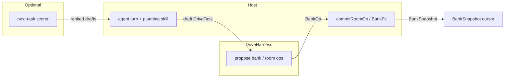

# 09 · Next-task proposer (harness boundary)

**Status.** Follow-on design note (not active harness PR work).  
**Product research.** [cline-drivemode/research/16-task-as-unit-models.md](../../cline-drivemode/research/16-task-as-unit-models.md)  
**Decision spine.** [ARD-0015](../../cline-drivemode/ard/ARD-0015-task-session-observability.md) (Proposed), [ARD-0008](../../cline-drivemode/ard/ARD-0008-task-bank.md)

## Problem

Product language wants “predict the next task” the way models predict the next token. The Drive harness must not become a second agent runtime or a silent plan writer to satisfy that metaphor.

## Layering

Caption:

- Harness proposes ops; host commits; apps project.
- Scorer feeds the **host** planning path, not the live cursor.
- Cursor remains deterministic plan order.

## Rules

1. `nowTaskId` / `nextTaskId` always come from `deriveBankSnapshot` (plan order + open statuses).
2. Harness may grow **pure** helpers: stall classify, draft-task shape validation, op builders — no LLM calls in `@cline/drive`.
3. Any learned scorer is out-of-process or host-side; outputs are proposals under ARD-0004-style accept when durable.
4. Do not fold task-bank CRUD into a hidden “predictor loop” inside `createDriveHarness`.
5. Show `planShowIntents` stays presentation ranking — orthogonal to DriveTask sequencing.

## Relationship to Omnigent lessons

Kept: meta-layer owns composition/policy; cedes the turn loop.  
Rejected here: eval/prompt-optimization as a shipped harness concern; telemetry defaults that retain session prose.

## When to implement

After [task-satisfaction-observability slice 1–2](../../cline-drivemode/initiatives/task-satisfaction-observability/) make session trajectories trustworthy. Until then, “next task” is the bank cursor only.

## References

- [06-sdk-leverage.md](06-sdk-leverage.md)
- [00-discovery-omnigent.md](../foundation/00-discovery-omnigent.md)
- [02-architecture.md](../foundation/02-architecture.md)
