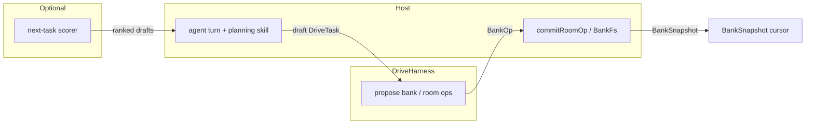

# 09 · Next-task proposer (harness boundary)

**Status.** Rule-2 pure helpers **landed** (claim:drv-bank-ops); no scorer, by rule 3.  
**Product research.** [cline-drivemode/research/16-task-as-unit-models.md](../../cline-drivemode/research/16-task-as-unit-models.md)  
**Decision spine.** [ADR-0015](../../cline-drivemode/adr/ADR-0015-task-session-observability.md) (**Accepted**), [ADR-0008](../../cline-drivemode/adr/ADR-0008-task-bank.md)

## Problem

Product language wants “predict the next task” the way models predict the next token. The Drive harness must not become a second agent runtime or a silent plan writer to satisfy that metaphor.

## Layering

Caption:

- Harness proposes ops; host commits; apps project.
- Scorer feeds the **host** planning path, not the live cursor.
- Cursor remains deterministic plan order.

## Rules

1. `nowTaskId` / `nextTaskId` always come from `deriveBankSnapshot` (plan order + open statuses).
2. Harness may grow **pure** helpers: stall classify, draft-task shape validation, op builders — no LLM calls in `@cline/drive`.
3. Any learned scorer is out-of-process or host-side; outputs are proposals under ADR-0004-style accept when durable.
4. Do not fold task-bank CRUD into a hidden “predictor loop” inside `createDriveHarness`.
5. Show `planShowIntents` stays presentation ranking — orthogonal to DriveTask sequencing.

## Relationship to Omnigent lessons

Kept: meta-layer owns composition/policy; cedes the turn loop.  
Rejected here: eval/prompt-optimization as a shipped harness concern; telemetry defaults that retain session prose.

## Implementation state (2026-08-08)

The gate below is **met** — [task-satisfaction-observability](../../cline-drivemode/initiatives/task-satisfaction-observability/) slices 1–3 landed on `main` (#80). It only ever gated the **scorer**; the rule-2 pure helpers were never gated, and were simply never built.

| Rule | State |
|---|---|
| 1 · `nowTaskId` / `nextTaskId` from `deriveBankSnapshot` | Holds. `bankSnapshot.ts` is the only producer; nothing competes with it |
| 2 · pure helpers — stall classify, draft validation, op builders | **Complete.** `stallClassifier.ts` already shipped; `DriveTaskDraft` + `bankOps.ts` land here |
| 3 · learned scorer out-of-process / host-side | Holds by absence. **No scorer exists and none is proposed** — gate met is not a reason to build one |
| 4 · no hidden predictor loop in `createDriveHarness` | Holds. Builders are standalone; `harness.ts` is untouched |
| 5 · `planShowIntents` stays presentation ranking | Holds. `director/planShowIntents.ts`, unrelated to `BankOp` |

`BankOp` — the type this note's own diagram centres on — did not exist before this slice. The bank was mutated only through `BankStore`'s 13 effectful methods, so there was no way to *propose* a bank change without performing it.

**What landed**

| Surface | Where | Diagram box |
|---|---|---|
| `DriveTaskDraft` / `DriveTaskDraftSchema` / `parseDriveTaskDraft` | `sdk/packages/shared/src/drive/bank.ts` | draft DriveTask |
| `BankOp`, `buildBankOpsForDrafts`, `applyAppendTasksToPlan` | `sdk/packages/drive/src/bankOps.ts` | ProposeOp |
| `commitBankOps(store, ops) → BankSnapshot` | `sdk/packages/drive/src/commitBankOps.ts` | Commit → Cursor |

Design notes worth keeping:

- A draft is `{title, body}` **only**. `id` and `status` are commit-time facts; `lastFailure` is runtime history. `.strict()` is the privacy mechanism — an extra `transcript` key fails to parse, so a draft cannot smuggle session prose into the bank. A forbidden-key list like [`stallClassifier`](../../../../../sdk/packages/drive/src/stallClassifier.ts)'s would be wrong here: a task's `body` is *legitimately* prose, so the invariant is "no unknown keys", not "no prose".
- Ids are **caller input**. A pure builder that minted its own would not be deterministic, and the host already owns bank identity.
- `appendTasksToPlan.taskIds` are the new ids, not the resulting plan order, so two proposals cannot clobber each other's ordering. `applyAppendTasksToPlan` holds the concat rule so hosts do not each re-derive it.

### Two bank behaviors the commit tests pin down

Both surfaced while writing `commitBankOps` and matter to anyone building the proposer:

1. **The propose window shuts with the final task.** `completeTask` archives the plan once `openTaskIds` is empty (`bankStore.ts`), so a plan cannot be extended after its last completion — the append is refused as `closed`. A proposer must draft *before* the last task finishes, or open a new plan. This is the sharpest real constraint on "predict the next task": there is no post-hoc window.
2. **Appending to a `draft` plan succeeds but moves no cursor**, because `deriveBankSnapshot` only reads an `active` plan. Only `closed` is refused, so drafting into a not-yet-activated plan is legal and silent.

Commit is sequential and **non-atomic** — `BankStore` is file-backed with no transaction. Plan preconditions are checked before any task is written, so the common failure cannot orphan tasks; a store error mid-batch still leaves earlier ops applied, and callers reconcile from the returned snapshot. There is deliberately no rollback layer.

### Not built, deliberately

- **A `proposeNextTasks` ranker.** Rule 1 makes it a duplicate of the bank cursor, and anything smarter is the rule-4 predictor loop this note exists to forbid.
- **A `harness.bank` surface.** `DriveHostPort` has no bank op, so a harness namespace could not commit — it would be a pure alias for `buildBankOpsForDrafts` with no behavior of its own. Until a host-port bank commit exists, **the propose surface is the exported builder**, and `harness.ts` stays untouched (which is also this slice's rule-4 evidence).

### Next: the host call site, and why it is queued

The remaining link is an agent-turn path that produces drafts and commits the ops. It is host work under [ADR-0008](../../cline-drivemode/adr/ADR-0008-task-bank.md) and lands as a hub command beside the other `call_*` handlers — which puts it in the same file set PR [#217](https://github.com/hhalperin/cline-drivecode/pull/217) rewrites (`drive-room-handlers.ts`, `hub-server-transport.ts`). Sequence it **after #217 merges**, batched with the [`call_dismiss_participant` wire](08-followon-tasks.md) that is blocked on the same files.

No product surface has requested the call site yet, so the batch is queued rather than scheduled.

## References

- [06-sdk-leverage.md](06-sdk-leverage.md)
- [00-discovery-omnigent.md](../foundation/00-discovery-omnigent.md)
- [02-architecture.md](../foundation/02-architecture.md)
