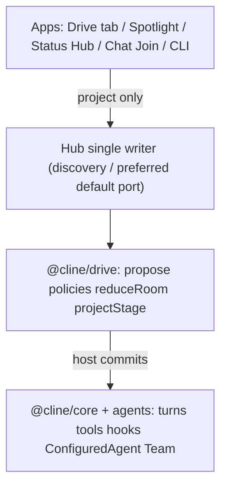

# Native Cline vs Drivecode

**Cline runs agents; Drive is a Cline mode that makes running them feel like being on a call.**

This page is a value comparison: what upstream Cline already ships versus what Drive mode adds. Every Drivecode row carries a maturity label so the claim stays honest. Integration goal: almost seamless—Drive enables features inside Cline, it is not a separate product ([PRD 8](../plans/cline-drivemode/prd/prd-drive-as-cline-mode.md), [ADR-0007](../plans/cline-drivemode/adr/ADR-0007-drive-as-cline-mode.md)).

Planning north star: [cline-drivemode](../plans/cline-drivemode/). Harness layer: [drivecode-sdk](../plans/drivecode-sdk/).

## Layering

Drive sits on Cline. It does not replace the agent loop, open a second daemon, or fork `ConfiguredAgent` YAML.

Three verbs: **the harness proposes, the host commits, apps project.** See [04-relationship-to-cline-drivecode.md](../plans/drivecode-sdk/foundation/04-relationship-to-cline-drivecode.md).

## Maturity legend

| Label | Meaning |
|---|---|
| `plan` | Documented in `docs/drivecode/plans/` only; no meaningful product code on the branch you run |
| `scaffold` | UI/CLI shell on the current workspace (Join call chrome, Drive status bar); little or no hub protocol |
| `branch` | Landed on this feature branch / PR — not necessarily merged to `main` yet |
| `shipped` | Present on `main` as a usable product surface |

## Value matrix

| Axis | Native Cline | Drivecode adds | Maturity | Primary refs |
|---|---|---|---|---|
| Interaction model | Turn chat: prompt → wait → transcript | Call room: join, roster, stay in the call | `shipped` | [00-vision.md](../plans/cline-drivemode/foundation/00-vision.md); [DriveCallChrome.tsx](../../../apps/cline-hub/src/webview/src/drive/DriveCallChrome.tsx) |
| WIP visibility | Transcript wall of tool output | Spotlight / stage cards (edit, command, test, plan, decision) | `shipped` | [DRV-STAGE](../plans/cline-drivemode/features/DRV-STAGE.md); hub `Spotlight.tsx`, `stageReducer.ts` |
| Multi-agent | Team tools / mailbox (runtime groups) | Room roster, address set; RosterPack hub seat path + recruit scoring | `shipped` (library/Add UI open) | [DRV-ROSTER-PACK](../plans/cline-drivemode/features/DRV-ROSTER-PACK.md); [DRV-RECRUIT](../plans/cline-drivemode/features/DRV-RECRUIT.md) |
| Cross-agent status | Transient hub events; session lifecycle column | Durable Status Hub (`status.db`, Board + Changelog + Sessions, `seq` cursor) | `shipped` | Hub status views; ADR-0005 |
| Interruptibility | Cancel / pending-prompt queue | Raise-hand pause-after-tool; mid-turn steer queue | `shipped` | [DRV-INTERRUPT](../plans/cline-drivemode/features/DRV-INTERRUPT.md); [DRV-STEER-QUEUE](../plans/cline-drivemode/features/DRV-STEER-QUEUE.md) |
| Mode UX | Plan / Act | Drive mode on the same control family; postures Plan/Agent/Ask/Debug while Drive is on | `shipped` | [DRV-MODE-OVERLAY](../plans/cline-drivemode/features/DRV-MODE-OVERLAY.md); [PRD 8](../plans/cline-drivemode/prd/prd-drive-as-cline-mode.md); [Chat.tsx](../../../apps/cline-hub/src/webview/src/Chat.tsx) |
| Agent identity | `.cline/agents/*.yaml` (ConfiguredAgent) | `.driveagent/<slug>/` home + AgentProfile overlay + recruit scoring | `shipped` (full editor UI open) | [ADR-0001](../plans/cline-drivemode/adr/ADR-0001-driveagent-home.md); compile fixture landed |
| Privacy | Session storage norms | Privacy-strict: no transcript/audio persist without explicit debug flag | `shipped` | [DRV-PRIVACY](../plans/cline-drivemode/features/DRV-PRIVACY.md); retention caps landed; debugRetention UI residual |
| Collaboration primitive | Session | Room: participants, stage sharer, addressSet | `shipped` | [01-architecture.md](../plans/cline-drivemode/foundation/01-architecture.md) D3; hub `call_*` / `drive.*` |
| Host portability | Cline SDK only | `@cline/drive` host port + capability descriptor + conformance kit | `shipped` | [02-architecture.md](../plans/drivecode-sdk/foundation/02-architecture.md); [DRV-KERNEL](../plans/cline-drivemode/features/DRV-KERNEL.md); `sdk/packages/drive` |
| Surface IA | Chat / CLI / IDE extension | Drive mode in Chat (+ Drive hub home + Status Hub); Discord channels wireframe only | `shipped` | [PRD 8](../plans/cline-drivemode/prd/prd-drive-as-cline-mode.md); [drive-view.tsx](../../../apps/cline-hub/src/webview/src/components/views/drive-view.tsx) |
| Media | N/A for coding-agent MVP | Events-first stage (typed work cards); WebRTC pixels later | `shipped` | [00-vision.md](../plans/cline-drivemode/foundation/00-vision.md); voice STT still stub |

## What we deliberately reuse

Drivecode is an overlay, not a second product stack:

| Keep from native Cline | Drivecode rule |
|---|---|
| Hub on `:25463` | Single writer; nothing defaults to `:7891` |
| `ConfiguredAgent` / `.cline/agents/*.yaml` | Prompts, tools, skills, provider, model stay here |
| Cline `Team` | Runtime execution group — never rename to RosterPack |
| Hook engine | Drive policies decide; core applies |
| Pending-prompt / turn queue | Steer queue builds on existing primitives |
| Bundled ai-elements | Stage cards render with existing UI building blocks |
| Sessions / cron DBs | Status Hub is a separate `status.db`, not a rewrite of sessions |

## Naming firewall

| Drive word | Native word | Do not conflate |
|---|---|---|
| RosterPack | Team | Seating preset vs runtime group |
| AgentProfile | ConfiguredAgent | Appearance overlay vs behavior definition |
| Spotlight (UI) | `stage` (wire) | Product label vs protocol field |
| Room | Session | Collaboration unit vs agent turn container |

## Related links

- Vision: [00-vision.md](../plans/cline-drivemode/foundation/00-vision.md)
- Architecture: [01-architecture.md](../plans/cline-drivemode/foundation/01-architecture.md)
- SDK relationship: [04-relationship-to-cline-drivecode.md](../plans/drivecode-sdk/foundation/04-relationship-to-cline-drivecode.md)
- Repo handoff: [HANDOFF.md](../plans/cline-drivemode/delivery/HANDOFF.md)
