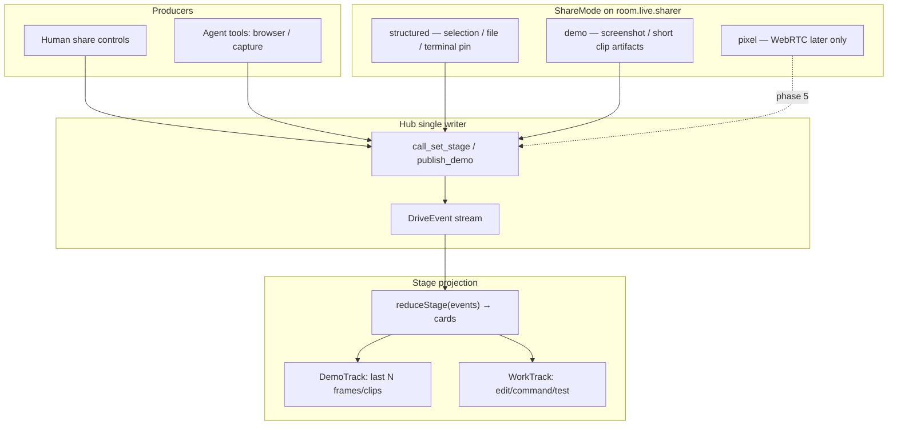
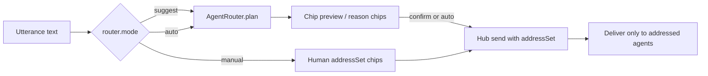

# PLAN · Drive share screen (demo track) + multi-agent router

Reference architecture plan. Implementation follows the phases below after approval.

**Index.** [README.md](README.md) · [09-demo-share.md](../09-demo-share.md) · [10-agent-router.md](../10-agent-router.md)

**Principles that shaped this plan:** redesign-from-first-principles, model-the-domain, boundary-discipline, experience-first, exhaust-the-design-space, laziness-protocol, separate-before-serializing-shared-state, foundational-thinking, type-system-discipline, minimize-reader-load.

**pstack playbook:** multi-phase-plan (+ architect Agree checkpoint). How grounding from existing DRV-SHARE / DRV-ADDRESS / DRV-RECRUIT / D4.

---

## Context

Drive already designed an events-first Call Stage and explicit addressing:

- **DRV-STAGE / DRV-SHARE.** Stage is a last-event-wins reducer. Sharer is `human | agent`. MVP human share is structured (selection / file / terminal). WebRTC pixels are deferred ([04-future-multi-user.md](../04-future-multi-user.md)).
- **DRV-ADDRESS.** Sends carry `addressSet`. Hub enforces delivery. Never silent widen.
- **DRV-RECRUIT.** Ranks agents to *seat* into the room. Does not decide who receives the next utterance among seated agents.
- **DRV-TEAM-OPT.** Spawns a specialist seat. Different verb from routing a message.

Two product gaps remain.

1. **Share screen for demos.** Users and agents need to show work the way Cursor demos do: screenshots and short recordings as proof, not only structured IDE events.
2. **Agent router.** In a room with multiple seated agents, a message (or parts of it) should reach the best agent for that work, with clear, reviewable routing.

**Who this is for.** Pair programmers who want Cursor-style demo proof on the stage, and multi-agent rooms that should not require manual recipient chips every turn.

---

## Scope

### In scope

- Technical architecture for an extended **share / demo track** on the stage.
- Technical architecture for an **AgentRouter** that plans delivery among seated agents (whole message or slices).
- Types, package ownership, ADRs, feature specs, phased landing that fits TASK-GRAPH.
- Explicit mapping from Cursor browser / computer-use demo patterns into Drive events.

### Out of scope

- Building a custom SFU or human↔human WebRTC media plane (still phase 5 design).
- Replacing DRV-ADDRESS manual chips (router sits beside them).
- Embeddings-first recruit rewrite (router MVP reuses lexical scoring among seated agents).
- Implementing code in this planning pass.

### Definition of done (this planning effort)

- ADR-0011 (demo share track) + ADR-0012 (agent router) drafted in the plan and ready to land as docs.
- Alternatives compared; chosen shapes named with types and ownership.
- Phased tasks with acceptance criteria and verification commands.
- Open decisions have defaults.

---

## Research · How Cursor supports agent demos

Synthesized from Cursor docs and product reports (Browser tool, Cloud Agents / computer use, Automations).

| Cursor pattern | What it does | Drive translation |
|---|---|---|
| **Browser tool** | Agent navigates a page, clicks, fills forms, takes screenshots the model can *see* as images | Agent tools emit `drive_demo_frame` events (image refs + caption + url) onto the stage demo track |
| **Computer use (cloud VM)** | Agent runs a full desktop, records video / screenshots as proof-of-work on PRs | Optional `drive_demo_clip` events (short recording URI + transcript caption); ephemeral unless user exports |
| **Artifacts over continuous media** | Demo is a discrete artifact attached to an outcome, not a live SFU stream | Stage renders last N demo artifacts; no media server; hub stores metadata + short-lived blob refs only |
| **Human review without checkout** | Reviewer watches the demo artifact | Drive stage + transcript show the demo card; PiP can surface “latest demo” |

**Anti-pattern to avoid.** Treating “share screen” as Discord Go Live for the agent. That forces WebRTC early and conflicts with D4 (events-first agent stage) and privacy defaults.

---

## Target architecture

### 1. Share screen · three share modes (one stage)



#### Domain types

```ts
type ShareMode = "structured" | "demo" | "pixel"; // pixel reserved, unimplemented

type StructuredSharePayload =
  | { kind: "selection"; path: string; startLine: number; endLine: number; textHash: string }
  | { kind: "file"; path: string }
  | { kind: "terminal"; sessionId: string; excerptHash: string };

/** Cursor-like proof-of-work unit. No raw PCM/video bytes in the event. */
type DemoArtifactRef = {
  artifactId: string;
  mediaKind: "screenshot" | "video_clip";
  /** Hub-issued short-lived blob URI or workspace-relative export path when user saved. */
  uri: string;
  caption: string;
  sourceUrl?: string;      // page under test
  width?: number;
  height?: number;
  durationMs?: number;     // video only
  createdAt: string;
};

type StageSharer = {
  participantId: string;
  kind: "human" | "agent";
  shareMode: ShareMode;
};
```

#### Event additions (DRV-EVENTS)

- `drive_share_started` / `drive_share_ended` (sharer + mode)
- `drive_structured_share` (payload)
- `drive_demo_frame` / `drive_demo_clip` (DemoArtifactRef metadata only)
- Blob bytes travel out-of-band via hub blob store or webview object URLs; events stay privacy-clean (no `audio` / raw frames in schema — extend forbidden-key tests)

#### Agent demo tool surface (Cursor-aligned)

| Tool (conceptual) | Maps from Cursor | Emits |
|---|---|---|
| `drive_browser_snapshot` | Browser screenshot | `drive_demo_frame` |
| `drive_browser_act` | navigate/click/fill (existing browser/computer-use host capability) | work events + optional frame |
| `drive_record_clip_start/stop` | computer-use video proof | `drive_demo_clip` |

HostCapabilities gains:

```ts
readonly demoCapture: boolean;      // can produce screenshot blobs
readonly demoRecord: boolean;       // can produce short video clips
readonly structuredShare: boolean;  // selection/file/terminal pin
```

Pixel/WebRTC remains absent from capabilities until phase 5.

#### Privacy

- Demo blobs are **ephemeral by default** (session memory / temp dir). Export is an explicit user act.
- `privacy.debugRetention` may keep blobs for the session with visible indicator (existing facet).
- Stage shows captions + thumbnails; full image bytes are fetched by the renderer on demand.

---

### 2. Agent router · route among seated agents



#### Domain types

```ts
type RouterMode = "manual" | "suggest" | "auto";

/** One delivery unit. Whole message = single slice spanning full text. */
type RouteSlice = {
  sliceId: string;
  /** Inclusive UTF-16 offsets into the original utterance, or full span. */
  start: number;
  end: number;
  text: string;
  addressSet:
    | { mode: "everyone" }
    | { mode: "agents"; agentIds: string[] }
    | { mode: "pack"; packId: string };
  score: number;
  reasons: string[];  // reviewable, cite capability/graph labels
};

type RoutePlan = {
  utteranceId: string;
  mode: RouterMode;
  slices: RouteSlice[];
  /** true when any slice score < threshold → UI must warn or force confirm */
  lowConfidence: boolean;
};

type SeatedAgentCard = {
  participantId: string;
  profileId: string;
  role: "pair_partner" | "specialist";
  /** Capability labels from AgentProfile / driveagent catalog — not prompts */
  labels: string[];
  domains: string[];
};
```

#### Pure API (`@cline/drive`)

```ts
function planRoute(input: {
  utterance: string;
  seated: readonly SeatedAgentCard[];
  allowFractions: boolean;
  threshold: number;
}): RoutePlan;

function assertRouteLegal(
  plan: RoutePlan,
  seatedIds: ReadonlySet<string>,
): { ok: true } | { ok: false; code: string; message: string };
```

**MVP scorer.** Lexical/tag overlap with seated agents’ labels (same spirit as DRV-RECRUIT, but **seated-only** and produces `addressSet`, not seat ops).

**Fraction routing.** Optional second stage: split utterance on explicit markers (`and also`, `;`, numbered lists) or a cheap classifier into 1..N slices. Default `allowFractions: false` until tests prove quality. When false, always one slice.

**Delivery.** Hub runs existing DRV-ADDRESS enforcement per slice. Multi-slice send becomes N conversation events sharing `utteranceId` / `routePlanId` for transcript grouping.

#### Modes (experience-first)

| Mode | Behavior | Default |
|---|---|---|
| `manual` | Human chips only; router idle | single-agent rooms |
| `suggest` | Router fills chips + shows reasons; send requires human glance | **multi-agent rooms** |
| `auto` | Router commits on send; lowConfidence forces suggest fallback | opt-in facet |

Facet: `router.mode` (durable), `router.allowFractions` (durable), `router.threshold` (durable).

#### What the router is not

| Concern | Owner |
|---|---|
| Who to add to the room | DRV-RECRUIT |
| Spawn specialist seat | DRV-TEAM-OPT |
| Manual override chips | DRV-ADDRESS |
| LLM provider choice | `@cline/llms` / ConfiguredAgent |

---

### 3. Package ownership

| Concern | Owner |
|---|---|
| ShareMode, DemoArtifactRef, RoutePlan schemas | `@cline/shared` |
| `reduceStage` demo track, `planRoute`, `assertRouteLegal` | `@cline/drive` |
| Blob mint/GC, `call_set_stage`, send-time route apply, delivery | `@cline/core` hub |
| Browser/capture tool adapters | host binding (`apps/cline-hub` / core tools) |
| Stage UI, share controls, route preview chips | `apps/cline-hub` |

Dependency rule unchanged: drive pure; no `@cline/llms` import for routing MVP.

---

### 4. SOLID sketch

| Letter | Application |
|---|---|
| **S** | Share publish ≠ stage reduce ≠ route plan ≠ hub deliver |
| **O** | New demo media kinds = new event variants + renderers; router scorers pluggable later |
| **L** | Every RouteSlice must be a valid addressSet the hub already understands |
| **I** | `demoCapture` / `demoRecord` / `structuredShare` separate HostCapabilities |
| **D** | UI depends on RoutePlan and StageState values; not on scorer internals |

---

## Alternatives

### Share

| Option | Verdict |
|---|---|
| WebRTC pixel share as MVP | Rejected — conflicts D4, privacy, SFU cost |
| Structured share only | Rejected as sole answer — weak for demos |
| **Structured + demo artifacts (Cursor-like)** | **Chosen** |
| Always-on agent desktop stream | Rejected — continuous media plane |

### Router

| Option | Verdict |
|---|---|
| Manual chips only | Rejected as sole answer for multi-agent |
| LLM classifies every send | Deferred — expensive; use as optional P2 scorer |
| **Suggest/auto + lexical seated scorer + optional fractions** | **Chosen** |
| Silent fan-out to all agents | Rejected — violates DRV-ADDRESS |

---

## Relationship to existing docs

| Doc / feature | Change |
|---|---|
| D4 / DRV-SHARE | Add `shareMode` + demo artifact events; keep pixel later |
| DRV-STAGE | Demo track in reducer (last N artifacts + work cards) |
| DRV-ADDRESS | Router emits addressSets; chips remain source of truth in manual/suggest |
| DRV-RECRUIT | Unchanged verb (seat); router may call same label index for seated cards |
| DRV-TEAM-OPT | Unchanged (spawn) |
| DRV-PRIVACY | Demo blob ephemerality + schema forbidden keys |
| HostCapabilities | `demoCapture`, `demoRecord`, `structuredShare` |
| New ADR-0011 | Demo share track |
| New ADR-0012 | Agent router |
| New features | `DRV-DEMO-SHARE`, `DRV-AGENT-ROUTER` |
| New docs | `09-demo-share.md`, `10-agent-router.md` |

Does **not** reopen: hub single writer, no second daemon, events-first agent work stage, RosterPack naming.

---

## Phases

No dates. Independently shippable.

### Phase 1 · Docs and ADRs

**Goal.** Freeze D10 (demo share) and D11 (router) in prose.  
**Changes.** ADR-0011, ADR-0012, `09-demo-share.md`, `10-agent-router.md`, amend DRV-SHARE/STAGE/ADDRESS, README, TASK-GRAPH phase notes.  
**Verify.** Docs linked.  
**Acceptance.** Engineer can explain demo artifacts vs WebRTC, and router vs recruit vs address.

### Phase 2 · Schemas

**Goal.** Types first.  
**Changes.** `@cline/shared` ShareMode, DemoArtifactRef, share/demo events, RoutePlan/RouteSlice, facet ids for `router.*`. Forbidden-key tests cover demo blob fields.  
**Verify.** `bun -F @cline/shared test`.

### Phase 3 · Stage demo track (pure)

**Goal.** Reducer understands demo frames/clips.  
**Changes.** `@cline/drive` `reduceStage` adds DemoTrack (last N). Fixture tests.  
**Verify.** `bun -F @cline/drive test`.

### Phase 4 · Structured share complete (DRV-SHARE MVP)

**Goal.** Human structured share works end-to-end (unblocks bidirectional stage).  
**Changes.** Hub `call_set_stage`, webview share controls, Stage header labels sharer.  
**Verify.** hub + core unit tests; control-ui smoke.

### Phase 5 · Demo capture tools + blob mint

**Goal.** Agent can publish a screenshot proof like Cursor browser tool.  
**Changes.** Hub blob mint/GC; `drive_browser_snapshot` tool (or host bridge); stage renders demo cards.  
**Verify.** Unit + hub test with fixture PNG; live smoke optional.  
**Acceptance.** Tool call → stage shows captioned screenshot without WebRTC.

### Phase 6 · AgentRouter pure MVP

**Goal.** planRoute among seated agents.  
**Changes.** `@cline/drive` scorer + assertRouteLegal; fixtures with two specialists.  
**Verify.** `bun -F @cline/drive test`.  
**Acceptance.** “fix the flake” ranks test specialist over docs agent; empty seated set rejected.

### Phase 7 · Suggest/auto wiring on send

**Goal.** Multi-agent rooms get router UX.  
**Changes.** Facets `router.mode` default `suggest` when seatCap>1 else `manual`; composer preview chips; hub applies plan → addressSet(s). LowConfidence forces confirm.  
**Verify.** hub unit + cline-hub tests; smoke with two seated agents.  
**Acceptance.** Suggest pre-fills chips with reasons; auto delivers without silent everyone-widen.

### Phase 8 · Fraction routing (optional gate)

**Goal.** Split utterance into slices when enabled.  
**Changes.** `router.allowFractions`; splitter + multi-event send grouping.  
**Verify.** Fixture utterances with two clear intents.  
**Acceptance.** Off by default; on → two slices two addressSets; transcript groups by utteranceId.

### Phase 9 · Demo clip + gate docs

**Goal.** Short video proof path (Cursor computer-use analog) + TASK-GRAPH update.  
**Changes.** `drive_demo_clip` if `demoRecord`; smokes for share + router; privacy checklist for blobs.  
**Verify.** Unit + optional live; update phase 2/4 gates.

---

## Testing strategy

```text
cd sdk
bun run build:sdk && bun run types
bun -F @cline/shared test
bun -F @cline/drive test
bun -F @cline/core test:unit
bun -F @cline/cline-hub test
```

Runtime (control-ui):

1. Structured share handoff human↔agent.  
2. Agent snapshot tool → demo card on stage.  
3. Two agents seated, suggest mode, send “fix flake” → test agent chip selected with reason.  
4. Auto mode lowConfidence → confirm UI, never silent everyone.

---

## Implementation guidance

1. **how** on stage reducer, hub send path, recruit scorer before edits.  
2. Router must emit DRV-ADDRESS shapes only (**Liskov**).  
3. No pixel SFU in phases 1–8.  
4. `/deslop` + **unslop** on ADRs; **interrogate** if auto-mode defaults contested.  
5. **show-me-your-work** for shareMode and router.mode defaults.  
6. Minimal diff: extend existing features; do not invent a second room bus.

---

## Risks

| Risk | Mitigation |
|---|---|
| Demo blobs become transcript dumps | Ephemeral default; export explicit; schema forbids inline bytes |
| Router silent fan-out | assertRouteLegal + never empty→everyone |
| Fraction splits garbage | Default off; high threshold; suggest mode |
| Confuse recruit vs router | Separate features/ADRs; different verbs seat vs deliver |
| Premature WebRTC | Pixel ShareMode reserved unimplemented |

---

## Open decisions (defaults)

1. **Default multi-agent router mode:** `suggest` (not auto).  
2. **Fractions:** off until phase 8 gate.  
3. **Demo blob retention:** ephemeral session; export opt-in.  
4. **MVP demo tool:** screenshot only; video in phase 9.  
5. **Scorer:** lexical seated labels first; optional LLM rerank later behind facet.

---

## Hand back

**Share.** Cursor-like demo artifact track on the events-first stage; structured share remains MVP; WebRTC still later.

**Router.** Pure RoutePlan over seated agents; suggest/auto modes; delivers via existing addressSet; fractions optional.

**Phases.** Docs → schemas → stage demo reduce → structured share → snapshot tool → router pure → suggest/auto wire → fractions → clips/gates.

Stop for review. Execution starts only after explicit approval.
