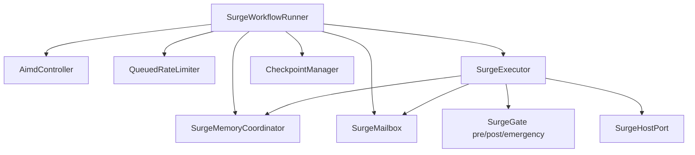

# Surge framework for Cline Drivecode

## Context

MOS (Modular Orchestration System) ships a Python **Surge** layer for parallel, gated, resumable agent work. Cline Drivecode had no equivalent. This package is a TypeScript port of the Surge *domain model* for the Bun/Node SDK monorepo so Drive, Teams, and future MOS bridges can share one parallel substrate.

## Package boundary

| Package | Owns |
|---|---|
| `@cline/surge` | Waves, gates, mailbox, memory bus, AIMD, rate limit, checkpoints, host port |
| `@cline/drive` | Pure room kernel (modes, fold, stage). Does **not** import surge |
| `@cline/core` Teams | Session-bound teammates and tools. May *adapt* surge later |
| `@cline/agents` | Single-agent loop. Unchanged |

`@cline/surge` has **no** workspace dependencies. Task execution enters through `SurgeHostPort.runTask`. That keeps the framework free of session, hub, and provider coupling.

## Domain model



### Wave lifecycle

1. Emergency gate (abort / pause / inject).
2. Pre gate.
3. Select ready tasks (deps satisfied), capped by AIMD window.
4. Acquire rate-limit tokens; invoke host in parallel.
5. Apply memory writes, mailbox sends, spawned tasks.
6. Post gate (continue / inject / redirect / pause / abort).
7. Checkpoint; repeat while ready work remains.

### Result contract

`SurgeResult` mirrors MOS `OrchestrationResult` status vocabulary for composition: `success | failure | partial | paused | aborted | skipped`.

## Drivecode leverage

- **Drive rooms:** a hub-owned room can launch a surge for specialist waves (review, test, docs) without inventing a second Team runtime. Seating stays Drive; execution shape stays Surge.
- **Teams:** `AgentTeamsRuntime.maxConcurrentRuns` is a fixed concurrency knob. AIMD + QueuedRateLimiter are the upgrade path when rate limits and long-tail waves matter.
- **MOS bridge:** a future adapter can project MOS plugin manifests onto `SurgeTaskInput` and map `SurgeResult` back to MOS MCP tool responses.

## Non-goals (this phase)

- Python MOS runtime embedding.
- Fleet APIs / external parallel-agent vendors.
- OpenTelemetry export (hook points only via logs + metadata for now).
- Replacing Teams tools in `@cline/core`.

## Usage

```ts
import { SurgeWorkflowRunner, failFastGate } from "@cline/surge";

const runner = new SurgeWorkflowRunner({
  host: {
    async runTask({ task }) {
      // Bind to Copilot / Cursor / Cline agent here.
      return { ok: true, result: { echo: task.kind } };
    },
  },
  gates: [failFastGate()],
  aimd: { initial: 2, max: 6 },
});

const result = await runner.run([
  { kind: "edit", payload: { path: "a.ts" } },
  { kind: "edit", payload: { path: "b.ts" } },
  { kind: "test", dependsOn: [/* ids from enqueue if needed */] },
]);
```

Prefer assigning stable `id`s when you need `dependsOn` edges across waves.

## Verification

```sh
bun -F @cline/surge test
bun -F @cline/surge build
bun -F @cline/surge typecheck
```
