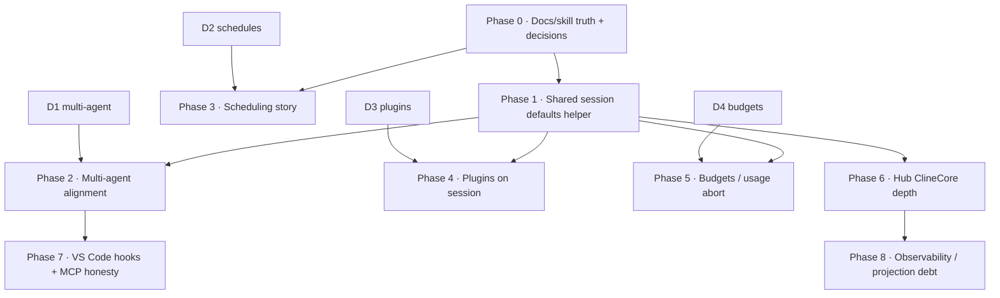

# SDK integration build

Turns [Usage analysis](/sdk/architecture/usage-analysis) into a sequenced build. Phases are ordered by dependency and option value — **no calendar estimates**. Each **agent task** is sized for one focused PR: clear inputs, files, acceptance, and verify commands.

**Source of truth for symbols:** code (`DefaultToolNames`, `TEAM_TOOL_NAMES`, `ClineCore` APIs) — not skill docs when they drift.

## North star

Product hosts stay on **`ClineCore`**. We do **not** migrate hosts to the lightweight `Agent` API. Success means:

1. Hosts share **one defaults story** for multi-agent, plugins-on-session, budgets, and Hub runtime depth.
2. Documented SDK surfaces either **match product paths** or docs explicitly name the product-canonical alternative (esp. scheduling).
3. An agent can pick any open task below and land it without inventing product policy.

## Non-goals (whole build)

- Replacing host adapters (VS Code terminal/diff/`McpHub`, Hub WS protocol) with a thin SDK client.
- Adopting `backendMode: "remote"` or browser automation without a separate product decision.
- Moving product hosts onto `@cline/sdk` umbrella imports (keep `@cline/core` / peer packages).
- Rewriting evals to construct SDK objects (CLI/Harbor behavioral coverage is enough).

## Decision gates (lock before coding)

Agents must **stop and surface** these if still open. Defaults below are the proposed lock; change them in this doc before implementing dependent tasks.

| ID | Decision | Proposed lock | Unlocks |
|----|----------|---------------|---------|
| **D1** | Multi-agent host defaults | **CLI non-YOLO semantics** as product default: `enableSpawnAgent: true`, `enableAgentTeams: true` unless YOLO/sandbox/ACP special-cases. Hub Chat and Desktop adopt the same defaults. VS Code: enable behind a user/setting flag defaulting **on** once UI is honest; until then do not leave dead subagent UI. | Phase 2 |
| **D2** | Scheduling canonical path | **Hub schedule services / `schedule.*` commands** are product-canonical. Docs (`scheduled-agents.mdx`) must describe that path first; `cline.automation` documented as the embedder/SDK-local alternative (or thin wrapper over hub schedules) — not as “what Desktop/CLI use.” | Phase 3 docs; optional Phase 3b |
| **D3** | Plugin session injection | Installed/enabled plugins are loaded into `CoreSessionConfig` via `pluginPaths` / `extensions` + `extensionContext.workspace` on session start for CLI, Hub, Desktop, and VS Code (where marketplace exists). | Phase 4 |
| **D4** | Cost budgets | Shared defaults for `maxIterations` (+ optional usage abort threshold) live in a small shared helper; hosts may override. No hard global $ kill-switch without settings UI. | Phase 5 |

## Dependency sketch



Caption: Phase 0 is documentary/decision only. Phase 1 is the shared code foothold. Hosts fan out in parallel after Phase 1 once their decision gate is locked.

## Phase overview

| Phase | Goal | Gate |
|-------|------|------|
| **0** | Decisions locked in this doc; skill/docs symbol drift fixed | D1–D4 recorded; skill refs match `DefaultToolNames` / `TEAM_TOOL_NAMES` / `spawn_agent` |
| **1** | Shared helper for session feature defaults + plugin resolve + budget knobs | Unit tests in `@cline/core` (or agreed shared module); no host behavior change yet unless opt-in |
| **2** | Multi-agent flags consistent across CLI / Hub / Desktop / VS Code | Defaults match D1; VS Code either enables or removes dead UI; tests assert flags |
| **3** | Scheduling docs match product; optional automation bridge | `scheduled-agents.mdx` describes hub path; no host regression |
| **4** | Installed plugins participate in agent loop | Session start passes `pluginPaths`/`extensions`; one plugin tool observable in a session |
| **5** | Iteration/token budget defaults + optional usage abort | Shared defaults applied; abort path tested |
| **6** | Hub `ClineCore.create` gains telemetry, compaction, hooks | Hub composition matches CLI depth for those three |
| **7** | VS Code deferred hooks; MCP path documented/honest | Hook kinds wired or explicitly wontfix; MCP split brain documented in architecture |
| **8** | OTEL adapter alignment; shared event projection helpers | Optional; no host required to adopt in full |

---

## Phase 0 · Truth and decisions

### Agent task `SDK-0.1` — Lock decisions D1–D4

| | |
|---|---|
| **Depends on** | — |
| **Owner surface** | docs |
| **Goal** | Confirm or amend D1–D4 in this document; link from usage analysis. |
| **Files** | `docs/sdk/architecture/integration-build.mdx`, `docs/sdk/architecture/usage-analysis.mdx` |
| **Done when** | Each decision has a single chosen lock (not “TBD”); dependent phases reference that lock. |
| **Verify** | Doc review only. |
| **Agent prompt** | Read usage analysis + this plan. If product owners disagree with proposed locks, edit the Decision gates table only — do not implement code. |

### Agent task `SDK-0.2` — Fix skill/docs symbol drift

| | |
|---|---|
| **Depends on** | — |
| **Owner surface** | `.agents/skills/cline-sdk`, `docs/sdk` |
| **Goal** | Align advertised tool and multi-agent names with Core exports. |
| **Files likely** | `.agents/skills/cline-sdk/references/tools/REFERENCE.md`, `.../multi-agent/REFERENCE.md`, `docs/sdk/tools.mdx`, `docs/sdk/guides/multi-agent-teams.mdx` |
| **Code truth** | `sdk/packages/core/src/extensions/tools/constants.ts` (`DefaultToolNames`); `TEAM_TOOL_NAMES` + `spawn_agent` under `sdk/packages/core/src/extensions/tools/team/` |
| **Done when** | No skill/doc examples teach `bash`/`search`/`start_subagent`/`team_delegate_task` as current APIs; names match code. |
| **Verify** | Grep skills/docs for obsolete names; spot-check against constants. |
| **Non-goals** | Changing runtime tool names. |

### Agent task `SDK-0.3` — Architecture note: MCP split brain

| | |
|---|---|
| **Depends on** | — |
| **Owner surface** | docs |
| **Goal** | Document CLI/Hub settings-file MCP vs VS Code `disableMcpSettingsTools` + `McpHub` as intentional adapter debt. |
| **Files** | This plan or `docs/sdk/architecture/overview.mdx` short subsection |
| **Done when** | Future agents know not to “fix” VS Code MCP by blindly enabling settings tools without a migration plan. |

---

## Phase 1 · Shared session defaults helper

### Agent task `SDK-1.1` — Extract `resolveProductSessionFeatures`

| | |
|---|---|
| **Depends on** | D1, D4 (locks) |
| **Owner surface** | `@cline/core` |
| **Goal** | One pure helper that, given host context (`yolo`, `acp`, `source`, explicit overrides), returns `{ enableSpawnAgent, enableAgentTeams, maxIterations?, ... }` matching D1/D4. |
| **Files likely** | New module under `sdk/packages/core/src/` (e.g. `session/product-session-defaults.ts`) + unit tests; export from core index if public |
| **Done when** | Unit tests cover: default on; YOLO off; ACP spawn on / teams off; explicit override wins. |
| **Verify** | `bun run build:sdk` then `bun -F @cline/core test:unit` (scoped test file). |
| **Non-goals** | Wiring every host yet (that is Phase 2/5). |

### Agent task `SDK-1.2` — Extract `resolveSessionPluginLoad`

| | |
|---|---|
| **Depends on** | D3 |
| **Owner surface** | `@cline/core` |
| **Goal** | Helper wrapping `resolveAndLoadAgentPlugins` / path discovery into `{ pluginPaths, extensions, extensionContext }` suitable for `CoreSessionConfig`. |
| **Files likely** | Near existing `sdk/packages/core/src/extensions/` plugin loaders; tests with fixture plugin path |
| **Done when** | Given cwd/workspace, returns loadable plugin inputs; empty/disabled plugins → empty arrays. |
| **Verify** | `bun run build:sdk`; focused core unit tests. |
| **Non-goals** | Marketplace install UX. |

---

## Phase 2 · Multi-agent alignment

### Agent task `SDK-2.1` — CLI: call shared defaults helper

| | |
|---|---|
| **Depends on** | SDK-1.1 |
| **Owner surface** | `apps/cli` |
| **Goal** | Replace ad-hoc `enableSpawnAgent: !isYoloMode` / teams / ACP special cases with `resolveProductSessionFeatures`. Behavior must stay equivalent to D1. |
| **Files** | `apps/cli/src/main.ts`, `apps/cli/src/acp/acpAgent.ts`, related tests |
| **Done when** | Existing CLI/ACP tests green; flags still match prior matrix for YOLO/ACP. |
| **Verify** | `bun -F @cline/cli test:unit` (or package’s unit script). |

### Agent task `SDK-2.2` — Hub Chat defaults match D1

| | |
|---|---|
| **Depends on** | SDK-1.1, D1 |
| **Owner surface** | `apps/cline-hub` |
| **Goal** | Fix Chat UI defaults (today: spawn off / teams on) and server omit-defaults so they match D1. |
| **Files** | `apps/cline-hub/src/webview/src/Chat.tsx`, `apps/cline-hub/src/server/sessions.ts` |
| **Done when** | Fresh Chat session starts with D1 flags unless user toggles; unit/UI tests updated. |
| **Verify** | `bun -F @cline/cline-hub test` (or package equivalent). |

### Agent task `SDK-2.3` — Desktop defaults match D1

| | |
|---|---|
| **Depends on** | SDK-1.1, D1 |
| **Owner surface** | `apps/examples/desktop-app` |
| **Goal** | `buildCoreSessionConfig` defaults for spawn/teams follow helper (not hard-false unless UI override). |
| **Files** | `sidecar/chat-session.ts`, webview settings if they force false |
| **Done when** | New sessions without explicit UI override get D1 defaults. |
| **Verify** | Desktop/sidecar unit tests if present; otherwise manual checklist in PR. |

### Agent task `SDK-2.4` — VS Code: enable multi-agent or remove dead UI

| | |
|---|---|
| **Depends on** | SDK-1.1, D1 |
| **Owner surface** | `apps/vscode` |
| **Goal** | Stop lying to the product: either wire `enableSpawnAgent`/`enableAgentTeams` from settings (default per D1) through `cline-session-factory.ts`, **or** remove/hide subagent UI + translator dead paths. Prefer enable-behind-setting if event translator already handles team events. |
| **Files** | `apps/vscode/src/sdk/cline-session-factory.ts`, settings UI, `message-translator.ts` (verify only) |
| **Done when** | Config flags match setting; no hard-coded `false` without comment pointing to D1 exception. |
| **Verify** | `bun run test:unit` in `apps/vscode` (scoped). |
| **Risks** | Host tool overrides + local backend — smoke one spawn in extension host if enabling. |

---

## Phase 3 · Scheduling story

### Agent task `SDK-3.1` — Rewrite scheduled-agents guide for product path

| | |
|---|---|
| **Depends on** | D2 |
| **Owner surface** | `docs/sdk` |
| **Goal** | Lead with HubSchedule / CLI `cline schedule` / Desktop routine commands; demote `cline.automation` to embedder section. |
| **Files** | `docs/sdk/guides/scheduled-agents.mdx`, cross-links from `clinecore.mdx` |
| **Done when** | A reader building Desktop/CLI would not think they must call `cline.automation.start()`. |
| **Verify** | Docs link check / editorial review. |

### Agent task `SDK-3.2` (optional) — Thin automation bridge

| | |
|---|---|
| **Depends on** | SDK-3.1, D2 |
| **Owner surface** | `@cline/core` |
| **Goal** | Only if D2 chooses “wrapper”: make `cline.automation` delegate to hub schedule runtime when `backendMode` is hub — so docs samples still work. |
| **Done when** | One integration test: automation API creates a schedule visible via `HubScheduleService`. |
| **Non-goals** | Replacing HubScheduleCommandService call sites in apps. |

---

## Phase 4 · Plugins on session

### Agent task `SDK-4.1` — CLI session start injects plugins

| | |
|---|---|
| **Depends on** | SDK-1.2, D3 |
| **Owner surface** | `apps/cli` |
| **Goal** | Interactive + one-shot session config includes resolved `pluginPaths`/`extensions` (respect disabled plugins). Slash-command path should not be the only plugin entry. |
| **Files** | `apps/cli/src/main.ts`, `utils/plugin-chat-commands.ts` (reuse), session start paths |
| **Done when** | With a fixture/local plugin installed, a tool from the plugin appears in the agent tool set for a new session. |
| **Verify** | Unit/integration test with fixture plugin; `bun -F @cline/cli test:unit`. |

### Agent task `SDK-4.2` — Hub + Desktop session injects plugins

| | |
|---|---|
| **Depends on** | SDK-1.2, D3 |
| **Owner surface** | Hub + Desktop |
| **Goal** | Same injection on Hub `buildSessionStartInput` and Desktop `buildCoreSessionConfig`. |
| **Files** | `apps/cline-hub/src/server/sessions.ts`, `apps/examples/desktop-app/sidecar/chat-session.ts` |
| **Done when** | Parity with CLI behavior for enabled plugins. |
| **Verify** | Focused tests or scripted checklist. |

### Agent task `SDK-4.3` — VS Code marketplace plugins on session

| | |
|---|---|
| **Depends on** | SDK-1.2, D3 |
| **Owner surface** | `apps/vscode` |
| **Goal** | After marketplace install, session factory loads plugins into Core config (not inventory-only). |
| **Files** | `cline-session-factory.ts`, marketplace helpers |
| **Done when** | Installed plugin tools available on next task start. |
| **Verify** | VS Code unit tests with mocked plugin paths. |

---

## Phase 5 · Budgets and usage abort

### Agent task `SDK-5.1` — Apply shared `maxIterations` defaults

| | |
|---|---|
| **Depends on** | SDK-1.1, D4 |
| **Owner surface** | CLI, Hub, Desktop, VS Code |
| **Goal** | Stop leaving `maxIterations` undefined without intent; apply helper default unless user/settings override. |
| **Done when** | Each host’s start config sets a positive default; settings/UI can override. |
| **Verify** | Unit assertions on built config objects. |

### Agent task `SDK-5.2` — Optional usage-based abort helper

| | |
|---|---|
| **Depends on** | SDK-5.1 |
| **Owner surface** | `@cline/core` or shared host util |
| **Goal** | Small helper: given usage event + threshold, return abort recommendation; wire in CLI first (richest subscribe path). |
| **Done when** | Test: crossing threshold triggers abort; below does not. |
| **Non-goals** | Billing UI; hard $ limits without settings. |

---

## Phase 6 · Hub ClineCore depth

### Agent task `SDK-6.1` — Telemetry on Hub `ClineCore.create`

| | |
|---|---|
| **Depends on** | Phase 1 optional |
| **Owner surface** | `apps/cline-hub` |
| **Goal** | Pass a configured telemetry handle into `ClineCore.create` (mirror Desktop/CLI), respecting opt-out. |
| **Files** | `apps/cline-hub/src/server/hub.ts`, telemetry util if needed |
| **Done when** | Hub-created sessions emit SDK telemetry when opt-out is false. |
| **Verify** | Unit test with mock telemetry service. |

### Agent task `SDK-6.2` — Compaction on Hub session start

| | |
|---|---|
| **Depends on** | — |
| **Owner surface** | Hub |
| **Goal** | `buildSessionStartInput` applies compaction config from global settings (same knobs CLI uses). |
| **Files** | `apps/cline-hub/src/server/sessions.ts` |
| **Done when** | When global compaction enabled, Hub sessions get `compaction.enabled` / strategy set. |
| **Verify** | Unit test on start input builder. |

### Agent task `SDK-6.3` — Runtime hooks on Hub sessions

| | |
|---|---|
| **Depends on** | — |
| **Owner surface** | Hub |
| **Goal** | Attach file/config hooks to session start (inventory already lists them — make them run). |
| **Files** | `sessions.ts`, reuse CLI `hooks` patterns where possible |
| **Done when** | A workspace hook config fires on a Hub-started session in test or documented smoke. |
| **Verify** | Focused test with temp hook fixture. |

---

## Phase 7 · VS Code hooks + MCP honesty

### Agent task `SDK-7.1` — Wire deferred VS Code hook kinds

| | |
|---|---|
| **Depends on** | — |
| **Owner surface** | `apps/vscode` |
| **Goal** | Implement or explicitly wontfix: `TaskResume`, `TaskError`, `SessionShutdown`, `PreCompact`, `Notification` in `hooks-adapter.ts`. |
| **Files** | `apps/vscode/src/sdk/hooks-adapter.ts` + tests |
| **Done when** | Each deferred kind is either mapped to `AgentHooks` or listed as wontfix with reason in adapter comment + this plan. |
| **Verify** | `hooks-adapter` unit tests. |

### Agent task `SDK-7.2` — MCP migration spike (doc-only or thin)

| | |
|---|---|
| **Depends on** | SDK-0.3 |
| **Owner surface** | VS Code |
| **Goal** | Spike writeup: what breaks if `disableMcpSettingsTools` is flipped false while keeping `McpHub`? Produce go/no-go. **No large rewrite in this task.** |
| **Done when** | Short ADR/section in this plan or `docs/sdk/architecture/` with recommendation. |

---

## Phase 8 · Observability and projection debt (optional)

### Agent task `SDK-8.1` — Prefer `loadOpenTelemetryAdapter` where remote OTEL exists

| | |
|---|---|
| **Depends on** | — |
| **Owner surface** | VS Code remote-config path |
| **Goal** | Align host OTEL provider construction with Core’s adapter export where equivalent. |
| **Done when** | One code path documents why Core adapter is or isn’t used; no duplicate config parsing if avoidable. |

### Agent task `SDK-8.2` — Shared event projection helpers

| | |
|---|---|
| **Depends on** | — |
| **Owner surface** | `@cline/shared` |
| **Goal** | Extract pure mappers for common `AgentEvent` → UI chunk shapes used by Hub/Desktop/CLI to reduce drift. Adopt incrementally (Desktop first). |
| **Done when** | At least one host uses shared helper; others unchanged. |
| **Verify** | Shared unit tests for mapper. |

---

## Suggested agent execution order

Work **one task ID per agent run**. Prefer this order unless a decision forces otherwise:

1. `SDK-0.1` → `SDK-0.2` → `SDK-0.3`
2. `SDK-1.1` → `SDK-1.2`
3. Parallel host tracks: `SDK-2.*`, `SDK-6.*`, `SDK-3.1`
4. `SDK-4.*` after 1.2
5. `SDK-5.*` after 1.1
6. `SDK-7.*` when VS Code bandwidth allows
7. `SDK-8.*` last

## Per-task agent checklist (copy into run prompts)

```text
You are executing task <SDK-X.Y> from docs/sdk/architecture/integration-build.mdx.
1. Read the task table + Decision gates. Do not violate D1–D4.
2. Read usage analysis for context: docs/sdk/architecture/usage-analysis.mdx
3. Implement only this task’s goal and files. No drive-by refactors.
4. After SDK package edits: bun run build:sdk before host tests.
5. Run the Verify commands listed on the task.
6. Update the task Done when checkboxes / PR description with evidence.
7. If a Decision gate is still TBD, stop and report — do not invent product policy.
```

## Progress tracker

| Task | Status |
|------|--------|
| SDK-0.1 Decisions | Open |
| SDK-0.2 Skill/docs drift | Open |
| SDK-0.3 MCP split brain note | Open |
| SDK-1.1 Product session features helper | Open |
| SDK-1.2 Session plugin load helper | Open |
| SDK-2.1 CLI multi-agent helper | Open |
| SDK-2.2 Hub multi-agent defaults | Open |
| SDK-2.3 Desktop multi-agent defaults | Open |
| SDK-2.4 VS Code multi-agent honesty | Open |
| SDK-3.1 Scheduling docs | Open |
| SDK-3.2 Automation bridge (optional) | Open |
| SDK-4.1 CLI plugins on session | Open |
| SDK-4.2 Hub/Desktop plugins on session | Open |
| SDK-4.3 VS Code plugins on session | Open |
| SDK-5.1 maxIterations defaults | Open |
| SDK-5.2 Usage abort helper | Open |
| SDK-6.1 Hub telemetry | Open |
| SDK-6.2 Hub compaction | Open |
| SDK-6.3 Hub hooks | Open |
| SDK-7.1 VS Code hooks | Open |
| SDK-7.2 MCP spike | Open |
| SDK-8.1 OTEL alignment | Open |
| SDK-8.2 Event projection helpers | Open |

## Related

- [Usage analysis](/sdk/architecture/usage-analysis)
- [Hub & Spoke](/sdk/architecture/hub-spoke)
- [Scheduled agents](/sdk/guides/scheduled-agents)
- [Multi-agent teams](/sdk/guides/multi-agent-teams)
- [Going to production](/sdk/guides/going-to-production)
